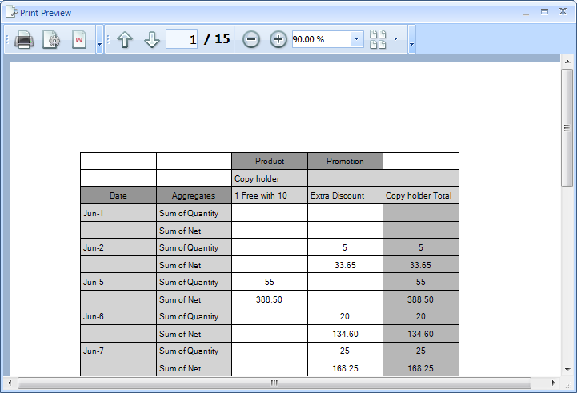

# Printing Support

The printing support of RadPivotGrid allows the end user to directly pass its data to the printer. RadPivotGrid uses
        the same printing mechanism as RadGridView and RadScheduler and therefore shares the common features provided by
        [RadPrintDocument]().
        You can modify the appearance and the layout of the printed pages by using the variety of options provided by the
        __PivotGridPrintStyle__ class.
      

## 

The RadPivotGrid has two public methods available for printing – __Print()__ and
          __PrintPreview()__ methods. The first method will directly send a print job to the
          default printer with the settings currently saved in the __PrintStyle__ property. This method
          has one overload available which can show a system __PrintDialog__ with the available printers
          and their options.
        

#### __[C#] __

{{source=..\SamplesCS\PivotGrid\PivotGridPrinting.cs region=Print}}
	            this.radPivotGrid1.Print();
	            this.radPivotGrid1.Print(true);
	{{endregion}}

#### __[VB.NET] __

{{source=..\SamplesVB\PivotGrid\PivotGridPrinting.vb region=Print}}
	        Me.radPivotGrid1.Print()
	        Me.radPivotGrid1.Print(True)
	        '#End Region
	    End Sub
	
	    Private Sub radButton2_Click(sender As Object, e As EventArgs) Handles radButton2.Click
	        '#Region "PrintPreview"
	        Me.radPivotGrid1.PrintPreview()
	        '#End Region
	    End Sub
	
	    Public Sub New()
	        InitializeComponent()
	
	        '#Region "PrintStyleFont"
	        Me.radPivotGrid1.PrintStyle.DataCellsFont = New Font("Segoe UI Light", 8, FontStyle.Regular)
	        Me.radPivotGrid1.PrintStyle.HeaderCellsFont = New Font("Segoe UI Light", 8, FontStyle.Bold)
	        Me.radPivotGrid1.PrintStyle.DecriptorsFont = New Font("Segoe UI Light", 9, FontStyle.Regular)
	        Me.radPivotGrid1.PrintStyle.SubTotalCellsFont = New Font("Segoe UI Light", 8, FontStyle.Italic)
	        Me.radPivotGrid1.PrintStyle.GrandTotalCellsFont = New Font("Segoe UI Light", 8, FontStyle.Italic Or FontStyle.Bold)
	        '#End Region
	
	        '#Region "PrintStyleColor"
	        Me.radPivotGrid1.PrintStyle.CellBackColor = Color.Wheat
	        Me.radPivotGrid1.PrintStyle.HeadersBackColor = Color.Gray
	        Me.radPivotGrid1.PrintStyle.DescriptorsBackColor = Color.Yellow
	        Me.radPivotGrid1.PrintStyle.SubTotalsBackColor = Color.LightBlue
	        Me.radPivotGrid1.PrintStyle.GrandTotalsBackColor = Color.Blue
	        '#End Region
	
	        '#Region "ScaleMode"
	        Me.radPivotGrid1.PrintStyle.ScaleMode = Telerik.WinControls.UI.PivotPrintScaleMode.FitAll
	        '#End Region
	
	        '#Region "PageOrder"
	        Me.radPivotGrid1.PrintStyle.PageOrder = Telerik.WinControls.UI.PivotGridPrintPageOrder.DownThenOver
	        '#End Region
	
	        '#Region "Layout"
	        Me.radPivotGrid1.PrintStyle.LayoutType = Telerik.WinControls.UI.PivotLayout.Compact
	        Me.radPivotGrid1.PrintStyle.ComactLayoutIndent = 20
	        '#End Region
	
	        '#Region "PrintSelection"
	        Me.radPivotGrid1.PrintStyle.PrintSelectionOnly = True
	        '#End Region
	
	        AddHandler Me.radPivotGrid1.PrintElementFormatting, AddressOf radPivotGrid1_PrintElementFormatting
	        AddHandler Me.radPivotGrid1.PrintElementPaint, AddressOf radPivotGrid1_PrintElementPaint
	
	    End Sub
	
	#Region "Formatting"
	    Private Sub radPivotGrid1_PrintElementFormatting(sender As Object, e As Telerik.WinControls.UI.PrintElementEventArgs)
	        Dim cell As PivotCellPrintElement = TryCast(e.PrintElement, PivotCellPrintElement)
	        If cell IsNot Nothing AndAlso cell.Value IsNot Nothing AndAlso (Convert.ToDouble(cell.Value)) < 100 Then
	            cell.BackColor = Color.Red
	        End If
	
	        If cell IsNot Nothing AndAlso cell.Value IsNot Nothing AndAlso (Convert.ToDouble(cell.Value)) > 500 Then
	            cell.BackColor = Color.Green
	        End If
	    End Sub
	
	    Private Sub radPivotGrid1_PrintElementPaint(sender As Object, e As PrintElementPaintEventArgs)
	        Dim cell As PivotCellPrintElement = TryCast(e.PrintElement, PivotCellPrintElement)
	        If cell IsNot Nothing AndAlso cell.Value Is Nothing Then
	            Dim b As Brush = New HatchBrush(HatchStyle.BackwardDiagonal, Color.LightGray, Color.Transparent)
	            e.Graphics.FillRectangle(b, e.Bounds)
	        End If
	    End Sub
	#End Region
	
	    Private Sub PivotGridPrinting_Load(sender As Object, e As EventArgs) Handles Me.Load
	        ' TODO: This line of code loads data into the 'nwindDataSet.Orders' table. You can move, or remove it, as needed.
	        Me.ordersTableAdapter.Fill(Me.nwindDataSet.Orders)
	
	    End Sub
	
	
	End Class

The other available method is __PrintPreview()__. It opens a new RadPrintPreviewDialog
          which is discussed in details [here]().
        

#### __[C#] __

{{source=..\SamplesCS\PivotGrid\PivotGridPrinting.cs region=PrintPreview}}
	            this.radPivotGrid1.PrintPreview();
	{{endregion}}

#### __[VB.NET] __

{{source=..\SamplesVB\PivotGrid\PivotGridPrinting.vb region=PrintPreview}}
	        Me.radPivotGrid1.PrintPreview()
	        '#End Region
	    End Sub
	
	    Public Sub New()
	        InitializeComponent()
	
	        '#Region "PrintStyleFont"
	        Me.radPivotGrid1.PrintStyle.DataCellsFont = New Font("Segoe UI Light", 8, FontStyle.Regular)
	        Me.radPivotGrid1.PrintStyle.HeaderCellsFont = New Font("Segoe UI Light", 8, FontStyle.Bold)
	        Me.radPivotGrid1.PrintStyle.DecriptorsFont = New Font("Segoe UI Light", 9, FontStyle.Regular)
	        Me.radPivotGrid1.PrintStyle.SubTotalCellsFont = New Font("Segoe UI Light", 8, FontStyle.Italic)
	        Me.radPivotGrid1.PrintStyle.GrandTotalCellsFont = New Font("Segoe UI Light", 8, FontStyle.Italic Or FontStyle.Bold)
	        '#End Region
	
	        '#Region "PrintStyleColor"
	        Me.radPivotGrid1.PrintStyle.CellBackColor = Color.Wheat
	        Me.radPivotGrid1.PrintStyle.HeadersBackColor = Color.Gray
	        Me.radPivotGrid1.PrintStyle.DescriptorsBackColor = Color.Yellow
	        Me.radPivotGrid1.PrintStyle.SubTotalsBackColor = Color.LightBlue
	        Me.radPivotGrid1.PrintStyle.GrandTotalsBackColor = Color.Blue
	        '#End Region
	
	        '#Region "ScaleMode"
	        Me.radPivotGrid1.PrintStyle.ScaleMode = Telerik.WinControls.UI.PivotPrintScaleMode.FitAll
	        '#End Region
	
	        '#Region "PageOrder"
	        Me.radPivotGrid1.PrintStyle.PageOrder = Telerik.WinControls.UI.PivotGridPrintPageOrder.DownThenOver
	        '#End Region
	
	        '#Region "Layout"
	        Me.radPivotGrid1.PrintStyle.LayoutType = Telerik.WinControls.UI.PivotLayout.Compact
	        Me.radPivotGrid1.PrintStyle.ComactLayoutIndent = 20
	        '#End Region
	
	        '#Region "PrintSelection"
	        Me.radPivotGrid1.PrintStyle.PrintSelectionOnly = True
	        '#End Region
	
	        AddHandler Me.radPivotGrid1.PrintElementFormatting, AddressOf radPivotGrid1_PrintElementFormatting
	        AddHandler Me.radPivotGrid1.PrintElementPaint, AddressOf radPivotGrid1_PrintElementPaint
	
	    End Sub
	
	#Region "Formatting"
	    Private Sub radPivotGrid1_PrintElementFormatting(sender As Object, e As Telerik.WinControls.UI.PrintElementEventArgs)
	        Dim cell As PivotCellPrintElement = TryCast(e.PrintElement, PivotCellPrintElement)
	        If cell IsNot Nothing AndAlso cell.Value IsNot Nothing AndAlso (Convert.ToDouble(cell.Value)) < 100 Then
	            cell.BackColor = Color.Red
	        End If
	
	        If cell IsNot Nothing AndAlso cell.Value IsNot Nothing AndAlso (Convert.ToDouble(cell.Value)) > 500 Then
	            cell.BackColor = Color.Green
	        End If
	    End Sub
	
	    Private Sub radPivotGrid1_PrintElementPaint(sender As Object, e As PrintElementPaintEventArgs)
	        Dim cell As PivotCellPrintElement = TryCast(e.PrintElement, PivotCellPrintElement)
	        If cell IsNot Nothing AndAlso cell.Value Is Nothing Then
	            Dim b As Brush = New HatchBrush(HatchStyle.BackwardDiagonal, Color.LightGray, Color.Transparent)
	            e.Graphics.FillRectangle(b, e.Bounds)
	        End If
	    End Sub
	#End Region
	
	    Private Sub PivotGridPrinting_Load(sender As Object, e As EventArgs) Handles Me.Load
	        ' TODO: This line of code loads data into the 'nwindDataSet.Orders' table. You can move, or remove it, as needed.
	        Me.ordersTableAdapter.Fill(Me.nwindDataSet.Orders)
	
	    End Sub
	
	
	End Class

