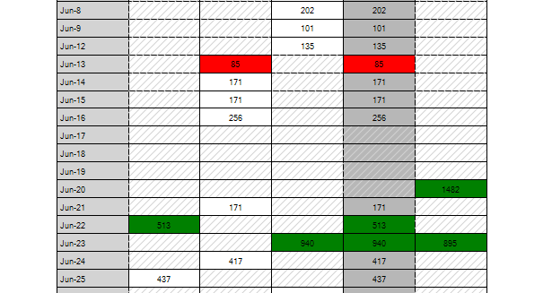

# Events and Customization

RadPivotGrid exposes two events which you can use to format the appearance and add custom painting to your printed cells: the __PrintElementFormatting__ and the __PrintElementPaint__ events. The following sample demonstrates how you can mark in __red__ the cells with value that is less than __100__ and in __green__ the cells with value greater than __500__. Additionally, the cells that __do not contain any value are grayed out with a hatch brush__.

{{source=..\SamplesCS\PivotGrid\PivotGridPrinting.cs region=Formatting}} 
{{source=..\SamplesVB\PivotGrid\PivotGridPrinting.vb region=Formatting}} 

````C#
        private void radPivotGrid1_PrintElementFormatting(object sender, Telerik.WinControls.UI.PrintElementEventArgs e)
        {
            PivotCellPrintElement cell = e.PrintElement as PivotCellPrintElement;
            if (cell != null && cell.Value != null && (Convert.ToDouble(cell.Value)) < 100)
            {
                cell.BackColor = Color.Red;
            }

            if (cell != null && cell.Value != null && (Convert.ToDouble(cell.Value)) > 500)
            {
                cell.BackColor = Color.Green;
            }
        }

        private void radPivotGrid1_PrintElementPaint(object sender, PrintElementPaintEventArgs e)
        {
            PivotCellPrintElement cell = e.PrintElement as PivotCellPrintElement;
            if (cell != null && cell.Value == null)
            {
                Brush b = new HatchBrush(HatchStyle.BackwardDiagonal, Color.LightGray, Color.Transparent);
                e.Graphics.FillRectangle(b, e.Bounds);
            }
        }
````
````VB.NET
    Private Sub radPivotGrid1_PrintElementFormatting(sender As Object, e As Telerik.WinControls.UI.PrintElementEventArgs)
        Dim cell As PivotCellPrintElement = TryCast(e.PrintElement, PivotCellPrintElement)
        If cell IsNot Nothing AndAlso cell.Value IsNot Nothing AndAlso (Convert.ToDouble(cell.Value)) < 100 Then
            cell.BackColor = Color.Red
        End If

        If cell IsNot Nothing AndAlso cell.Value IsNot Nothing AndAlso (Convert.ToDouble(cell.Value)) > 500 Then
            cell.BackColor = Color.Green
        End If
    End Sub

    Private Sub radPivotGrid1_PrintElementPaint(sender As Object, e As PrintElementPaintEventArgs)
        Dim cell As PivotCellPrintElement = TryCast(e.PrintElement, PivotCellPrintElement)
        If cell IsNot Nothing AndAlso cell.Value Is Nothing Then
            Dim b As Brush = New HatchBrush(HatchStyle.BackwardDiagonal, Color.LightGray, Color.Transparent)
            e.Graphics.FillRectangle(b, e.Bounds)
        End If
    End Sub
````

{{endregion}} 

Here is how the result of the above code would look like:<br>
