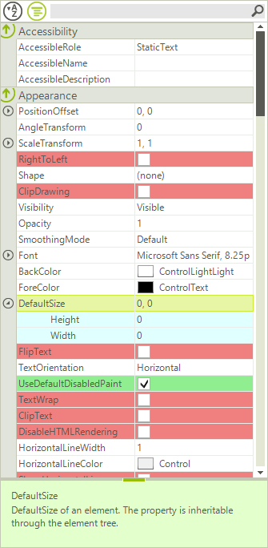

# Customization

Customizing the appearance of the items in RadPropertyGrid is controlled by a number of properties and the __ItemFormatting__ event. The properties that you can use to customize the item appearance are:

* __ItemHeight__: Sets the height of the items.

* __ItemSpacing__: Sets the distance between the items in the control.

* __ItemIndent__: Increases the indent before the items. Valid for all levels.

>caution Since the control uses data virtualization (just like **RadGridView** and **RadListControl**) and you should always reset the values of the customized properties, in order to to prevent applying the formatting to other items (because of the item reuse).
>

>caption Figure 1: Customizing Items



Here is an example on how you can change the back color of the subitems and also to change the colors of the items with values *True* and *False*:

#### Customizing Items

{{source=..\SamplesCS\PropertyGrid\PropertyGridCustomization.cs region=itemFormatting}} 
{{source=..\SamplesVB\PropertyGrid\PropertyGridCustomization.vb region=itemFormatting}} 

````C#
void radPropertyGrid1_ItemFormatting(object sender, PropertyGridItemFormattingEventArgs e)
{
    //set the back color of all child items to yellow
    if (e.Item.Level > 0)
    {
        e.VisualElement.BackColor = Color.LightCyan;
    }
    else
    {
        e.VisualElement.ResetValue(LightVisualElement.BackColorProperty, Telerik.WinControls.ValueResetFlags.Local);
    }
    //set the back color of items with value True to LightGreen and with value equal to False to Red
    PropertyGridItem item = e.Item as PropertyGridItem;
    if (item != null && item.Value != null)
    {
        if (item.Value.ToString() == "True")
        {
            e.VisualElement.BackColor = Color.LightGreen;
        }
        else if (item.Value.ToString() == "False")
        {
            e.VisualElement.BackColor = Color.LightCoral;
        }
    }
    else
    {
        e.VisualElement.ResetValue(LightVisualElement.BackColorProperty, Telerik.WinControls.ValueResetFlags.Local);
    }
}

````
````VB.NET
Private Sub radPropertyGrid1_ItemFormatting(ByVal sender As Object, ByVal e As PropertyGridItemFormattingEventArgs)
    'set the back color of all child items to yellow
    If e.Item.Level > 0 Then
        e.VisualElement.BackColor = Color.LightCyan
    Else
        e.VisualElement.ResetValue(LightVisualElement.BackColorProperty, Telerik.WinControls.ValueResetFlags.Local)
    End If
    'set the back color of items with value True to LightGreen and with value equal to False to Red
    Dim item As PropertyGridItem = TryCast(e.Item, PropertyGridItem)
    If item IsNot Nothing AndAlso item.Value IsNot Nothing Then
        If item.Value.ToString() = "True" Then
            e.VisualElement.BackColor = Color.LightGreen
        ElseIf item.Value.ToString() = "False" Then
            e.VisualElement.BackColor = Color.LightCoral
        End If
    Else
        e.VisualElement.ResetValue(LightVisualElement.BackColorProperty, Telerik.WinControls.ValueResetFlags.Local)
    End If
End Sub

````

{{endregion}} 

# See Also

* [Structure]()
