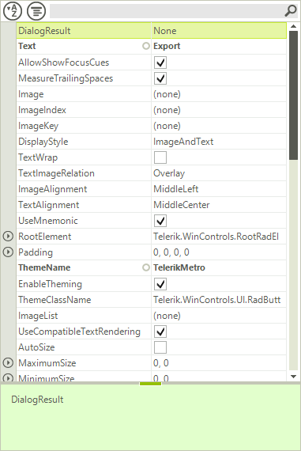
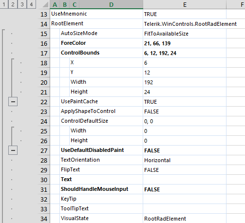
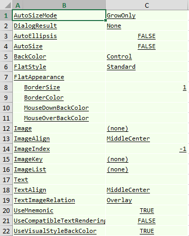
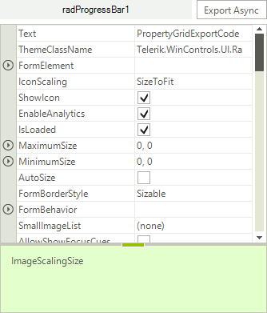

# Spread Export

__PropertyGridSpreadExport__ utilizes our [RadSpreadProcessing](http://docs.telerik.com/devtools/document-processing/libraries/radspreadprocessing/overview) libraries to export the contents of __RadPropertyGrid__ to *xlsx, csv, pdf* and *txt* formats. This article will explain in detail the SpreadExport abilities and will demonstrate how you can use it.

* [Exporting Data](#exporting-data)

* [Async Spread Export](#async-spread-export)

Here is how the following __RadPropertyGrid__, looks when it is exported.
      
>caption Figure 1: Before and after export

<br>

>note The spread export functionality is located in the __TelerikExport.dll__ assembly. You need to include the following namespace in order to access the types contained in TelerikExport:
* Telerik.WinControls.TelerikExport
>

>important Since this functionality is using the [RadSpreadProcessingLibrary](http://docs.telerik.com/devtools/document-processing/libraries/radspreadprocessing/overview) you need to reference the following assemblies as well:
* Telerik.Windows.Documents.Core
* Telerik.Windows.Documents.Fixed
* Telerik.Windows.Documents.Spreadsheet
* Telerik.Windows.Documents.Spreadsheet.FormatProviders.OpenXml
* Telerik.Windows.Documents.Spreadsheet.FormatProviders.Pdf
* Telerik.Windows.Maths
* Telerik.Windows.Zip
>


## Exporting Data

To use the spread export functionality, an instance of the __PropertyGridSpreadExport__ object should be created, passing as parameter the __RadPropertyGrid__ instance to export. Afterwards, the __RunExport__ method will trigger the export process. The latter method accepts as parameter the filename of the file to be exported.

You should pass an instance of a [SpreadExportRenderer]() to the export method as well.

{{source=..\SamplesCS\PropertyGrid\PropertyGridExportCode.cs region=Export}} 
{{source=..\SamplesVB\PropertyGrid\PropertyGridExportCode.vb region=Export}} 

````C#
PropertyGridSpreadExport exporter = new PropertyGridSpreadExport(this.radPropertyGrid1);
SpreadExportRenderer renderer = new SpreadExportRenderer();
exporter.RunExport(@"C:\ExportedFile.xlsx", renderer);

````
````VB.NET
Dim exporter As New PropertyGridSpreadExport(Me.radPropertyGrid1)
Dim renderer As New SpreadExportRenderer()
exporter.RunExport("C:\ExportedFile.xlsx", renderer)

````

{{endregion}}

The __RunExport__ method has several overloads allowing the user to export using a stream as well:

####  Running export synchronously using a stream

{{source=..\SamplesCS\PropertyGrid\PropertyGridExportCode.cs region=StreamRunExport}} 
{{source=..\SamplesVB\PropertyGrid\PropertyGridExportCode.vb region=StreamRunExport}} 

````C#
string exportFile = @"..\..\exportedData.xlsx";
using (System.IO.MemoryStream ms = new System.IO.MemoryStream())
{
    Telerik.WinControls.Export.PropertyGridSpreadExport spreadExporter = new Telerik.WinControls.Export.PropertyGridSpreadExport(this.radPropertyGrid1);
    Telerik.WinControls.Export.SpreadExportRenderer spreadRenderer = new Telerik.WinControls.Export.SpreadExportRenderer();
    spreadExporter.RunExport(ms, spreadRenderer);
    using (System.IO.FileStream fileStream = new System.IO.FileStream(exportFile, FileMode.Create, FileAccess.Write))
    {
        ms.WriteTo(fileStream);
    }
}

````
````VB.NET
Dim exportFile As String = "..\..\exportedData.xlsx"
Using ms As New System.IO.MemoryStream()
    Dim spreadExporter As New Telerik.WinControls.Export.PropertyGridSpreadExport(Me.radPropertyGrid1)
    Dim spreadRenderer As New Telerik.WinControls.Export.SpreadExportRenderer()
    spreadExporter.RunExport(ms, spreadRenderer)
    Using fileStream As New System.IO.FileStream(exportFile, FileMode.Create, FileAccess.Write)
        ms.WriteTo(fileStream)
    End Using
End Using

````

{{endregion}} 


## Properties

* __ExportFormat__: Defines the format the TreeView will be exported to. The available values are __Xslx, Pdf, Csv, Txt__. The default value of the property is __Xslx__, hence if not other specified, the exporter will export to __Xslx__.

* __ExportVisualSettings__: Allows you to export the visual settings (themes) to the exported file. RadPropertyGrid will also export all formatting to the Excel file.

* __SheetMaxRows__: Тhe exporter splits the data on separate sheets if the number of rows is greater than the Excel maximum. You can control the maximum number of rows through this __SheetMaxRows__  property. Available options are:

  * __1048576__: Max rows for Excel 2007 and above

  * __65536 (default)__: Max rows for previous versions of Excel. This is the default setting.

* __SheetName__: Defines the sheet name of the sheet to export to. If your data is large enough to be split on more than one sheets, then the export method adds index to the names of the next sheets.

* __FileExportMode__: This property determines whether the data will be exported into an existing or a new file. If new is chosen and such exists it will be overridden. Available options are:

  * __NewSheetInExistingFile__: This option will create a new sheet in an already existing file.

  * __CreateOrOverrideFile__: Creates new or overrides an existing file. __ExportChildItemsGrouped:__ Gets or sets a value indicating whether to export child items grouped.

* __ExportDescriptions:__ Gets or sets a value indicating whether to export item descriptions.

* __ItemIndent:__ Gets or sets the indent of child items.

* __CollapsedItemOption:__ Gets or sets a value indicating how children of collapsed items are exported.

## Events

* __CellFormatting__: This event is used to format the cells to be exported. The event arguments provide:

  * __Item__: Gives you access to the currently exported item.

  * __ExportCell__: Allows you to set the styles of the exported cell.

  * __RowIndex__: The index of the currently exported row. Here is an example of formatting the exported TreeView:

{{source=..\SamplesCS\PropertyGrid\PropertyGridExportCode.cs region=Formatting}} 
{{source=..\SamplesVB\PropertyGrid\PropertyGridExportCode.vb region=Formatting}} 

````C#
void exporter_CellFormatting(object sender, PropertyGridSpreadExportCellFormattingEventArgs e)
{
    e.ExportCell.BackColor = ColorTranslator.FromHtml("#F4FFEC");
    e.ExportCell.Font = new Font("Consolas", 10, FontStyle.Underline);
}

````
````VB.NET
Private Sub exporter_CellFormatting(ByVal sender As Object, ByVal e As PropertyGridSpreadExportCellFormattingEventArgs)
    e.ExportCell.BackColor = ColorTranslator.FromHtml("#F4FFEC")
    e.ExportCell.Font = New Font("Consolas", 10, FontStyle.Underline)
End Sub

````

{{endregion}} 

>caption Figure 2: Export using formating



* __ExportCompleted__: This event is triggered when the export operation completes.

## Async Spread Export

__RadPropertyGrid__ provides functionality for asynchronous spread export. This feature can be utilized by calling the __RunExportAsync__ method on the __PropertyGridSpreadExport__ object.

>caution If the __ExportVisualSettings__ property is set to *true* the UI can be freezed at some point.
This is expected since exporting the visual settings requires creating visual elements for all items and updating the exported control UI.
>

The following example will demonstrate how the async spread export feature can be combined with a __RadProgressBar__ control to deliver better user experience.
        
>caption Fig.3 Exporting Data Asynchronously



1\. The following code shows how you can subscribe to the notification events and start the async export operation.

{{source=..\SamplesCS\PropertyGrid\PropertyGridExportCode.cs region=AsyncExport}} 
{{source=..\SamplesVB\PropertyGrid\PropertyGridExportCode.vb region=AsyncExport}} 

````C#
private void btnExportAsync_Click(object sender, EventArgs e)
{
    PropertyGridSpreadExport spreadExporter = new PropertyGridSpreadExport(this.radPropertyGrid1);
    spreadExporter.AsyncExportProgressChanged += spreadExporter_AsyncExportProgressChanged;
    spreadExporter.AsyncExportCompleted += spreadExporter_AsyncExportCompleted;
    SpreadExportRenderer exportRenderer = new SpreadExportRenderer();
    spreadExporter.RunExportAsync(@"..\..\ExportedFile.xlsx", exportRenderer);
}

````
````VB.NET
Private Sub btnExportAsync_Click(ByVal sender As Object, ByVal e As EventArgs)
    Dim spreadExporter As New PropertyGridSpreadExport(Me.radPropertyGrid1)
    AddHandler spreadExporter.AsyncExportProgressChanged, AddressOf spreadExporter_AsyncExportProgressChanged
    AddHandler spreadExporter.AsyncExportCompleted, AddressOf spreadExporter_AsyncExportCompleted
    Dim exportRenderer As New SpreadExportRenderer()
    spreadExporter.RunExportAsync("..\..\ExportedFile.xlsx", exportRenderer)
End Sub

````

{{endregion}}

2\. Handle the notification events and report progress.

{{source=..\SamplesCS\PropertyGrid\PropertyGridExportCode.cs region=ReportProgress}} 
{{source=..\SamplesVB\PropertyGrid\PropertyGridExportCode.vb region=ReportProgress}} 

````C#
private void spreadExporter_AsyncExportProgressChanged(object sender, ProgressChangedEventArgs e)
{
    this.radProgressBar1.Value1 = e.ProgressPercentage;
}
private void spreadExporter_AsyncExportCompleted(object sender, AsyncCompletedEventArgs e)
{
    RadMessageBox.Show("Async Spread Export Completed!");
    this.radProgressBar1.Value1 = 0;
}

````
````VB.NET
Private Sub spreadExporter_AsyncExportProgressChanged(ByVal sender As Object, ByVal e As ProgressChangedEventArgs)
    Me.radProgressBar1.Value1 = e.ProgressPercentage
End Sub
Private Sub spreadExporter_AsyncExportCompleted(ByVal sender As Object, ByVal e As AsyncCompletedEventArgs)
    RadMessageBox.Show("Async Spread Export Completed!")
    Me.radProgressBar1.Value1 = 0
End Sub

````

{{endregion}}

The __RunExportAsync__ method has several overloads allowing the user to export using a stream as well:

####  Running export asynchronously using a stream

{{source=..\SamplesCS\PropertyGrid\PropertyGridExportCode.cs region=StreamRunExportAsync}} 
{{source=..\SamplesVB\PropertyGrid\PropertyGridExportCode.vb region=StreamRunExportAsync}} 

````C#
private void buttonRunExportAsync_Click(object sender, EventArgs e)
{
    System.IO.MemoryStream ms = new System.IO.MemoryStream();
    Telerik.WinControls.Export.PropertyGridSpreadExport spreadExporter = new Telerik.WinControls.Export.PropertyGridSpreadExport(this.radPropertyGrid1);
    Telerik.WinControls.Export.SpreadExportRenderer spreadRenderer = new Telerik.WinControls.Export.SpreadExportRenderer();
    spreadExporter.AsyncExportCompleted += exporter_AsyncExportCompleted;
    spreadExporter.RunExportAsync(ms, spreadRenderer);
}
private void exporter_AsyncExportCompleted(object sender, AsyncCompletedEventArgs e)
{
    RunWorkerCompletedEventArgs args = e as RunWorkerCompletedEventArgs;
    string exportFile = @"..\..\exportedAsyncData.xlsx";
    using (System.IO.FileStream fileStream = new System.IO.FileStream(exportFile, FileMode.Create, FileAccess.Write))
    {
        MemoryStream ms = args.Result as MemoryStream;
        ms.WriteTo(fileStream);
        ms.Close();
    }
}

````
````VB.NET
Private Sub buttonRunExportAsync_Click(sender As Object, e As EventArgs)
    Dim ms As New System.IO.MemoryStream()
    Dim spreadExporter As New Telerik.WinControls.Export.PropertyGridSpreadExport(Me.radPropertyGrid1)
    Dim spreadRenderer As New Telerik.WinControls.Export.SpreadExportRenderer()
    AddHandler spreadExporter.AsyncExportCompleted, AddressOf exporter_AsyncExportCompleted
    spreadExporter.RunExportAsync(ms, spreadRenderer)
End Sub
Private Sub exporter_AsyncExportCompleted(sender As Object, e As AsyncCompletedEventArgs)
    Dim args As RunWorkerCompletedEventArgs = TryCast(e, RunWorkerCompletedEventArgs)
    Dim exportFile As String = "..\..\exportedAsyncData.xlsx"
    Using fileStream As New System.IO.FileStream(exportFile, FileMode.Create, FileAccess.Write)
        Dim ms As MemoryStream = TryCast(args.Result, MemoryStream)
        ms.WriteTo(fileStream)
        ms.Close()
    End Using
End Sub

````

{{endregion}} 

## Async Export Methods and Events

__Methods__

The following methods of the __TreeViewSpreadExport__ class are responsible for exporting the data.

* __RunExportAsync__: Starts an export operation which runs in a background thread.

* __CancelExportAsync__: Cancels an export operation.

__Events__

The following events provide information about the state of the export operation.

* __AsyncExportProgressChanged__: Occurs when the progress of an asynchronous export operation changes.

* __AsyncExportCompleted__: Occurs when an async export operation is completed.