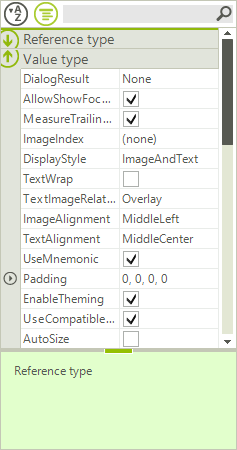

# Custom Grouping

Custom grouping is a flexible mechanism for creating RadPropertyGrid groups by using custom logic. It has a higher
      	priority than the applied __GroupDescriptors__. Grouping is applied if user grouping is enabled through the 
      	__RadPropertyGrid.EnableGrouping__ or __PropertyGridElement.EnableGrouping__ properties.
      	By default, grouping is enabled.
      

You can use the __ItemFormatting__ event to format the group text of the created custom groups.

## Using the CustomGrouping event

The __CustomGrouping__ event is fired if custom grouping is enabled through the 
        	__RadPropertyGrid.EnableCustomGrouping__or __PropertyGridElement.EnableCustomGrouping__
        	properties. By default, custom grouping is disabled.
        

* __PropertyGridTable__ – the table while holds the items that will be grouped

* __Item__ – the item which group is defined

* __GroupKey__ – identifier of the group

* __Handled__ – defines whether the item is processed by the custom algorithm or by the applied group descriptors.

The following example demonstrates how to handle the __CustomGrouping__ event to group the RadPropertyGrid items by the type of the property:

#### __[C#] Custom grouping__

{{source=..\SamplesCS\PropertyGrid\Features\PropertyGridCustomGrouping.cs region=CustomGrouping}}
	        public PropertyGridCustomGrouping()
	        {
	            InitializeComponent();
	
	            radPropertyGrid1.SelectedObject = new RadButton();
	            radPropertyGrid1.ToolbarVisible = true;
	
	            this.radPropertyGrid1.EnableCustomGrouping = true;
	            this.radPropertyGrid1.CustomGrouping += new PropertyGridCustomGroupingEventHandler(radPropertyGrid1_CustomGrouping);
	            radPropertyGrid1.ItemFormatting += new PropertyGridItemFormattingEventHandler(radPropertyGrid1_ItemFormatting);
	
	            GroupDescriptor descriptor = new GroupDescriptor("PropertyType");
	            this.radPropertyGrid1.GroupDescriptors.Add(descriptor);
	
	        }
	
	        void radPropertyGrid1_ItemFormatting(object sender, PropertyGridItemFormattingEventArgs e)
	        {
	            PropertyGridGroupItem groupItem = e.Item as PropertyGridGroupItem;
	            if (groupItem != null)
	            {
	                e.Item.Label = groupItem.Group.Key.ToString();
	            }
	        }
	
	        private void radPropertyGrid1_CustomGrouping(object sender, PropertyGridCustomGroupingEventArgs e)
	        {
	            Type propertyType = e.Item.PropertyType;
	
	            if (propertyType.IsClass)
	            {
	                e.GroupKey = "Reference type";
	            }
	            else
	            {
	                e.GroupKey = "Value type";
	            }
	        }
	{{endregion}}

#### __[VB.NET] Custom grouping__

{{source=..\SamplesVB\PropertyGrid\Features\PropertyGridCustomGrouping.vb region=CustomGrouping}}
	    Public Sub New()
	        InitializeComponent()
	
	        RadPropertyGrid1.SelectedObject = New RadButton()
	        RadPropertyGrid1.ToolbarVisible = True
	
	        Me.RadPropertyGrid1.EnableCustomGrouping = True
	
	        Dim descriptor As New GroupDescriptor("PropertyType")
	        Me.RadPropertyGrid1.GroupDescriptors.Add(descriptor)
	
	
	    End Sub
	
	    Private Sub RadPropertyGrid1_CustomGrouping(ByVal sender As Object, ByVal e As Telerik.WinControls.UI.PropertyGridCustomGroupingEventArgs) Handles RadPropertyGrid1.CustomGrouping
	        Dim propertyType As Type = e.Item.PropertyType
	
	        If propertyType.IsClass Then
	            e.GroupKey = "Reference type"
	        Else
	            e.GroupKey = "Value type"
	        End If
	
	    End Sub
	
	    Private Sub RadPropertyGrid1_ItemFormatting(ByVal sender As Object, ByVal e As Telerik.WinControls.UI.PropertyGridItemFormattingEventArgs) Handles RadPropertyGrid1.ItemFormatting
	        Dim groupItem As PropertyGridGroupItem = TryCast(e.Item, PropertyGridGroupItem)
	        If groupItem IsNot Nothing Then
	            e.Item.Label = groupItem.Group.Key.ToString()
	        End If
	    End Sub
	{{endregion}}

