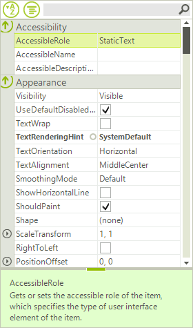
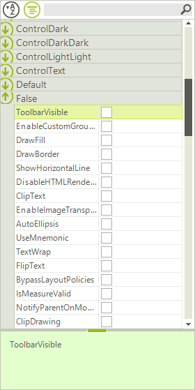

# Grouping


## 

RadPropertyGrid allow you to group the displayed items in two ways. The first one is the predefined grouping capability,
        	which groups the properties according to their __Category__ attribute and the second one is by programatically 
        	defining __GroupDescriptors__.
        

The predefined grouping can be called by the end user by clicking the group button in the tool bar,
        	or programmatically by setting the __PropertySort__ property to __Categorized__
        	or __CategorizedAlphabetical__. There are few possibilities here:
        	

* __PropertySort = Categorized__ – groups the properties according to their __Category__
        			attribute and shows them in the order they are enlisted in the object.

* __PropertySort = CategorizedAlphabetical__ - groups the properties according to their 
    	    		__Category__ attribute and shows them in alphabetical order.

Additionally, you can tune the sort order by setting the __SortOrder__ property.
        	Here is an example of descending alphabetical category sorting:
        #_[C#] Setting default groups_

	


{{source=..\SamplesCS\PropertyGrid\Features\PropertyGridGrouping.cs region=PropertySort}} 
{{source=..\SamplesVB\PropertyGrid\Features\PropertyGridGrouping.vb region=PropertySort}} 

````C#
            radPropertyGrid1.PropertySort = PropertySort.CategorizedAlphabetical;
            radPropertyGrid1.SortOrder = SortOrder.Descending;
````
````VB.NET
        RadPropertyGrid1.PropertySort = PropertySort.CategorizedAlphabetical
        RadPropertyGrid1.SortOrder = SortOrder.Descending
        '
````

{{endregion}} 




To add your own groups programatically, make sure that the __EnableGrouping__ property is set to 
        	*true* and add the desired __GroupDescriptor__ to the 
        	__GroupDescriptors__ collection of the control.
        

You can group by the following criteria’s: 

* __Name__ - the property name.

* __Value__ - the property value.

* __Category__ - assigned from the __Category__ attrubute name.

* __FormattedValue__ - the value of the property converted to string.

* __Label__ - by default this is identical to the property name, unless
        				changed by setting the __Label__ property of the item.

* __Description__ - this is determined by the property __Description__ attribute/

* __OriginalValue__ - the value used when the property is initialized.

Here is an example of grouping by the formatted value:#_[C#] Adding a group descriptor_

	


{{source=..\SamplesCS\PropertyGrid\Features\PropertyGridGrouping.cs region=GroupDescriptor}} 
{{source=..\SamplesVB\PropertyGrid\Features\PropertyGridGrouping.vb region=GroupDescriptor}} 

````C#
            radPropertyGrid1.EnableGrouping = true;
            GroupDescriptor group = new GroupDescriptor(new SortDescriptor[] { new SortDescriptor("FormattedValue", ListSortDirection.Ascending) });
            radPropertyGrid1.GroupDescriptors.Add(group);
````
````VB.NET
        RadPropertyGrid1.EnableGrouping = True
        Dim group = New GroupDescriptor(New SortDescriptor() {New SortDescriptor("FormattedValue", ListSortDirection.Ascending)})
        RadPropertyGrid1.GroupDescriptors.Add(group)
        '
````

{{endregion}} 



