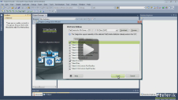
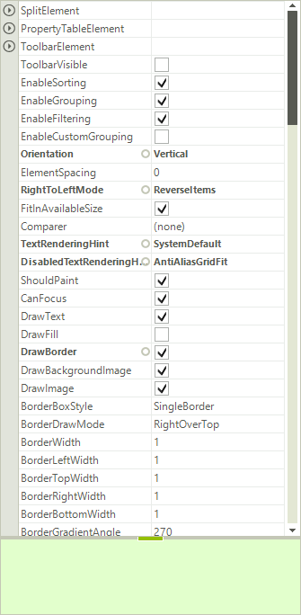
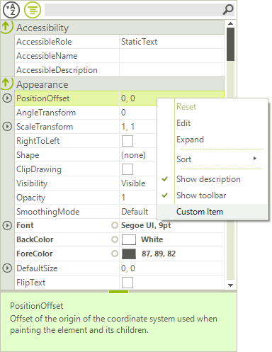
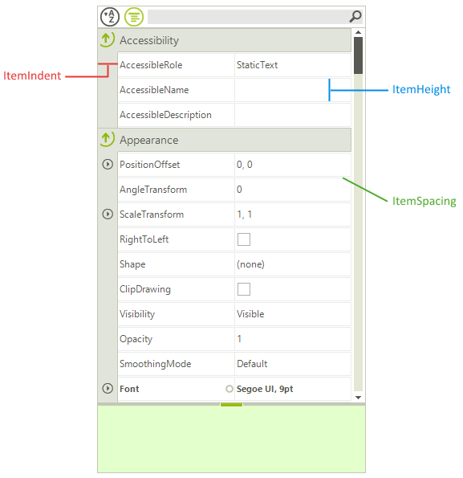

# Getting Started

## 
<table><tr><td>RELATED VIDEOS</td><td></td></tr><tr><td>

[ Getting started with RadPropertyGrid ](http://tv.telerik.com/watch/winforms/getting-started-with-teleriks-radpropertygrid)</td><td>

RadPropertyGrid provides an easy and versatile approach to processing data objects' 
		          properties. Utilizing its autogeneration features and the intuitive custom editors 
		          capabilities, users would be able either to display data in a way that best fits their 
		          needs or modify it with minimal effort. RadPropertyGrid can be bound to an item with 
		          just a single line of code and you may start exploring or editing its properties.
		          The property editor controls are auto generated - text fields for string properties,
		          DateTimePickers for dates, ComboBoxes for enums and Booleans, RadColorPicker for colors. 
		          In addition, RadPropertyGrid allows flexible manual settings and customization of editors. 
		          RadPropertyGrid also supports scrolling operations via touch interface.
                </td></tr></table>

The following example will demonstrate the basic functionalities of RadPropertyGrid control.
          Let’s start with adding RadPropertyGrid control to a RadForm. In the code behind we will set the
          __SelectedObject__ property of the control to an object, which properties we
          want to display. For the sake of this example we will use the element of the control – __PropertyGridElement__.
        

#### __[C#] Setting the SelectedObject of RadPropertyGrid__

{{source=..\SamplesCS\PropertyGrid\PropertyGridGettingStarted.cs region=SelectedObject}}
	            radPropertyGrid1.SelectedObject = new PropertyGridElement();
	{{endregion}}

#### __[VB.NET] Setting the SelectedObject of RadPropertyGrid__

{{source=..\SamplesVB\PropertyGrid\PropertyGridGettingStarted.vb region=SelectedObject}}
	        RadPropertyGrid1.SelectedObject = New PropertyGridElement()
	{{endregion}}

It is all set and RadProperyGrid reads all public properties of the given object and displays them:
        

Now, let’s customize the example a bit and take advantage of some of its features. As you can see in the image above,
          on the bottom of the control a help section is displayed. This section reads the name and the content of the
          __Description__ attribute of the selected property. The section visibility is controlled by
          the __HelpVisible__ property and it is turned on by default.
        

Next, we will add a predefined toolbox on the top of the control. This toolbox contains of two buttons –
          for alphabetical sorting and for grouping the items (grups are created by reading the __Category__
          attribute of the __SelectedObject__ properties) – and also a text box used for filtering
          the property grid. All this functionality comes out of the box by simply setting the __ToolBarVisible__
          property to *true*:
        

#### __[C#] Showing the tool box on the top of RadPropertyGrid__

{{source=..\SamplesCS\PropertyGrid\PropertyGridGettingStarted.cs region=ToolBarVisible}}
	            radPropertyGrid1.ToolbarVisible = true;
	{{endregion}}

#### __[VB.NET] Showing the tool box on the top of RadPropertyGrid__

{{source=..\SamplesVB\PropertyGrid\PropertyGridGettingStarted.vb region=ToolBarVisible}}
	        RadPropertyGrid1.ToolbarVisible = True
	{{endregion}}

Additionally, since the toolbox consists of a __StackLayoutPanel__, is supports adding additional elements.
          Here is how to add a button that clears the filter text box:
        

#### __[C#] Add element to toolbox__

{{source=..\SamplesCS\PropertyGrid\PropertyGridGettingStarted.cs region=AddElementToToolbox1}}
	            RadButtonElement clearFiltering = new RadButtonElement();
	            clearFiltering.Text = "Clear";
	            clearFiltering.MinSize = new System.Drawing.Size(25, 22);
	            clearFiltering.StretchHorizontally = false;
	            clearFiltering.Click += new EventHandler(clearFiltering_Click);
	{{endregion}}

#### __[C#] Clear the filter__

{{source=..\SamplesCS\PropertyGrid\PropertyGridGettingStarted.cs region=AddElementToToolbox2}}
	        void clearFiltering_Click(object sender, EventArgs e)
	        {
	            radPropertyGrid1.PropertyGridElement.ToolbarElement.SearchTextBoxElement.Text = "";
	        }
	{{endregion}}

#### __[VB.NET] Add element to toolbox__

{{source=..\SamplesVB\PropertyGrid\PropertyGridGettingStarted.vb region=AddElementToToolbox1}}
	        Dim clearFiltering = New RadButtonElement()
	        clearFiltering.Text = "Clear"
	        clearFiltering.MinSize = New System.Drawing.Size(25, 22)
	        clearFiltering.StretchHorizontally = False
	        AddHandler clearFiltering.Click, AddressOf clearFiltering_Click
	{{endregion}}

#### __[VB.NET] Clear the filter__

{{source=..\SamplesVB\PropertyGrid\PropertyGridGettingStarted.vb region=AddElementToToolbox2}}
	    Private Sub clearFiltering_Click(ByVal sender As Object, ByVal e As EventArgs)
	        RadPropertyGrid1.PropertyGridElement.ToolbarElement.SearchTextBoxElement.Text = ""
	    End Sub
	{{endregion}}

By default, opening the editor for editing is done by double clicking the editor. This behavior can be easily changed
          by selecting one of the predefined options of the __BeginEditMode__ property. The options to choose
          from are follows:
        

* __BeginEditOnClick__ – the editor is opened on the first click

* __BeginEditOnDoubleClick__ – the editor is opened on double click

* __BeginEditoProgramatically__ – the editor can be opened only programmatically (by calling BeginEdit() method)

#### __[C#] Selecting the begin edit mode__

{{source=..\SamplesCS\PropertyGrid\PropertyGridGettingStarted.cs region=BeginEditMode}}
	            radPropertyGrid1.BeginEditMode = RadPropertyGridBeginEditModes.BeginEditOnClick;
	{{endregion}}

#### __[VB.NET] Selecting the begin edit mode__

{{source=..\SamplesVB\PropertyGrid\PropertyGridGettingStarted.vb region=BeginEditMode}}
	        RadPropertyGrid1.BeginEditMode = RadPropertyGridBeginEditModes.BeginEditOnClick
	{{endregion}}

To set the default sorting or grouping of the properties, just set the __PropertySort__ property,
          to one of the enumerated values: 

* __Alphabetical__ – sorts the properties according to the __SortOrder__ setting
              (*Ascending* or *Descending*)

* __Categorized__– groups the properties according to their __Category__ attribute

* __CategorizedAlphabetical__– groups the properties according to their __Category__
              attribute and sorts them Alphabetically, according to the __SortOrder__ setting
              (*Ascending* or *Descending*)

* __None__ – removes sorting and grouping

#### __[C#] Group by categories__

{{source=..\SamplesCS\PropertyGrid\PropertyGridGettingStarted.cs region=PropertySort}}
	            radPropertyGrid1.PropertySort = PropertySort.Categorized;
	{{endregion}}

#### __[VB.NET] Group by categories__

{{source=..\SamplesVB\PropertyGrid\PropertyGridGettingStarted.vb region=PropertySort}}
	        RadPropertyGrid1.PropertySort = PropertySort.Categorized
	{{endregion}}

You can control the sort order, by setting the __SortOrder__ property of the control.
          Possible values are *Ascending*, *Descending* and *None*:
        

#### __[C#] Setting the sort order__

{{source=..\SamplesCS\PropertyGrid\PropertyGridGettingStarted.cs region=SortOrder}}
	            radPropertyGrid1.SortOrder = SortOrder.Ascending;
	{{endregion}}

#### __[VB.NET] Setting the sort order__

{{source=..\SamplesVB\PropertyGrid\PropertyGridGettingStarted.vb region=SortOrder}}
	        RadPropertyGrid1.SortOrder = SortOrder.Ascending
	{{endregion}}

There are also four properties that allow you to control the expand/collapse image of the control. These are as follows:
          __CollapseImage__, __ExpandImage__, __HoveredCollapseImage__
          and __HoveredExpandImage__.
        

The selection of the items is controlled by either setting a certain item to the __SelectedGridItem__
          property, or by calling the __Select()__ method of an item.
        

Accessing and modifying the default context menu, can be achieved by accessing the __RadContextMenu__ property
          of the control. For more information on how to work with menu items, please refer to our
          [Menu]() section.
        

There are a few properties that you can set in order to change the item appearance:  

* __ItemHeight__ - sets the visible items height.

* __ItemSpacing__ - sets the spacing between the items.

* __ItemIndent__ - sets the indent space in the beginning of the items.

At the end, if you want to expand all groups automatically, you can set the __AutoExpandGroups__ to
          *true* (which is also the default setting).
        
