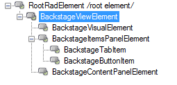

# Customization

The appearance of the BackstageView can be customized by using one of the predefined themes: Control Default, Office2010Blue, Office2010Black, Office2010Silver themes, modifying one of them in the Visual Style Builder, or creating a custom one by using the [Visual Style Builder](). Additionally, appearance modifications can be introduced through code.

The following image demonstrates the Backstage view Element tree, which can help you to access the desired elements.  

* __BackstageViewElement__ - main control element, which contains the UI and the logic of the control

* __BackstageVisualElement__ - top border of the BackstageViewElement.

* __BackstageItemsPanelElement__ - the left panel (by default) which contains the BackstageTabItems, 
        BackstageButtonItems or other RadItems

* __BackstageTabItems__ - the visual element that represents the tab in the ItemsPanel

* __BackstageButtonItems__ - the visual element that represents the button in the ItemsPanel

* __BackstageContentPanelElement__ - the visual element representing the area where the pages are rendered

Follows code snippet demonstrates how you can access the most used items in the control:

#### Accessing BackstageView elements

{{source=..\SamplesCS\RibbonBar\BackstageView\RibbonBackstageView.cs region=accessElements}} 
{{source=..\SamplesVB\RibbonBar\BackstageView\RibbonBackstageView.vb region=accessElements}} 

````C#
BackstageViewElement backstageViewElemet = radRibbonBarBackstageView1.BackstageElement;
            
BackstageItemsPanelElement itemsPanel = backstageViewElemet.ItemsPanelElement;
BackstageContentPanelElement contentPanel = backstageViewElemet.ContentElement;

````
````VB.NET
Dim backstageViewElemet = CType(RadRibbonBarBackstageView1.BackstageElement, BackstageViewElement)
Dim itemsPanel = CType(backstageViewElemet.ItemsPanelElement, BackstageItemsPanelElement)
Dim contentPanel = CType(backstageViewElemet.ContentElement, BackstageContentPanelElement)

````

{{endregion}}

By accessing these elements, you can customize BackstageView. Here is an example on how to change the BackgroundImage of the content area:

#### Customizing the content area

{{source=..\SamplesCS\RibbonBar\BackstageView\RibbonBackstageView.cs region=changeContentAreaImage}} 
{{source=..\SamplesVB\RibbonBar\BackstageView\RibbonBackstageView.vb region=changeContentAreaImage}} 

````C#
RadImageShape imageShape = new RadImageShape();
imageShape.Image = Image.FromFile(@"C:\MyFile.png");
//the next line of code defines how to strech the image (if necessary)
imageShape.Margins = new System.Windows.Forms.Padding(10,10,10,10);
radRibbonBarBackstageView1.BackstageElement.ContentElement.BackgroundShape = imageShape;

````
````VB.NET
Dim imageShape As New RadImageShape()
imageShape.Image = Image.FromFile("C:\MyFile.png")
'the next line of code defines how to strech the image (if necessary)
imageShape.Margins = New System.Windows.Forms.Padding(10, 10, 10, 10)
RadRibbonBarBackstageView1.BackstageElement.ContentElement.BackgroundShape = imageShape

````

{{endregion}}

>note BackstageTabItems, BackstageItemsPanelElement and BackstageContentPanelElement use[RadImageShape]()for most of the predefinied themes.
>