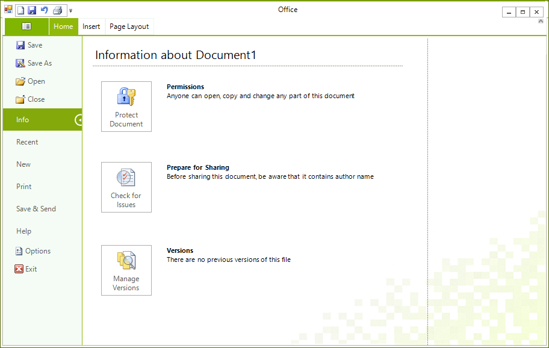
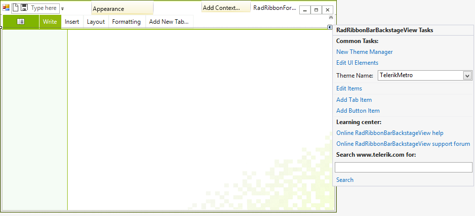
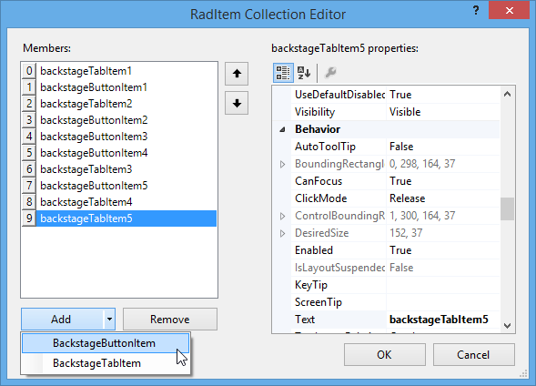
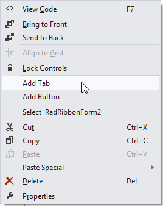

# Working with Backstage View


## 

To enable the Backstage View in RadRibbonBar change the __ApplicationMenuStyle__ property to *BackstageView*.#_[C#] Enabling Backstage view mode_

	


{{source=..\SamplesCS\RibbonBar\BackstageView\RibbonBackstageView.cs region=ApplicationMenuStyle}} 
{{source=..\SamplesVB\RibbonBar\BackstageView\RibbonBackstageView.vb region=ApplicationMenuStyle}} 

````C#
            radRibbonBar1.ApplicationMenuStyle = Telerik.WinControls.UI.ApplicationMenuStyle.BackstageView;
````
````VB.NET
        RadRibbonBar1.ApplicationMenuStyle = Telerik.WinControls.UI.ApplicationMenuStyle.BackstageView
        '
````

{{endregion}} 




## Adding and editing items and controls at design time

You can add two types of items to the BackstageVIew’s left panel at design time: __BackstageButtonItem__ and 
        	__BackstageTabItem__. The __BackstageButtonItem__ serves as a normal button while the 
        	__BackstageTabItem__ has a page associated with it on which you can drag controls from the toolbox.
        

You have three options to add these items to the BackstageView at design time.
        

The first one is by using the __Smart Tag__:



The second one is using the __RadItem Collection Editor__ to edit the Items collection:



The third one is using the context menu:



## Adding and editing items and controls at runtime

You can also add these items as well as any other RadItem to the backstageview’s left panel at runtime via the __Items collection__:
        #_[C#] Adding items programatically_

	


{{source=..\SamplesCS\RibbonBar\BackstageView\RibbonBackstageView.cs region=addingItems}} 
{{source=..\SamplesVB\RibbonBar\BackstageView\RibbonBackstageView.vb region=addingItems}} 

````C#
            radRibbonBarBackstageView1.Items.Add(new BackstageButtonItem("ButtonItem"));
            radRibbonBarBackstageView1.Items.Add(new RadButtonElement("ButtonElement"));
            radRibbonBarBackstageView1.Items.Add(new RadDropDownListElement());
````
````VB.NET
        RadRibbonBarBackstageView1.Items.Add(New BackstageButtonItem("ButtonItem"))
        RadRibbonBarBackstageView1.Items.Add(New RadButtonElement("ButtonElement"))
        RadRibbonBarBackstageView1.Items.Add(New RadDropDownListElement())
        '
````

{{endregion}} 


## Adding controls to the pages

When you add __BackstageTabItem__ to the backstage view’s left panel and select it, on the right side you have a 
      		__BackstageViewPage__ on which you can arrange any type of controls.
        


