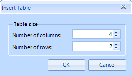

# Tables

The __RadRichTextBox__ is capable of displaying tables. To add a table to the document you can use the provided API.

The tables inside the __RadRichTextBox__ are constructed using the __Table__, __TableRow__ and __TableCell__ classes. The defining of a table is very similar to the one in HTML. The __Table__ class define the table itself and it accepts __TableRow__ objects as children. The __TableRow__ on its hand accepts __TableCell__ objects as children. The __TableCell__ accepts Block elements as children, so to specify its contents of a cell use such one (e.g. a Paragraph) to wrap it.

>note  __Tables__ are block elements.
>

Here is a simple example.

{{source=..\SamplesCS\RichTextBox\Features\Document Elements\RichTextBoxTables.cs region=AddTable}} 
{{source=..\SamplesVB\RichTextBox\Features\Document Elements\RichTextBoxTables.vb region=AddTable}} 

````C#
            Section section = new Section();
            Table table = new Table();

            TableRow row1 = new TableRow();
            TableCell cell1 = new TableCell();
            Paragraph p1 = new Paragraph();
            Span s1 = new Span();
            s1.Text = "Cell 1";
            p1.Inlines.Add(s1);
            cell1.Blocks.Add(p1);
            row1.Cells.Add(cell1);

            TableCell cell2 = new TableCell();
            Paragraph p2 = new Paragraph();
            Span s2 = new Span();
            s2.Text = "Cell 2";
            p2.Inlines.Add(s2);
            cell2.Blocks.Add(p2);
            row1.Cells.Add(cell2);
            table.Rows.Add(row1);

            TableRow row2 = new TableRow();
            TableCell cell3 = new TableCell();
            cell3.ColumnSpan = 2;
            Paragraph p3 = new Paragraph();
            Span s3 = new Span();
            s3.Text = "Cell 3";
            p3.Inlines.Add(s3);
            cell3.Blocks.Add(p3);
            row2.Cells.Add(cell3);
            table.Rows.Add(row2);
            section.Blocks.Add(table);
            this.radRichTextBox1.Document.Sections.Add(section);
````
````VB.NET
        Dim _section As New Section()
        Dim _table As New Table()
        Dim row1 As New TableRow()
        Dim cell1 As New TableCell()
        Dim p1 As New Paragraph()
        Dim s1 As New Span()
        s1.Text = "Cell 1"
        p1.Inlines.Add(s1)
        cell1.Blocks.Add(p1)
        row1.Cells.Add(cell1)
        Dim cell2 As New TableCell()
        Dim p2 As New Paragraph()
        Dim s2 As New Span()
        s2.Text = "Cell 2"
        p2.Inlines.Add(s2)
        cell2.Blocks.Add(p2)
        row1.Cells.Add(cell2)
        _table.Rows.Add(row1)
        Dim row2 As New TableRow()
        Dim cell3 As New TableCell()
        cell3.ColumnSpan = 2
        Dim p3 As New Paragraph()
        Dim s3 As New Span()
        s3.Text = "Cell 3"
        p3.Inlines.Add(s3)
        cell3.Blocks.Add(p3)
        row2.Cells.Add(cell3)
        _table.Rows.Add(row2)
        _section.Blocks.Add(_table)
        Me.RadRichTextBox1.Document.Sections.Add(_section)

        '
````

{{endregion}}


Additionally you can span cells in columns and rows. This is done by using the __RowSpan__ and __ColumnSpan__ properties of the __TableCell__ object. Also you can specify the layout mode for the table via the __LayoutMode__ property. it can have one of the following values:

* __Fixed__ - specifies that the table should have width equal to the value of its __PrefferedWidth__ property.

* __AutoFit__ - specifies that the table should fit into the entire space available. This means that the table will get stretched horizontally.

>tip To learn more about the  __Formatting API__  of the  __RadRichTextBox__ , read [this topic]().

The __RadRichTextBox__ exposes a rich API, which allows you to use various methods to add, modify or delete elements form the __RadDocument__. The methods exposed by the API can be wired to a UI and get executed upon user interaction with this UI. The __RadRichTextBox__ exposes the following methods that regard the creation or deletion of a table:

* __DeleteTable__ - deletes the currently selected table.

* __DeleteTableColumn__ - deletes the currently selected column.

* __DeleteTableRow__ - deletes the currently selected row.

* __InsertTable__ - inserts a table. Allows you to specify the number of rows and columns.

* __InsertTableColumn__ -  inserts a column at the end..

* __InsertTableColumnToTheLeft__ -  inserts a column to the left of the selected one.

* __InsertTableColumnToTheRight__ - inserts a column to the right of the selected one.

* __InsertTableRow__ - inserts a row at the end.

* __InsertTableRowAbove__ - inserts a row above the selected one.

* __InsertTableRowBelow__ - inserts a row below the selected one.

## Creating a Table via the Built-in UI

You can use the __InsertTableDialog__, which comes out of the box. To show it upon a user action just call the __ShowInsertTableDialog()__ method of the __RadRichTextBox__. Here is a snapshot of it.

>note The __RadRichTextBoxUI__ also uses this dialog.
>



## Formatting a Table at Runtime via RadRichTextBox's API

>tip To learn more about the  __Formatting API__  of the  __RadRichTextBox__ , read [this topic]().


The __RadRichTextBox__ exposes a rich API, which allows you to use various methods to add, modify or delete elements form the __RadDocument__. The methods exposed by the API can be wired to a UI and get executed upon user interaction with this UI. The __RadRichTextBox__ exposes the following methods that regard the modifying of a table:

* __ChangeTableBorders__ - modifies the borders of the currently selected table via a __TableBorders__ object.

* __ChangeTableCellBackground__ - sets the color of the currently selected cell's borders.

* __ChangeTableCellBorders__ - modifies the borders of the currently selected table via a __TableCellBorders__object.

* __ChangeTableCellContentAlignment__ - modifies the content alignment of the currently selected cell.

* __ChangeTableCellPadding__ -  modifies the padding of the currently selected cell.

* __ChangeTableColumnsLayoutMode__ -  modifies the layout mode of the table's columns.

* __ChangeTableGridColumnWidth__ - modifies the width of the column.

* __MergeTableCells__ - merges the currently selected cells.