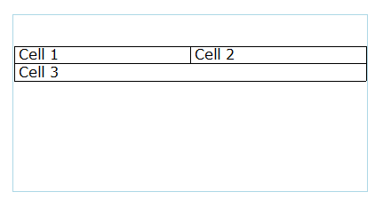
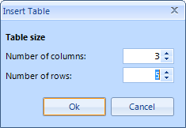
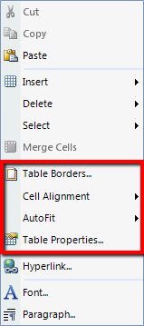

# Table


The __RadRichTextEditor__ is capable of displaying tables. To add a table to the document you can use one of the following approaches:
      

* [Programmatically via RadRichTextEditor's API](#creating-a-table-programmatically-via-radrichtexteditor's-api)

* [Via the built-in UI](#creating-a-table-via-the-built-in-ui)

The same approaches can be adopted when formatting the table:

* [Runtime via RadRichTextEditor's API](#formatting-a-table-at-runtime-via-radrichtexteditor's-api)

* [Via the built-in UI](#formatting-a-table-via-the-built-in-ui)

## Creating a Table Programmatically via RadRichTextEditor's API

>tip To learn more about the __Formatting API__ of the __RadRichTextEditor__ , read [this topic]().
>


The __RadRichTextEditor__ exposes a rich API, which allows you to use various methods to add, modify or delete elements form the __RadDocument__. The methods exposed by the API can be wired to a UI and get executed upon user interaction with this UI.
 
Here is an example done in the code-behind.

{{source=..\SamplesCS\RichTextEditor\DocumentElements\TableCode.cs region=add}} 
{{source=..\SamplesVB\RichTextEditor\DocumentElements\TableCode.vb region=add}} 

````C#
            
RadDocument document = new RadDocument();
Section section = new Section();
            
Table table = new Table();
table.StyleName = RadDocumentDefaultStyles.DefaultTableGridStyleName;
TableRow row1 = new TableRow();
            
TableCell cell1 = new TableCell();
Paragraph p1 = new Paragraph();
Span s1 = new Span();
s1.Text = "Cell 1";
p1.Inlines.Add(s1);
cell1.Blocks.Add(p1);
row1.Cells.Add(cell1);
            
TableCell cell2 = new TableCell();
Paragraph p2 = new Paragraph();
Span s2 = new Span();
s2.Text = "Cell 2";
p2.Inlines.Add(s2);
cell2.Blocks.Add(p2);
row1.Cells.Add(cell2);
table.Rows.Add(row1);
TableRow row2 = new TableRow();
            
TableCell cell3 = new TableCell();
cell3.ColumnSpan = 2;
Paragraph p3 = new Paragraph();
Span s3 = new Span();
s3.Text = "Cell 3";
p3.Inlines.Add(s3);
cell3.Blocks.Add(p3);
row2.Cells.Add(cell3);
table.Rows.Add(row2);
            
section.Blocks.Add(new Paragraph());
section.Blocks.Add(table);
section.Blocks.Add(new Paragraph());
document.Sections.Add(section);
            
this.radRichTextEditor1.Document = document;

````
````VB.NET
Dim document As New RadDocument()
Dim section As New Section()
Dim table As New Table()
table.StyleName = RadDocumentDefaultStyles.DefaultTableGridStyleName
Dim row1 As New TableRow()
Dim cell1 As New TableCell()
Dim p1 As New Paragraph()
Dim s1 As New Span()
s1.Text = "Cell 1"
p1.Inlines.Add(s1)
cell1.Blocks.Add(p1)
row1.Cells.Add(cell1)
Dim cell2 As New TableCell()
Dim p2 As New Paragraph()
Dim s2 As New Span()
s2.Text = "Cell 2"
p2.Inlines.Add(s2)
cell2.Blocks.Add(p2)
row1.Cells.Add(cell2)
table.Rows.Add(row1)
Dim row2 As New TableRow()
Dim cell3 As New TableCell()
cell3.ColumnSpan = 2
Dim p3 As New Paragraph()
Dim s3 As New Span()
s3.Text = "Cell 3"
p3.Inlines.Add(s3)
cell3.Blocks.Add(p3)
row2.Cells.Add(cell3)
table.Rows.Add(row2)
section.Blocks.Add(New Paragraph())
section.Blocks.Add(table)
section.Blocks.Add(New Paragraph())
document.Sections.Add(section)
Me.radRichTextEditor1.Document = document

````

{{endregion}} 


Here is a snapshot of the result.

The __RadRichTextEditor__ exposes the following methods that regard the creation or deletion of a table:
        

* __DeleteTable__ - deletes the currently selected table.
            

* __DeleteTableColumn__ - deletes the currently selected column.
            

* __DeleteTableRow__ - deletes the currently selected row.
            

* __InsertTable__ - inserts a table. Allows you to specify the number of rows and columns.
            

* __InsertTableColumn__- inserts a column at the end.
            

* __InsertTableColumnToTheLeft__ - inserts a column to the left of the selected one.
            

* __InsertTableColumnToTheRight__ - inserts a column to the right of the selected one.
            

* __InsertTableRow__ - inserts a row at the end.
            

* __InsertTableRowAbove__ - inserts a row above the selected one.
            

* __InsertTableRowBelow__ - inserts a row below the selected one.
            

## Creating a Table via the Built-in UI

You can enable the user to create a table via the built-in UI of the __RadRichTextEditor__. This is done by using   the __RadRichTextEditorRibbonUI__, which exposes two different ways of creating a table by selection in the UI or on button click. 

You can also use the __InsertTableDialog__, which comes out of the box. To show it upon a user action just call the __ShowInsertTableDialog()__ method of the __RadRichTextEditor__. Here is a snapshot of it.
        

>note The __RadRichTextEditorUI__ also uses this dialog.
>


>caution Inserting a table through the UI applies to it a __TableGrid style__ , which has a predefined set of borders. However, a table created in code-behind is applied the __TableNormal__ style and does not have predefined borders.
>


A table could be deleted or modified via the Table Tools' contextual tab __Layout__. There are UI buttons for each of the API methods used for deleting and modifying a table. 

## Formatting a Table at Runtime via RadRichTextEditor's API

>tip To learn more about the __Formatting API__ of the __RadRichTextEditor__ , read[this topic]().
>


The __RadRichTextEditor__ exposes a rich API, which allows you to use various methods to add, modify or delete elements  form the __RadDocument__. The methods exposed by the API can be wired to a UI and get executed upon user interaction with this  UI. The __RadRichTextEditor__ exposes the following methods that regard the modifying of a table:

* __ChangeTableBorders__ - modifies the borders of the currently selected table via a __TableBorders__ object.
            

* __ChangeTableCellBackground__ - sets the color of the currently selected cell's borders.
            

* __ChangeTableCellBorders__ - modifies the borders of the currently selected table via a __TableCellBorders__ object.
            

* __ChangeTableCellContentAlignment__ - modifies the content alignment of the currently selected cell.
            

* __ChangeTableCellPadding__ - modifies the padding of the currently selected cell.
            

* __ChangeTableColumnsLayoutMode__ - modifies the layout mode of the table's columns.
            

* __ChangeTableGridColumnWidth__ - modifies the width of the column.
            

* __MergeTableCells__ - merges the currently selected cells.
            

## Formatting a Table via the Built-in UI

You can enable the user to modify a table via the built-in UI of the __RadRichTextEditor__. This is done by using the __RadRichTextEditorRibbonUI__, which exposes a __Table Tools__ contextual menu with two tabs –  __Design__ and __Layout__. They expose UI buttons for all API methods used for formatting and modifying a table.  To learn more about how to use the __RadRichTextEditorRibbonUI__ read  [this topic](). 

The __Design__ contextual tab allows you to use a predefined set of formatting options called Table styles. The __TableStylesGallery__ offers a way to easily create, delete, modify and apply table styles in a document. To  learn more about how to use the TableStylesGallery read [this topic](). 

Additionally the built-in context menu of the __RadRichTextEditor__ gives the user the possibility to open the   __Table Properties__ and __Table Borders__ dialogs.



>tip To wire these dialogs to your own UI you can use the __ShowTablePropertiesDialog()__ method of __RadRichTextEditor__ or the __ShowTablePropertiesCommand__ .
>

