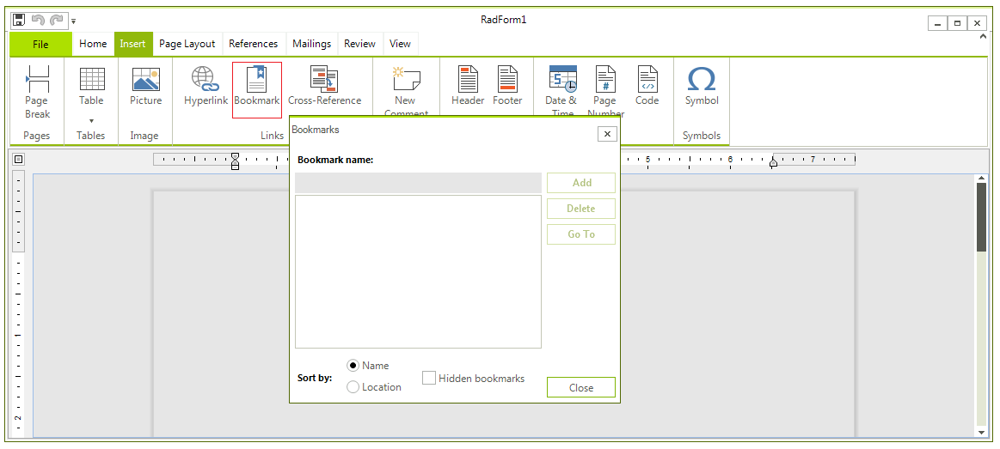

# Bookmarks

__Bookmarks__ are a powerful tool for marking parts of the document, which can be later retrieved and reviewed. They can be added to the document both programmatically and via the UI. You can also have [hyperlinks]() pointing to the annotations in the document. This is very convenient, as it provides the means for easier navigation in the document and enables features like table of contents.
      
## Adding Bookmarks via the UI

__Bookmarks__ can be inserted in the document and removed through the __ManageBookmarksDialog__, which is opened on pressing the **Bookmark** button in the **Insert** tab of the default **RadRichTextEditorRibbonUI**.



As all pop-ups that **RadRichTextEditor** uses, the **ManageBookmarksDialog** can be completely replaced by another, user-defined dialog implementing an interface.

## Using Bookmarks Programmatically

The document elements that encapsulate the bookmarks functionality are __BookmarkRangeStart__ and __BookMarkRangeEnd__, which are placed at the start and the end of the bookmark respectively. Some of the useful methods that **RadRichTextEditor** and **RadDocument** expose are:
        
* __InsertBookmark__(__string bookmarkName__) – inserts a bookmark with the name specified. If there is selection in the document, the **BookmarkRangeStart** will be inserted just before the first selected element and the **BookmarkRangeEnd** will be added at the end of the first selection range.
            
* Document.__GoToBookmark__(__string bookmarkName__) / Document.__GoToBookmark__(__BookmarkRangeStart bookmarkStart__): Both methods move the caret to the bookmark specified. As bookmarks with the same name cannot be inserted in the same document, the name of the bookmark can be used as an identifier.
            
* Document.Selection.__SelectAnnotationRange__(__AnnotationRangeStart annotationStart__) – selects the annotation passed as parameter. Particularly useful, as most methods of **RadRichTextEditor** and **RadDocument** operate on the selection. For example, if you invoke Delete(false), the text of the bookmark along with the bookmark itself will be erased.
            
* __DeleteBookmark__(__string bookmarkName__) / __DeleteBookmark__(__BookmarkRangeStart bookmarkRangeStart__): These two methods remove the bookmark. The text in the document between the **BookmarkRangeStart** and **BookmarkRangeEnd** is __not__ deleted.
            
* Document.__GetAllBookmarks__() – returns an **IEnumerable<BookmarkRangeStart>** containing all **BookmarkRangeStarts**.
            
* Document.__EnumerateChildrenOfType&lt;BookmarkRangeStart&gt;()__ – returns all bookmarks in the document. This method can be used on document elements other than **RadDocument**, in case you want to detect all bookmarks in a limited part of the document, e.g. a **Paragraph** or a **Table**.
            
You can also add bookmarks in a document you are creating manually. As both __BookmarkRangeStart__ and __BookMarkRangeEnd__ inherit from __Inline__, they can be added to the **Inlines** property of a **Paragraph**, just like any other **Inline**. You can also have document positions go to the start or end of the bookmark and perform non-standard operations.
  
For example, you can keep a **Dictionary<string, string>** mapping each bookmark name to another string and substitute a bookmark with the corresponding text using the following method:

{{source=..\SamplesCS\RichTextEditor\Features\Bookmarks.cs region=replace}} 
{{source=..\SamplesVB\RichTextEditor\Features\Bookmarks.vb region=replace}} 

````C#
        
private void ReplaceContentOfBookmark(string bookmarkName)
{
    BookmarkRangeStart bookmark = this.radRichTextEditor1.Document.GetBookmarkByName(bookmarkName);
    this.radRichTextEditor1.Document.Selection.SelectAnnotationRange(bookmark);
    this.radRichTextEditor1.Document.Delete(false);
    this.radRichTextEditor1.Insert("new text");
}

````
````VB.NET
Private Sub ReplaceContentOfBookmark(ByVal bookmarkName As String)
    Dim bookmark As BookmarkRangeStart = Me.radRichTextEditor1.Document.GetBookmarkByName(bookmarkName)
    Me.radRichTextEditor1.Document.Selection.SelectAnnotationRange(bookmark)
    Me.radRichTextEditor1.Document.Delete(False)
    Me.radRichTextEditor1.Insert("new text")
End Sub

````

{{endregion}} 

If you want to preserve the bookmarks in the document and only change the text between the **BookmarkRangeStart** and **BookmarkRangeEnd** document elements, you can do so like this:

{{source=..\SamplesCS\RichTextEditor\Features\Bookmarks.cs region=change}} 
{{source=..\SamplesVB\RichTextEditor\Features\Bookmarks.vb region=change}} 

````C#
        
private void ChangeAllBookmarks(RadRichTextEditor radRichTextEditor)
{
    BookmarkRangeStart[] bookmarks = radRichTextEditor.Document.GetAllBookmarks().ToArray<BookmarkRangeStart>();
    DocumentPosition start = new DocumentPosition(radRichTextEditor.Document);
    DocumentPosition end = new DocumentPosition(radRichTextEditor.Document);
    foreach (BookmarkRangeStart item in bookmarks)
    {
        radRichTextEditor.Document.GoToBookmark(item);
        
        start.MoveToInline(item.FirstLayoutBox as InlineLayoutBox, 0);
        end.MoveToInline(item.End.FirstLayoutBox as InlineLayoutBox, 0);
        start.MoveToNextInline();
        radRichTextEditor.Document.Selection.SetSelectionStart(start);
        radRichTextEditor.Document.Selection.AddSelectionEnd(end);
        
        radRichTextEditor.Delete(false);
        
        radRichTextEditor.Insert("new text");
    }
}

````
````VB.NET
Private Sub ChangeAllBookmarks(ByVal radRichTextEditor As RadRichTextEditor)
    Dim bookmarks() As BookmarkRangeStart = radRichTextEditor.Document.GetAllBookmarks().ToArray()
    Dim start As New DocumentPosition(radRichTextEditor.Document)
    Dim [end] As New DocumentPosition(radRichTextEditor.Document)
    For Each item As BookmarkRangeStart In bookmarks
        radRichTextEditor.Document.GoToBookmark(item)
        start.MoveToInline(TryCast(item.FirstLayoutBox, InlineLayoutBox), 0)
        [end].MoveToInline(TryCast(item.End.FirstLayoutBox, InlineLayoutBox), 0)
        start.MoveToNextInline()
        radRichTextEditor.Document.Selection.SetSelectionStart(start)
        radRichTextEditor.Document.Selection.AddSelectionEnd([end])
        radRichTextEditor.Delete(False)
        radRichTextEditor.Insert("new text")
    Next item
End Sub

````

{{endregion}} 


