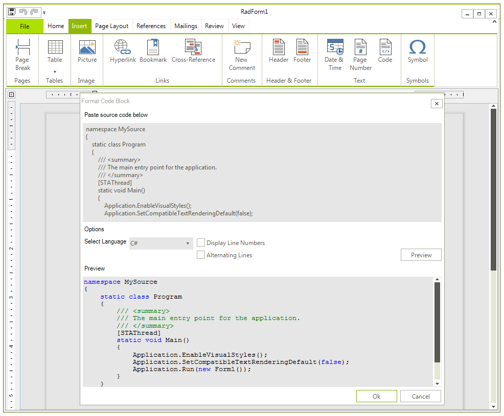

# Code Block

Code blocks allow users to add source code fragments to their document and using the existing functionality to format and style those fragments. This can be done programmatically or via the Code dialog.
      

* [User Interface](#user-interface)

* [Insert and Remove code blocks](#insert-and-delete-code-blocks)

* [Code Formatter](#code-formatter)

## User Interface

The options in the dialog allow to select the desired code language, as well as whether you wish to display line numbers and alternate the formatting of the lines.



## Insert and Delete code blocks

If you want to programmatically add code blocks to the document you should use the __InsertCodeBlock()__ method of __RadRichTextEditor__ or __RadDocumentEditor__.  These methods accept a code fragment as  a string and code settings which specify the formatting of the code block.
        

The constructor of __CodeFormattingSettings__ requires a code language to be specified.  These are the languages that are currently supported out-of-the-box:
        
* CSharp

* JavaScript

* PHP

* XML

Additionally, you can enable the display of line numbers and the alternating lines options.

{{source=..\SamplesCS\RichTextEditor\Features\CodeBlock.cs region=insert}} 
{{source=..\SamplesVB\RichTextEditor\Features\CodeBlock.vb region=insert}} 

````C#
            
string code = "this.IsCodeBlock = true;\nthis.IsCodeBlock = false;\nthis.IsCodeBlock = true;";
CodeFormattingSettings formattingSettings = new CodeFormattingSettings(CodeLanguages.CSharp);
formattingSettings.IsLineNumberingEnabled = true;
formattingSettings.IsAlternatingLinesEnabled = true;
            
this.radRichTextEditor1.InsertCodeBlock(code, formattingSettings);

````
````VB.NET
Dim code As String = "this.IsCodeBlock = true;" & ControlChars.Lf & "this.IsCodeBlock = false;" & ControlChars.Lf & "this.IsCodeBlock = true;"
Dim formattingSettings As New CodeFormattingSettings(CodeLanguages.CSharp)
formattingSettings.IsLineNumberingEnabled = True
formattingSettings.IsAlternatingLinesEnabled = True
Me.radRichTextEditor1.InsertCodeBlock(code, formattingSettings)

````

{{endregion}} 

The inner representation of the code block in the document is achieved by surrounding the content with __CodeAnnotationRangeStart__ and __CodeAnnotationRangeEnd__.
        

>tip More about annotations you can learn in the respective help [article]().


To remove the code block you can use the __DeleteCodeBlock()__ method of __RadRichTextEditor__ accepting __CodeAnnotationRangeStart__ as parameter:

{{source=..\SamplesCS\RichTextEditor\Features\CodeBlock.cs region=delete}} 
{{source=..\SamplesVB\RichTextEditor\Features\CodeBlock.vb region=delete}} 

````C#
            
IEnumerable<CodeAnnotationRangeStart> markers = this.radRichTextEditor1.Document.GetAnnotationMarkersOfType<CodeAnnotationRangeStart>();
this.radRichTextEditor1.DeleteCodeBlock(markers.First());

````
````VB.NET
Dim markers As IEnumerable(Of CodeAnnotationRangeStart) = Me.radRichTextEditor1.Document.GetAnnotationMarkersOfType(Of CodeAnnotationRangeStart)()
Me.radRichTextEditor1.DeleteCodeBlock(markers.First())

````

{{endregion}} 

The contents of a code block can be selected and copied, but cannot be edited. However, existing code blocks can be modified with the code block dialog.

## Code Formatter

Inside each __RadDocument__ there is an instance of the __CodeFromatter__ class which is used for formatting code blocks and is also an extensibility point for adding code languages. It is available through the __CodeFormatter__ property of the __RadDocument__.
        
Inside the __CodeFormatter__, a classification tagger is registered for each supported code language. The role of the tagger is to identify ranges in the code which should be associated with particular classification type – i.e. keywords, comments, string literals etc. The __CodeFormatter__ class also holds information which style should be used for words identified with particular classification type.
        

The default taggers are based on regular expressions, which come particularly handy in such scenarios. If you would like to implement a custom taggerfor an already added language or a new one, you can do so by registering an instance of __RegexTagger__ in the Code formatter. You can also implement you custom tagger by deriving from __TaggerBase__. With the second approach you have full control over theimplementation and you may base your implementation on a mechanism different from regular expressions. Once you register a tagger for a new language,
 the language will be visible in the __InsertCodeBlock__ dialog.
        

You can also register or change which style will be used for which classification types in which language in the __CodeFormatter__ class. Here is how to change the color for all comments when formatting JavaScript:

{{source=..\SamplesCS\RichTextEditor\Features\CodeBlock.cs region=js}} 
{{source=..\SamplesVB\RichTextEditor\Features\CodeBlock.vb region=js}} 

````C#
            
StyleDefinition commentJS = new StyleDefinition("CommentJS", StyleType.Character);
commentJS.SpanProperties.ForeColor = Colors.Gray;
commentJS.IsCustom = false;
commentJS.IsPrimary = false;
this.radRichTextEditor1.Document.CodeFormatter.RegisterClassificationType(ClassificationTypes.Comment, CodeLanguages.JavaScript, commentJS);

````
````VB.NET
Dim commentJS As New StyleDefinition("CommentJS", StyleType.Character)
commentJS.SpanProperties.ForeColor = Colors.Gray
commentJS.IsCustom = False
commentJS.IsPrimary = False
Me.radRichTextEditor1.Document.CodeFormatter.RegisterClassificationType(ClassificationTypes.Comment, CodeLanguages.JavaScript, commentJS)

````

{{endregion}} 


