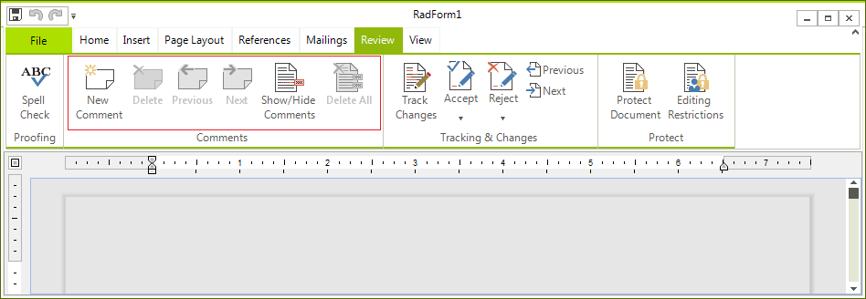

# Comments


__RadRichTextEditor__ control provides functionality for inserting comment annotations inside the document. You can programmatically insert and delete comments though the [RadDocumentEditor]() class.
      

## UI and Commands

Commenting functionality is available in the Review tab inside the RadRichTextEditorRibbonUI example:



The following commands related to the commenting functionality are available in the Commands property of the RadRichTextEditor:
        

* __InsertCommentCommand__: Adds a comment about the current selection.
            

* __DeleteCommentCommand__: Deletes the selected comment.
            

* __DeleteAllCommentsCommand__: Deletes all of the comments in the document.
            

* __GoToPreviousCommentCommand__: Navigates to the previous comment in the document.
            

* __GoToNextCommentCommand__: Navigate to the next comment in the document.
            

* __ToggleCommentsCommand__: Toggles comments visibility.
            

>tip In order to learn more about commands and how to use them refer to [this article]().
>


## Working with Comments Programmatically

Comments inside the __RadDocument__ model are implemented using the __CommentRangeStart__ and __CommentRangeEnd__ annotations. The actual __Comment__ object which contains the content of the comment is a property of the __CommentRangeEnd__.
        

Comments can be programmatically inserted/deleted using the following methods of __RadDocumentEditor__:
        

* __public void InsertComment(Comment comment)__

* __public void DeleteComment()__

* __public void DeleteComment(CommentRangeStart commentRangeStart)__

* __DeleteAllComments()__

Note, that these methods work with the current position and selection in the document.
        

You can also programmatically navigate and select comments using the API of __RadDocument__:
        

* __public CommentRangeStart GetNextComment()__

* __public CommentRangeStart GetPreviousComment()__

* __public CommentRangeStart GoToNextComment()__

* __public CommentRangeStart GoToPreviousComment()__

* __public void GoToComment(Comment comment)__

* __public void GoToComment(CommentRangeStart commentRangeStart)__

* __public CommentRangeStart GetCommentRangeStartByComment(Comment comment)__

There are also __GoToNextComment()__ and __GoToPreviousComment()__ methods available in __RadRichTextEditor__. They select the appropriate comment and place the focus inside the comment balloon if the comments are visible.  These methods also show a message box if no comment is found.
        

## Customizing Visualization

You can customize the looks of the comments by attaching to the __CommentShowing__ event of __RadRichTextEditor__.   Inside the event handler you can access the __Comment__ and modify the __AppearanceSettings__ that are used to  visualize the comment. Here is an example:

{{source=..\SamplesCS\RichTextEditor\Features\Comments.cs region=event}} 
{{source=..\SamplesVB\RichTextEditor\Features\Comments.vb region=event}} 

````C#
        
private void radRichTextEditor1_CommentShowing(object sender, Telerik.WinForms.Documents.UI.CommentShowingEventArgs e)
{
    if (e.Comment.Author == "Boss")
    {
        e.AppearanceSettings.BorderBrush = System.Drawing.Brushes.Red;
        e.AppearanceSettings.BackgroundBrush = System.Drawing.Brushes.Orange;
        e.AppearanceSettings.HighlightColor = Telerik.WinControls.RichTextEditor.UI.Colors.Orange;
    }
    else
    {
        e.AppearanceSettings.BorderBrush = System.Drawing.Brushes.Green;
        e.AppearanceSettings.BackgroundBrush = System.Drawing.Brushes.LightGray;
        e.AppearanceSettings.HighlightColor = Telerik.WinControls.RichTextEditor.UI.Colors.LightGray;
    }
}

````
````VB.NET
Private Sub radRichTextEditor1_CommentShowing(ByVal sender As Object, ByVal e As Telerik.WinForms.Documents.UI.CommentShowingEventArgs)
    If e.Comment.Author = "Boss" Then
        e.AppearanceSettings.BorderBrush = System.Drawing.Brushes.Red
        e.AppearanceSettings.BackgroundBrush = System.Drawing.Brushes.Orange
        e.AppearanceSettings.HighlightColor = Telerik.WinControls.RichTextEditor.UI.Colors.Orange
    Else
        e.AppearanceSettings.BorderBrush = System.Drawing.Brushes.Green
        e.AppearanceSettings.BackgroundBrush = System.Drawing.Brushes.LightGray
        e.AppearanceSettings.HighlightColor = Telerik.WinControls.RichTextEditor.UI.Colors.LightGray
    End If
End Sub

````

{{endregion}} 


And the result looks like this:


Note, that for performance reasons this event will be thrown only once per each comment – the first time it is shown. The __AppearanceSettings__ will then be cached and used for the associated comment when needed.
        
# See Also

 * [RadDocumentEditor]()

 * [Ribbon UI]()

 * [Annotations]()
