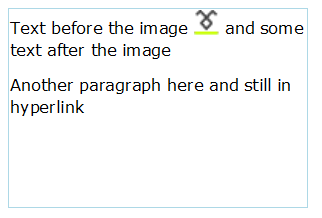

# Hyperlink

The following functionality is supported in the __RadRichTextEditor__:

* having a hyperlink span several paragraphs;

* being able to embed all kind of elements inside hyperlinks, e.g. images, tables and table elements;

* making bookmarks in the document the targets of hyperlinks.

The classes that encapsulate the functionality of hyperlinks are [HyperlinkInfo](#hyperlinkinfo),[HyperlinkRangeStart and HyperlinkRangeEnd](#hyperlinkrangestart-and-hyperlinkrangeend).      

[Other customization options](#othercustomizationoptions) include setting the tool tip format and detecting the click of hyperlinks.
      
## HyperlinkInfo

More often than not, you would only need to use objects of type **HyperlinkInfo**. **HyperlinkInfo** objects have the following properties:

* **IsAnchor** - a Boolean property determining if the hyperlink points to a URL or a bookmark;

* **NavigateUri** - the URI of the hyperlink;

* **Target** - determines if the link should be opened in another window (if set to HyperlinkTargets.*Blank*) or in the same frame (HyperlinkTargets.*Self*).

For example, a link to our site can be inserted in the document programmatically as follows:

{{source=..\SamplesCS\RichTextEditor\Features\HyperlinkCode.cs region=insert}} 
{{source=..\SamplesVB\RichTextEditor\Features\HyperlinkCode.vb region=insert}} 

````C#
HyperlinkInfo info = new HyperlinkInfo()
{
    NavigateUri = "http://www.telerik.com",
    Target = HyperlinkTargets.Blank,
    IsAnchor = false
};
this.radRichTextEditor1.InsertHyperlink(info, "RichTextBox demo");

````
````VB.NET
Dim info As New HyperlinkInfo() With {.NavigateUri = "http://www.telerik.com", .Target = HyperlinkTargets.Blank, .IsAnchor = False}
Me.radRichTextEditor1.InsertHyperlink(info, "RichTextBox demo")

````
{{endregion}} 

A link to a bookmark is inserted by specifying the bookmark's name as **NavigateUri** and setting the **IsAnchor** property to *true*:

{{source=..\SamplesCS\RichTextEditor\Features\HyperlinkCode.cs region=remove}} 
{{source=..\SamplesVB\RichTextEditor\Features\HyperlinkCode.vb region=remove}} 

````C#
this.radRichTextEditor1.RemoveHyperlink();

````
````VB.NET
Me.radRichTextEditor1.RemoveHyperlink()

````

{{endregion}} 

You can also use the overloaded methods for inserting a hyperlink:

* public void __InsertHyperlink__(HyperlinkInfo hyperlinkInfo, string hyperlinkText, StyleDefinition hyperlinkStyle) - insert a hyperlink using a custom style, different from the default blue font color and single underline;
            
* public void __InsertHyperlink__(HyperlinkInfo hyperlinkInfo, IEnumerable<Inline> inlines) - insert a hyperlink which spans several different adjacent inlines, e.g. part of the hyperlink text is bold or there is an image inside the hyperlink;            

* public void __InsertHyperlink__(HyperlinkInfo hyperlinkInfo) - create a hyperlink from the currently selected part of the document;
            
* public void __InsertHyperlink__(HyperlinkInfo hyperlinkInfo, StyleDefinition hyperlinkStyle) - create a hyperlink from the currently selected part of the document and change the style of the text to the style passed as second argument.

Removing a hyperlink (and keeping the part of the document that the hyperlink spanned) can be done by positioning the caret in the hyperlink and invoking.

{{source=..\SamplesCS\RichTextEditor\Features\HyperlinkCode.cs region=remove}} 
{{source=..\SamplesVB\RichTextEditor\Features\HyperlinkCode.vb region=remove}} 

````C#
this.radRichTextEditor1.RemoveHyperlink();

````
````VB.NET
Me.radRichTextEditor1.RemoveHyperlink()

````

{{endregion}} 

## HyperlinkRangeStart and HyperlinkRangeEnd

**HyperlinkRangeStart** and **HyperlinkRangeEnd** are **Inline** DocumentElements and can be added to the inlines of a document, if you are building the contents of a **RadDocument** in code-behind.
        
Here is an example that creates a document with a hyperlink spanning several paragraphs, including an image in one of the paragraphs:

{{source=..\SamplesCS\RichTextEditor\Features\HyperlinkCode.cs region=startend}} 
{{source=..\SamplesVB\RichTextEditor\Features\HyperlinkCode.vb region=startend}} 

````C#
HyperlinkRangeStart hyperlinkStart = new HyperlinkRangeStart();
HyperlinkRangeEnd hyperlinkEnd = new HyperlinkRangeEnd();
hyperlinkEnd.PairWithStart(hyperlinkStart);
HyperlinkInfo hyperlinkInfo = new HyperlinkInfo() { NavigateUri = "http://telerik.com", Target = HyperlinkTargets.Blank };
hyperlinkStart.HyperlinkInfo = hyperlinkInfo;
RadDocument document = new RadDocument();
Section section = new Section();
Paragraph paragraph = new Paragraph();
Span spanBefore = new Span("Text before the image ");
ImageInline image;
using (MemoryStream ms = new MemoryStream())
{
    System.Drawing.Image.FromFile(@"C:\logo.png").Save(ms, System.Drawing.Imaging.ImageFormat.Png);
    image = new ImageInline(ms, new Telerik.WinControls.RichTextEditor.UI.Size(25, 25), "png");
}
Span spanAfter = new Span(" and some text after the image");
paragraph.Inlines.Add(hyperlinkStart);
paragraph.Inlines.Add(spanBefore);
paragraph.Inlines.Add(image);
paragraph.Inlines.Add(spanAfter);
section.Blocks.Add(paragraph);
Paragraph anotherParagraph = new Paragraph();
anotherParagraph.Inlines.Add(new Span("Another paragraph here and still in hyperlink"));
anotherParagraph.Inlines.Add(hyperlinkEnd);
section.Blocks.Add(anotherParagraph);
document.Sections.Add(section);
this.radRichTextEditor1.Document = document;

````
````VB.NET
Dim hyperlinkStart As New HyperlinkRangeStart()
Dim hyperlinkEnd As New HyperlinkRangeEnd()
hyperlinkEnd.PairWithStart(hyperlinkStart)
Dim hyperlinkInfo As New HyperlinkInfo() With {.NavigateUri = "http://telerik.com", .Target = HyperlinkTargets.Blank}
hyperlinkStart.HyperlinkInfo = hyperlinkInfo
Dim document As New RadDocument()
Dim section As New Section()
Dim paragraph As New Paragraph()
Dim spanBefore As New Span("Text before the image ")
Dim image As ImageInline
Using ms As New MemoryStream()
    System.Drawing.Image.FromFile("C:\logo.png").Save(ms, System.Drawing.Imaging.ImageFormat.Png)
    image = New ImageInline(ms, New Telerik.WinControls.RichTextEditor.UI.Size(25, 25), "png")
End Using
Dim spanAfter As New Span(" and some text after the image")
paragraph.Inlines.Add(hyperlinkStart)
paragraph.Inlines.Add(spanBefore)
paragraph.Inlines.Add(image)
paragraph.Inlines.Add(spanAfter)
section.Blocks.Add(paragraph)
Dim anotherParagraph As New Paragraph()
anotherParagraph.Inlines.Add(New Span("Another paragraph here and still in hyperlink"))
anotherParagraph.Inlines.Add(hyperlinkEnd)
section.Blocks.Add(anotherParagraph)
document.Sections.Add(section)
Me.radRichTextEditor1.Document = document

````

{{endregion}} 

The result (`Ctrl` + `Click` to follow):



You will also need to use **HyperlinkRangeStart** and **HyperlinkRangeEnd**, if you are using hyperlinks for the implementation of a custom logic and want to get all hyperlinks from the document, manipulate the properties of the **HyperlinkInfo** or the whole part of the document that is included in the hyperlink.
        
For instance, here is how you can delete all hyperlinks in the document and replace them with some text:

{{source=..\SamplesCS\RichTextEditor\Features\HyperlinkCode.cs region=delete}} 
{{source=..\SamplesVB\RichTextEditor\Features\HyperlinkCode.vb region=delete}} 

````C#
IEnumerable<HyperlinkRangeStart> links = this.radRichTextEditor1.Document.EnumerateChildrenOfType<HyperlinkRangeStart>();
foreach (HyperlinkRangeStart link in links)
{
    this.radRichTextEditor1.Document.CaretPosition.MoveToInline(link.FirstLayoutBox as Telerik.WinForms.Documents.Layout.InlineLayoutBox, 0);
    this.radRichTextEditor1.Document.Selection.SelectAnnotationRange(link);
    this.radRichTextEditor1.Delete(false);
    this.radRichTextEditor1.Insert("Removed hyperlink");
}

````
````VB.NET
Dim links As IEnumerable(Of HyperlinkRangeStart) = Me.radRichTextEditor1.Document.EnumerateChildrenOfType(Of HyperlinkRangeStart)()
For Each link As HyperlinkRangeStart In links
    Me.radRichTextEditor1.Document.CaretPosition.MoveToInline(TryCast(link.FirstLayoutBox, Telerik.WinForms.Documents.Layout.InlineLayoutBox), 0)
    Me.radRichTextEditor1.Document.Selection.SelectAnnotationRange(link)
    Me.radRichTextEditor1.Delete(False)
    Me.radRichTextEditor1.Insert("Removed hyperlink")
Next link

````

{{endregion}} 

## OtherCustomizationOptions

__ToolTip__

By default, hyperlinks take a fixed string as a tool tip. The default format is:

>note {0}{1} to follow link
>

You have control over it using the __HyperlinkToolTipFormatString__ of **RadRichTextEditor**, which will set the format for all hyperlinks in the document.
        
__HyperlinkClicked__

When you click on a hyperlink, the __HyperlinkClicked__ event of __RadRichTextEditor__ is fired. The sender of the event is the document element, which you have clicked, e.g. a **Span**, an **Image**, **InlineUIContainer**, etc. The event args on the other hand, provide the possibility to mark the event as handled and prevent the default action. Custom logic can also be implemented depending on the __HyperlinkTarget__ and __URL__, which are also visible as properties of the event args.


# See Also

 * [Document Elements]()

 * [RadDocument]()

 * [Inline Image]()
