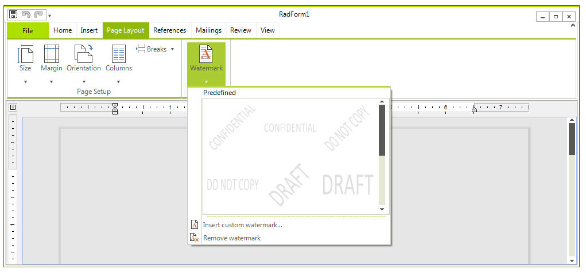
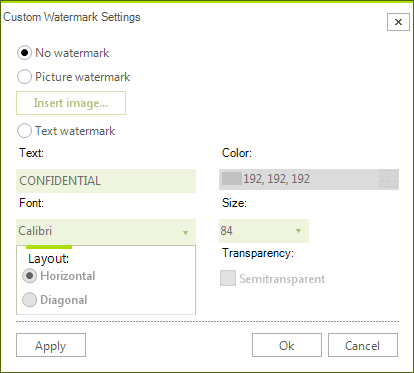

# Watermark

Watermarks are text or pictures that appear behind document text. They often add interest or identify the document status. You can see watermarks
        in Paged layout mode; they can be printed and exported to all rich-text formats, except HTML.
      

>tipMore on the specifics of the format providers you can find [here]().
        

* [Uisng UI](#using-ui)

* [Manipulating Watermarks Programatically](#manipulating-watermarks-programatically)

## Using UI

You ca easily insert bookmarks, for example you can use the __RichTextEditor__ and choose from several predefined watermarks:
      

Alternatively, you can create your custom watermark from text or picture through the *Insert custom watermark* option.
        

## Manipulating Watermarks Programatically

There are two types of watermarks - text and image. Both of them are shown behind the contents of the documents - text, images, tables, etc. and 
        are applied on a per document basis.

There is also a set of predefined textual watermarks - the most commonly used ones like ASAP, Urgent, Confidential, etc., that can be easily set
        in the following way:

#### __[C#] __

{{source=..\SamplesCS\RichTextEditor\Features\Watermark.cs region=set}}
	            this.radRichTextEditor1.SetWatermark(PredefinedWatermarkType.Confidential);
	{{endregion}}

#### __[VB.NET] __

{{source=..\SamplesVB\RichTextEditor\Features\Watermark.vb region=set}}
	        Me.radRichTextEditor1.SetWatermark(PredefinedWatermarkType.Confidential)
	        '#End Region
	
	        '#Region "settings"
	        Dim textSettings As New WatermarkTextSettings()
	        textSettings.Text = "Purple Watermark"
	        textSettings.RotateAngle = 30
	        textSettings.Opacity = 1
	        textSettings.ForegroundColor = Colors.Purple
	
	        Me.radRichTextEditor1.SetWatermarkText(textSettings)
	        '#End Region
	        Dim uri As New Uri("")
	        '#Region "image"
	        Dim imageSettings As New WatermarkImageSettings()
	        imageSettings.UriSource = uri
	        imageSettings.Size = New Size(500, 665)
	
	        Me.radRichTextEditor1.SetWatermarkImage(imageSettings)
	        '#End Region
	    End Sub
	End Class

You can create custom watermarks using the __WatermarkTextSettings__ and __WatermarkImageSettings__
          classes and the respective methods of __RadRichTextEditor__ - __SetWatermarkText()__ and
          __SetWatermarkImage()__.
        

The following example demonstrates how to crate a text watermark and apply it to the document in the editor:

#### __[C#] __

{{source=..\SamplesCS\RichTextEditor\Features\Watermark.cs region=settings}}
	            WatermarkTextSettings textSettings = new WatermarkTextSettings();
	            textSettings.Text = "Purple Watermark";
	            textSettings.RotateAngle = 30;
	            textSettings.Opacity = 1;
	            textSettings.ForegroundColor = Colors.Purple;
	
	            this.radRichTextEditor1.SetWatermarkText(textSettings);
	{{endregion}}

#### __[VB.NET] __

{{source=..\SamplesVB\RichTextEditor\Features\Watermark.vb region=settings}}
	        Dim textSettings As New WatermarkTextSettings()
	        textSettings.Text = "Purple Watermark"
	        textSettings.RotateAngle = 30
	        textSettings.Opacity = 1
	        textSettings.ForegroundColor = Colors.Purple
	
	        Me.radRichTextEditor1.SetWatermarkText(textSettings)
	        '#End Region
	        Dim uri As New Uri("")
	        '#Region "image"
	        Dim imageSettings As New WatermarkImageSettings()
	        imageSettings.UriSource = uri
	        imageSettings.Size = New Size(500, 665)
	
	        Me.radRichTextEditor1.SetWatermarkImage(imageSettings)
	        '#End Region
	    End Sub
	End Class

And this is how you create an image watermark and apply it:

#### __[C#] __

{{source=..\SamplesCS\RichTextEditor\Features\Watermark.cs region=image}}
	            WatermarkImageSettings imageSettings = new WatermarkImageSettings();
	            imageSettings.UriSource = uri;
	            imageSettings.Size = new Size(500, 665);
	
	            this.radRichTextEditor1.SetWatermarkImage(imageSettings);
	{{endregion}}

#### __[VB.NET] __

{{source=..\SamplesVB\RichTextEditor\Features\Watermark.vb region=image}}
	        Dim imageSettings As New WatermarkImageSettings()
	        imageSettings.UriSource = uri
	        imageSettings.Size = New Size(500, 665)
	
	        Me.radRichTextEditor1.SetWatermarkImage(imageSettings)
	        '#End Region
	    End Sub
	End Class

# See Also

 * [Formatting API]()
