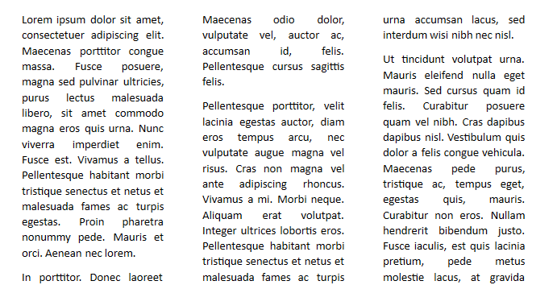
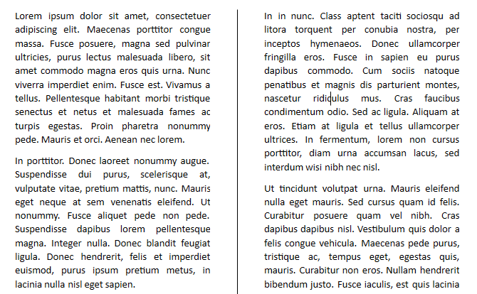

# Section Columns

With the Section Columns feature, __RadRichTextBox__ allows you arrange the text in a section into columns. This article will show you how to arrange the text into columns with different or customized width and set a separator between them.

* [SectionColumn Class](#sectioncolumn-class)

* [SectionColumnCollection Class](#sectioncolumncollection-class)

* [Using Section Columns](#using-section-columns)

>caption Figure 1: Text laid out in columns



## SectionColumn Class

The __SectionColumn__ class holds the information about a particular column. It exposes the following properties:

* __Width__: Represents the text column width.

* __SpacingAfter__: Represents the spacing, which will be rendered before the next column. When columns are rendered, this value is ignored for the last section column. The default and minimal value is *48 dpi* (1 dpi = 1/96 inch).

You can create an instance of __SectionColumn__ and specify the desired settings through the parameters of the exposed constructor overloads:


* **SectionColumn()**

* **SectionColumn(double width)**

* **SectionColumn(double width, double spacingAfter)**


## SectionColumnCollection Class

The `SectionColumnCollection` class contains the information about the text columns in a Section. The class exposes several constructor overloads that allow you create columns and specify different properties:

 
* **SectionColumnCollection(int equalColumnsCount)**: Initializes a new instance of the `SectionColumnCollection` class with equally sized columns and default spacing between them. The parameter represents the number of columns with equal width.


* **SectionColumnCollection(int equalColumnsCount, double columnSpacing = 48, bool hasSeparator = false)**: Initializes a new instance of the SectionColumnCollection class with equally sized columns and default spacing between them. Using the constructor parameters you can set a different width of the columns and choose whether a separator between the columns should be applied. 

* **SectionColumnCollection(IEnumerable&lt;SectionColumn&gt; sectionColumns, bool hasSeparator = false)**: Initializes a new instance of the SectionColumnCollection class based on the already existing collection, passed as a parameter.


**Example 1** demonstrates how you can create an instance of the `SectionColumnCollection` class that represents two text columns with a custom space and a separator between them.

#### [C#] Example 1: Create SectionColumnCollection

{{source=..\SamplesCS\RichTextEditor\Features\SectionColumnCode.cs region=NewCollection}}
{{source=..\SamplesVB\RichTextEditor\Features\SectionColumnCode.vb region=NewCollection}}
````C#
SectionColumnCollection sectionColumnCollection = new SectionColumnCollection(2, 75, true);

````
````VB.NET
Dim sectionColumnCollection As New SectionColumnCollection(2, 75, True)

````


{{endregion}}

__Figure 2__ demonstrates the result of __Example 1__.

>caption Figure 2: Columns with separator



## Using Section Columns

Depending on whether you prefer to insert columns with equal width or assign a specific width for each of them, you will need to create an instance of the **SectionColumnCollection** class and assign it to the **Columns** collection of [Section](). Another option to achieve a similar scenario is to change the Section layout using [RadDocumentEditor](). This section will explain the different approaches.

### Apply Columns With Equal Width

To create text columns with equal width, you could directly use the SectionColumnCollection constructor overloads that allow you specify the number of columns you would like to insert. **Example 2** shows how to apply the SectionColumnCollection instance, created in **Example 1** to a Section object.

#### [C#] Example 2: Apply columns with equal width
{{source=..\SamplesCS\RichTextEditor\Features\SectionColumnCode.cs region=AssignCollection}}
{{source=..\SamplesVB\RichTextEditor\Features\SectionColumnCode.vb region=AssignCollection}}
````C#
section.Columns = sectionColumnCollection;

````
````VB.NET
section.Columns = sectionColumnCollection

````
    
{{endregion}}


### Apply Columns With Different Width

The API allows you create the columns severally from each other with the SectionColumn class. Then, the created columns could be united in a single SectionColumnCollection and applied to a Section. **Example 3** creates a collection of 3 columns with different settings and applies it.

#### [C#] Example 3: Apply columns with different width

{{source=..\SamplesCS\RichTextEditor\Features\SectionColumnCode.cs region=DifferentWidth}}
{{source=..\SamplesVB\RichTextEditor\Features\SectionColumnCode.vb region=DifferentWidth}}
````C#
IEnumerable<SectionColumn> columns = new List<SectionColumn>()
{
    new SectionColumn(100, 5),
    new SectionColumn(200, 10),
    new SectionColumn(300, 15)
};
SectionColumnCollection sectionColumnCollection1 = new SectionColumnCollection(columns);
section.Columns = sectionColumnCollection1;

````
````VB.NET
Dim columns As IEnumerable(Of SectionColumn) = New List(Of SectionColumn)() From {
    New SectionColumn(100, 5),
    New SectionColumn(200, 10),
    New SectionColumn(300, 15)
}
Dim sectionColumnCollection1 As New SectionColumnCollection(columns)
section.Columns = sectionColumnCollection1

````
 
{{endregion}}

### Apply Columns With RadDocumentEditor

In addition to the so far discussed approaches, [RadDocumentEditor]() exposes a method that you can utilize to lay out the text in columns as well. The overloads of the ChangeSectionColumns() method allows you to pass a SectionColumnCollection instance or a value of the [**SectionColumnsLayout enumeration**](http://docs.telerik.com/devtools/wpf/api/html/T_Telerik_Windows_Documents_Model_SectionColumnsLayout.htm).

**SectionColumnsLayout** enumeration could have the following values:

* **One**: Represents a single text column.

* **Two**: Represents two text columns with equal width.

* **Three**: Represents three text columns with equal width.

* **Left**: Represents two text columns where the left one has a smaller width than the right one.

* **Right**: Represents two text columns where the right one has a smaller width than the left one.

#### **[C#] Example 4: Apply columns through editor**
{{source=..\SamplesCS\RichTextEditor\Features\SectionColumnCode.cs region=Editor}}
{{source=..\SamplesVB\RichTextEditor\Features\SectionColumnCode.vb region=Editor}}
````C#
editor.ChangeSectionColumns(SectionColumnsLayout.Left);

````
````VB.NET
editor.ChangeSectionColumns(SectionColumnsLayout.Left)

````
    
{{endregion}}


#### __Figure 3: SectionColumnsLayout.Left applied on a section__


>You can insert a column break at a specific position inside a section column. For more information, check [this article]().

# See Also

 * [Document Editor]()
 * [RadDocument]()
 * [Section]()