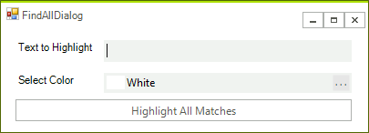

# Repalce Default Dialogs

This article will demonstrate how you can replace the default __FindAndRepacle__ dialog with a custom one. It will show which
      dialogs can be replaced as well.

## Create custom dialog

1. Let's start by adding a simple RadForm to our project (the main form of the project should contain at least one RadRichTextEditor).
              Make the form to look like in the following picture (you can leave the default control names).
            

1. Open the code behind and add event handler for the button. You can add a method that will perform the search as well:
            

#### __[C#] __

{{source=..\SamplesCS\RichTextEditor\HowTo\FindAllDialog.cs region=search}}
	            
	        private void radButton1_Click(object sender, EventArgs e)
	        {
	            string textToFind = radTextBox1.Text;
	            SelectAllMatches(textToFind);
	            var color = radColorBox1.Value;
	            richTextBox.ChangeTextHighlightColor(color);
	            this.richTextBox.Document.Selection.Clear();
	        }
	            
	        private void SelectAllMatches(string toSearch)
	        {
	            this.richTextBox.Document.Selection.Clear();
	            DocumentTextSearch search = new DocumentTextSearch(this.richTextBox.Document);
	            foreach (var textRange in search.FindAll(toSearch))
	            {
	                this.richTextBox.Document.Selection.AddSelectionStart(textRange.StartPosition);
	                this.richTextBox.Document.Selection.AddSelectionEnd(textRange.EndPosition);
	            }
	        }
	        
	{{endregion}}

#### __[VB.NET] __

{{source=..\SamplesVB\RichTextEditor\HowTo\FindAllDialog.vb region=search}}
	    Private Sub radButton1_Click(ByVal sender As Object, ByVal e As EventArgs)
	        Dim textToFind As String = radTextBox1.Text
	        SelectAllMatches(textToFind)
	        Dim color = radColorBox1.Value
	        richTextBox.ChangeTextHighlightColor(color)
	        Me.richTextBox.Document.Selection.Clear()
	    End Sub
	
	    Private Sub SelectAllMatches(ByVal toSearch As String)
	        Me.richTextBox.Document.Selection.Clear()
	        Dim search As New DocumentTextSearch(Me.richTextBox.Document)
	        For Each textRange In search.FindAll(toSearch)
	            Me.richTextBox.Document.Selection.AddSelectionStart(textRange.StartPosition)
	            Me.richTextBox.Document.Selection.AddSelectionEnd(textRange.EndPosition)
	        Next textRange
	    End Sub
	    '#End Region
	
	    '#Region "interface"
	    Private richTextBox As RadRichTextBox
	    Private _isOpen As Boolean
	
	    Public ReadOnly Property IsOpen() As Boolean Implements IFindReplaceDialog.IsOpen
	        Get
	            Return Me._isOpen
	        End Get
	    End Property
	
	    Public Sub Show(ByVal richTextBox As RadRichTextBox, ByVal replaceCallback As Func(Of String, Boolean), ByVal textToFind As String) Implements IFindReplaceDialog.Show
	        Me.Owner = richTextBox.ElementTree.Control.FindForm()
	        Me.richTextBox = richTextBox
	        MyBase.Show()
	    End Sub
	
	    Public Sub Close() Implements IFindReplaceDialog.Close
	
	    End Sub
	
	    Protected Overrides Sub OnShown(ByVal e As EventArgs)
	        Me._isOpen = True
	        MyBase.OnShown(e)
	    End Sub
	
	    Protected Overrides Sub OnActivated(ByVal e As EventArgs)
	        Me._isOpen = False
	        MyBase.OnActivated(e)
	    End Sub
	    '#End Region
	End Class

1. The new dialog need to implement the __IFindReplaceDialog__ otherwise you cannot replace the default one.
              So go ahead and add the interface to the form's class declaration:
            

#### __[C#] __

{{source=..\SamplesCS\RichTextEditor\HowTo\FindAllDialog.cs region=declare}}
	    
	    public partial class FindAllDialog : RadForm, IFindReplaceDialog
	    
	{{endregion}}

#### __[VB.NET] __

{{source=..\SamplesVB\RichTextEditor\HowTo\FindAllDialog.vb region=declare}}
	Partial Public Class FindAllDialog
	    Inherits RadForm
	    Implements IFindReplaceDialog
	    '#End Region
	
	    Dim radTextBox1 As New RadTextBox()
	    Dim radColorBox1 As New RadColorBox()
	Public Sub New()
	    InitializeComponent()
	End Sub
	    '#Region "search"
	    Private Sub radButton1_Click(ByVal sender As Object, ByVal e As EventArgs)
	        Dim textToFind As String = radTextBox1.Text
	        SelectAllMatches(textToFind)
	        Dim color = radColorBox1.Value
	        richTextBox.ChangeTextHighlightColor(color)
	        Me.richTextBox.Document.Selection.Clear()
	    End Sub
	
	    Private Sub SelectAllMatches(ByVal toSearch As String)
	        Me.richTextBox.Document.Selection.Clear()
	        Dim search As New DocumentTextSearch(Me.richTextBox.Document)
	        For Each textRange In search.FindAll(toSearch)
	            Me.richTextBox.Document.Selection.AddSelectionStart(textRange.StartPosition)
	            Me.richTextBox.Document.Selection.AddSelectionEnd(textRange.EndPosition)
	        Next textRange
	    End Sub
	    '#End Region
	
	    '#Region "interface"
	    Private richTextBox As RadRichTextBox
	    Private _isOpen As Boolean
	
	    Public ReadOnly Property IsOpen() As Boolean Implements IFindReplaceDialog.IsOpen
	        Get
	            Return Me._isOpen
	        End Get
	    End Property
	
	    Public Sub Show(ByVal richTextBox As RadRichTextBox, ByVal replaceCallback As Func(Of String, Boolean), ByVal textToFind As String) Implements IFindReplaceDialog.Show
	        Me.Owner = richTextBox.ElementTree.Control.FindForm()
	        Me.richTextBox = richTextBox
	        MyBase.Show()
	    End Sub
	
	    Public Sub Close() Implements IFindReplaceDialog.Close
	
	    End Sub
	
	    Protected Overrides Sub OnShown(ByVal e As EventArgs)
	        Me._isOpen = True
	        MyBase.OnShown(e)
	    End Sub
	
	    Protected Overrides Sub OnActivated(ByVal e As EventArgs)
	        Me._isOpen = False
	        MyBase.OnActivated(e)
	    End Sub
	    '#End Region
	End Class

Now you are ready to add the required fields, property and methods:

#### __[C#] __

{{source=..\SamplesCS\RichTextEditor\HowTo\FindAllDialog.cs region=interface}}
	        
	        RadRichTextBox richTextBox;
	        bool isOpen;
	                
	        public bool IsOpen
	        {
	            get
	            {
	                return this.isOpen;
	            }
	        }
	            
	        public void Show(RadRichTextBox richTextBox, Func<string, bool> replaceCallback, string textToFind)
	        {
	            this.Owner = richTextBox.ElementTree.Control.FindForm();
	            this.richTextBox = richTextBox;
	            this.Show();
	        }
	        
	        protected override void OnShown(EventArgs e)
	        {
	            this.isOpen = true;
	            base.OnShown(e);
	        }
	        
	        protected override void OnActivated(EventArgs e)
	        {
	            this.isOpen = false;
	            base.OnActivated(e);
	        }
	
	{{endregion}}

#### __[VB.NET] __

{{source=..\SamplesVB\RichTextEditor\HowTo\FindAllDialog.vb region=interface}}
	    Private richTextBox As RadRichTextBox
	    Private _isOpen As Boolean
	
	    Public ReadOnly Property IsOpen() As Boolean Implements IFindReplaceDialog.IsOpen
	        Get
	            Return Me._isOpen
	        End Get
	    End Property
	
	    Public Sub Show(ByVal richTextBox As RadRichTextBox, ByVal replaceCallback As Func(Of String, Boolean), ByVal textToFind As String) Implements IFindReplaceDialog.Show
	        Me.Owner = richTextBox.ElementTree.Control.FindForm()
	        Me.richTextBox = richTextBox
	        MyBase.Show()
	    End Sub
	
	    Public Sub Close() Implements IFindReplaceDialog.Close
	
	    End Sub
	
	    Protected Overrides Sub OnShown(ByVal e As EventArgs)
	        Me._isOpen = True
	        MyBase.OnShown(e)
	    End Sub
	
	    Protected Overrides Sub OnActivated(ByVal e As EventArgs)
	        Me._isOpen = False
	        MyBase.OnActivated(e)
	    End Sub
	    '#End Region
	End Class

1. The final step is to assign a new instance of the dialog to the corresponding property:
            

#### __[C#] __

{{source=..\SamplesCS\RichTextEditor\HowTo\ChangeDefaultDialogs.cs region=assign}}
	            radRichTextEditor1.RichTextBoxElement.FindReplaceDialog = new FindAllDialog();
	{{endregion}}

#### __[VB.NET] __

{{source=..\SamplesVB\RichTextEditor\HowTo\ChangeDefaultDialogs.vb region=assign}}
	        radRichTextEditor1.RichTextBoxElement.FindReplaceDialog = New FindAllDialog()
	        '#End Region
	    End Sub
	End Class

## Dialogs that can be replaced

The following list shows which dialogs can be replaced in RadRichTextEditor:
        

* AddNewBibliographicSourceDialog

* ChangeEditingPermissionsDialog

* CodeFormattingDialog

* EditCustomDictionaryDialog

* FindReplaceDialog

* FloatingBlockPropertiesDialog

* FontPropertiesDialog

* InsertCaptionDialog

* InsertCrossReferenceWindow

* InsertDateTimeDialog

* InsertHyperlinkDialog

* InsertSymbolDialog

* InsertTableDialog

* InsertTableOfContentsDialog

* ManageBibliographicSourcesDialog

* ManageBookmarksDialog

* ManageStylesDialog

* NewCaptionLabelDialog

* NotesDialog

* ParagraphPropertiesDialog

* ProtectDocumentDialog

* SetNumberingValueDialog

* SpellCheckingDialog

* StyleFormattingPropertiesDialog

* TablePropertiesDialog

* TabStopsPropertiesDialog

* UnprotectDocumentDialog

* WatermarkSettingsDialog
