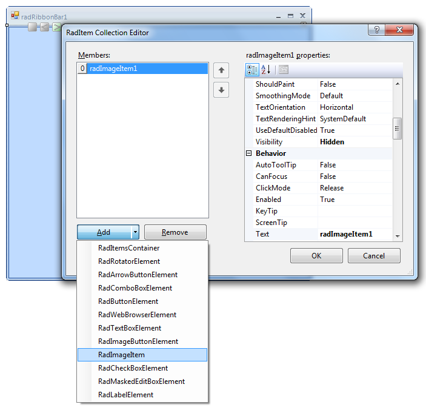
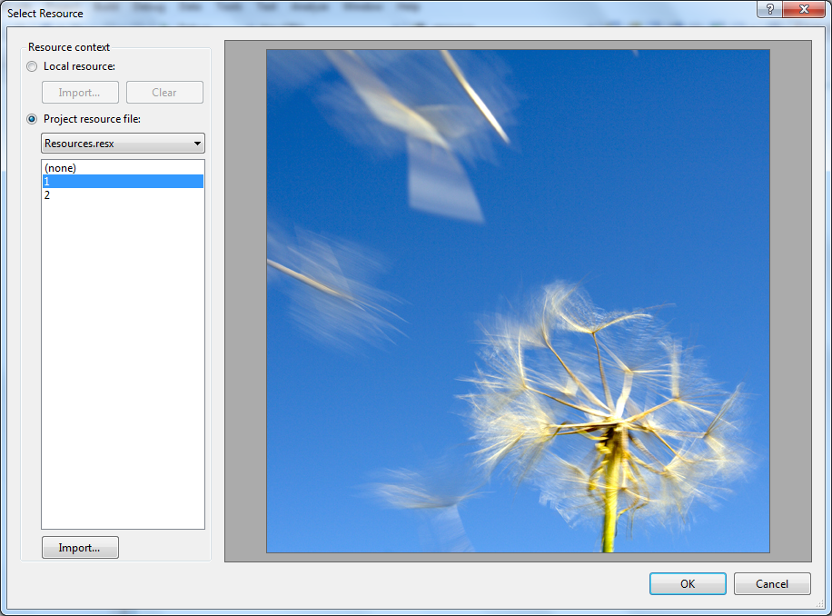
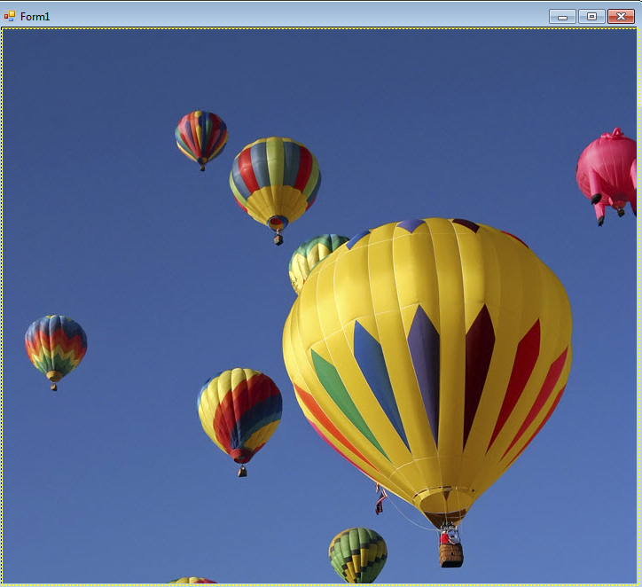

# Getting Started

## 

This tutorial demonstrates configuring __RadRotator__ at design-time, then running the animation at design time and run time. This example displays a series of images and one web site.
        

1. In a new Windows Application, set the form __Size__ property to 500,500.
            

1. Drop a RadRotator on the form and set the Dock property to Fill. 

1. In the Property Window click the ellipses for the Items property. This step will launch the __Rad Items Collection Editor__.
            

1. In the __Rad Items Collection Editor__, click the Add split button arrow to display the types that can be used by RadRotator.
            

1. Locate and click the __RadImageItem__.

1. In the __Rad Items Collection Editor__ properties, click the Image property ellipses.

1. In the __Select Resource__ dialog, click the __Local Resource__ radio button, click the __Import__ button and open any image file. The "Sample Pictures" distributed with Windows can be used too.

1. Click __OK__ to close the __Select Resource__ dialog.
            

1. Add three more RadImageItems. 

1. Add a __RadWebBrowserItem__ to the collection. Set the Url property to [http://www.telerik.com](http://www.telerik.com).

1. Click __OK__ to close the __RadItem Collection Editor.__

1. In the designer, notice the controls in the upper left of the __RadRotator__. Click the ">" button and observe that you can navigate through the items at design time.

1. In the __Properties__ window for the __RadRotator__, set the __Running__ property to __true__.

1. Press __F5__ to run the application.
            
