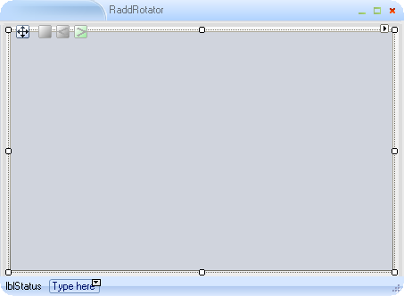

# Tutorial: Creating a Slide Viewer with RadRotator

## 

The following tutorial demonstrates programmatically loading images from your "My Documents\Pictures" directory for display in the RadRotator. The tutorial will also integrate __RadStatusStrip__ control which contains RadLabelElement.


1\. In the default form of a new Windows application:

2\. Drop a __RadStatusStrip__ to the form and set the __Dock__ property to __Bottom__.
            
3\. Click the __RadStatusStrip__ downward pointing arrow and add a __RadLabelElement__.
            
4\. Drop a __RadRotator__ on the __Form__ and set its __Dock__ property to *Fill*.
            
5\. Navigate to the code view of the default form.

6\. Change the declaration of the form so that it derives from RadForm.
            
{{source=..\SamplesCS\Rotator\TutorialCreatingASlideViewerWithRadRotator.cs region=inheritFromRadForm}} 
{{source=..\SamplesVB\Rotator\TutorialCreatingASlideViewerWithRadRotator.Designer.vb region=inheritFromRadForm}} 

````C#
public partial class TutorialCreatingASlideViewerWithRadRotator : RadForm

````
````VB.NET
Partial Class TutorialCreatingASlideViewerWithRadRotator
    Inherits Telerik.WinControls.UI.RadForm

````
	
{{endregion}} 

7\. Return to the design view of the form. Visual Studio will repaint the form.



8\. Click the __Events__ tab of the __Properties__ Window and navigate to the Forms __Load__ event.  Double click it to create a Load event handler and replace that code with the code below. *The code here uses the System.IO Directory object GetFiles() method to retrieve all "*.jpg" file paths. The file paths are passed to a GetThumbNail() method that will be described next. GetThumbNail() returns an ImageItem that is added to the RadRotator items collection. Once the image items are loaded the Start() method is called to begin animation.

{{source=..\SamplesCS\Rotator\TutorialCreatingASlideViewerWithRadRotator.cs region=rotatorExample}} 
{{source=..\SamplesVB\Rotator\TutorialCreatingASlideViewerWithRadRotator.vb region=rotatorExample}} 

````C#
public TutorialCreatingASlideViewerWithRadRotator()
{
    InitializeComponent();
    radRotator1.BeginRotate += new BeginRotateEventHandler(radRotator1_BeginRotate);
}
private void TutorialCreatingASlideViewerWithRadRotator_Load(object sender, EventArgs e)
{
    string myPicturesPath = Environment.GetFolderPath(Environment.SpecialFolder.MyPictures);
    foreach (string fileName in Directory.GetFiles(myPicturesPath, "*.jpg"))
    {
        radRotator1.Items.Add(GetThumbNail(fileName));
    }
    radRotator1.Start(true);
    radRotator1.ShouldStopOnMouseOver = false;
}
private RadImageItem GetThumbNail(string path)
{
    RadImageItem imageItem = new RadImageItem();
    Image image = Image.FromFile(path);
    // workaround to prevent using internal image thumbnail
    image.RotateFlip(System.Drawing.RotateFlipType.Rotate180FlipNone);
    image.RotateFlip(System.Drawing.RotateFlipType.Rotate180FlipNone);
    // calculate aspect ratio so image is not distorted
    double ratio = 0;
    if (image.Width > image.Height)
    {
        ratio = ClientRectangle.Width / image.Width;
    }
    else
    {
        ratio = ClientRectangle.Height / image.Height;
    }
    int newWidth = (int)(image.Width * ratio);
    int newHeight = (int)(image.Height * ratio);
    imageItem.Image = image.GetThumbnailImage(newWidth, newHeight, null, IntPtr.Zero);
    return imageItem;
}
void radRotator1_BeginRotate(object sender, BeginRotateEventArgs e)
{
    radLabelElement1.Text = String.Format("Rotating from item {0} to {1}", e.From, e.To);
}

````
````VB.NET
Private Sub TutorialCreatingASlideViewerWithRadRotator_Load(ByVal sender As System.Object, ByVal e As System.EventArgs) Handles Me.Load
    Dim myPicturesPath As String = Environment.GetFolderPath(Environment.SpecialFolder.MyPictures)
    For Each fileName As String In Directory.GetFiles(myPicturesPath, "*.jpg")
        RadRotator1.Items.Add(GetThumbNail(fileName))
    Next
    RadRotator1.Start(True)
    RadRotator1.ShouldStopOnMouseOver = False
End Sub
Private Function GetThumbNail(ByVal path As String) As RadImageItem
    Dim imageItem As New RadImageItem()
    Dim image As Image = image.FromFile(path)
    ' workaround to prevent using internal image thumbnail
    image.RotateFlip(System.Drawing.RotateFlipType.Rotate180FlipNone)
    image.RotateFlip(System.Drawing.RotateFlipType.Rotate180FlipNone)
    ' calculate aspect ratio so image is not distorted
    Dim ratio As Double = 0
    If image.Width > image.Height Then
        ratio = ClientRectangle.Width / image.Width
    Else
        ratio = ClientRectangle.Height / image.Height
    End If
    Dim newWidth As Integer = Convert.ToInt32(image.Width * ratio)
    Dim newHeight As Integer = Convert.ToInt32(image.Height * ratio)
    imageItem.Image = image.GetThumbnailImage(newWidth, newHeight, Nothing, IntPtr.Zero)
    Return imageItem
End Function
Private Sub RadRotator1_BeginRotate(ByVal sender As Object, ByVal e As Telerik.WinControls.UI.BeginRotateEventArgs) Handles RadRotator1.BeginRotate
    RadLabelElement1.Text = [String].Format("Rotating from item {0} to {1}", e.From, e.[To])
End Sub

````

{{endregion}} 

9\. Press __F5__ to run the application. 
            
