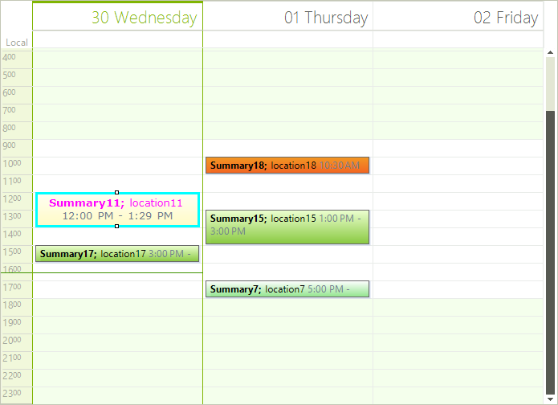
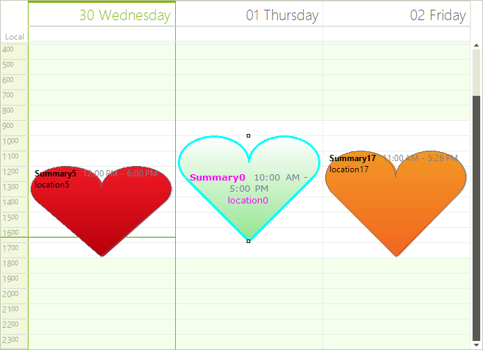

# Formatting appointments

##
Appointments appearance in __RadScheduler__ can be customized using the __AppointmentFormatting__ event.

>note Appointment elements are created only for the currently visible cells and are being reused when scrolling or navigating backwards/forwards in the __RadScheduler__ . In order to prevent applying the formatting to other appointment elements, all styles should be reset for the rest of the appointment elements.
>


The code snippet below demonstrates how to change the font, fore color, border color and text alignment for the selected appointment element:#_[C#] _

{{source=..\SamplesCS\Scheduler\Appearance\FormattingAppointments.cs region=AppointmentFormatting}} 
{{source=..\SamplesVB\Scheduler\Appearance\FormattingAppointments.vb region=AppointmentFormatting}} 

````C#
        
Font font = new Font("Verdana", 10f, FontStyle.Bold);
    
private void radScheduler1_AppointmentFormatting(object sender, Telerik.WinControls.UI.SchedulerAppointmentEventArgs e)
{
    if (e.AppointmentElement.Selected)
    {
        e.AppointmentElement.Font = font;
        e.AppointmentElement.ForeColor = Color.Fuchsia;
        e.AppointmentElement.TextAlignment = ContentAlignment.MiddleCenter;
        e.AppointmentElement.UseDefaultPaint = true;
        e.AppointmentElement.BorderColor = Color.Aqua;
        e.AppointmentElement.BorderBoxStyle = BorderBoxStyle.SingleBorder;
        e.AppointmentElement.BorderWidth = 3;
    }
    else
    {
        e.AppointmentElement.ResetValue(VisualElement.FontProperty, ValueResetFlags.Local); 
        e.AppointmentElement.ResetValue(VisualElement.ForeColorProperty, ValueResetFlags.Local);
        e.AppointmentElement.ResetValue(LightVisualElement.TextAlignmentProperty, ValueResetFlags.Local);
        e.AppointmentElement.UseDefaultPaint = false;
        e.AppointmentElement.ResetValue(LightVisualElement.BorderColorProperty, ValueResetFlags.Local);
        e.AppointmentElement.ResetValue(LightVisualElement.BorderWidthProperty, ValueResetFlags.Local);
        e.AppointmentElement.ResetValue(LightVisualElement.BorderBoxStyleProperty, ValueResetFlags.Local);
    }
}

````
````VB.NET
Private font As New Font("Verdana", 10.0F, FontStyle.Bold)
Private Sub RadScheduler1_AppointmentFormatting(sender As Object, e As Telerik.WinControls.UI.SchedulerAppointmentEventArgs) Handles RadScheduler1.AppointmentFormatting
    If e.AppointmentElement.Selected Then
        e.AppointmentElement.Font = font
        e.AppointmentElement.ForeColor = Color.Fuchsia
        e.AppointmentElement.TextAlignment = ContentAlignment.MiddleCenter
        e.AppointmentElement.UseDefaultPaint = True
        e.AppointmentElement.BorderColor = Color.Aqua
        e.AppointmentElement.BorderBoxStyle = BorderBoxStyle.SingleBorder
        e.AppointmentElement.BorderWidth = 3
    Else
        e.AppointmentElement.ResetValue(VisualElement.FontProperty, ValueResetFlags.Local)
        e.AppointmentElement.ResetValue(VisualElement.ForeColorProperty, ValueResetFlags.Local)
        e.AppointmentElement.ResetValue(LightVisualElement.TextAlignmentProperty, ValueResetFlags.Local)
        e.AppointmentElement.UseDefaultPaint = False
        e.AppointmentElement.ResetValue(LightVisualElement.BorderColorProperty, ValueResetFlags.Local)
        e.AppointmentElement.ResetValue(LightVisualElement.BorderWidthProperty, ValueResetFlags.Local)
        e.AppointmentElement.ResetValue(LightVisualElement.BorderBoxStyleProperty, ValueResetFlags.Local)
    End If
End Sub

````

{{endregion}}


It is possible to change the appointments’ shape setting the SchedulerElement.__AppointmentShape__ property to the desired shape. Changing the __AppointmentShape__ will also change the shape of the shadow and the appointment type indicator (tentative/busy).#_[C#] _

{{source=..\SamplesCS\Scheduler\Appearance\FormattingAppointments.cs region=AppointmentShape}} 
{{source=..\SamplesVB\Scheduler\Appearance\FormattingAppointments.vb region=AppointmentShape}} 

````C#
            
 this.radScheduler1.SchedulerElement.AppointmentShape = new HeartShape();

````
````VB.NET
Me.RadScheduler1.SchedulerElement.AppointmentShape = New HeartShape()

````

{{endregion}} 



