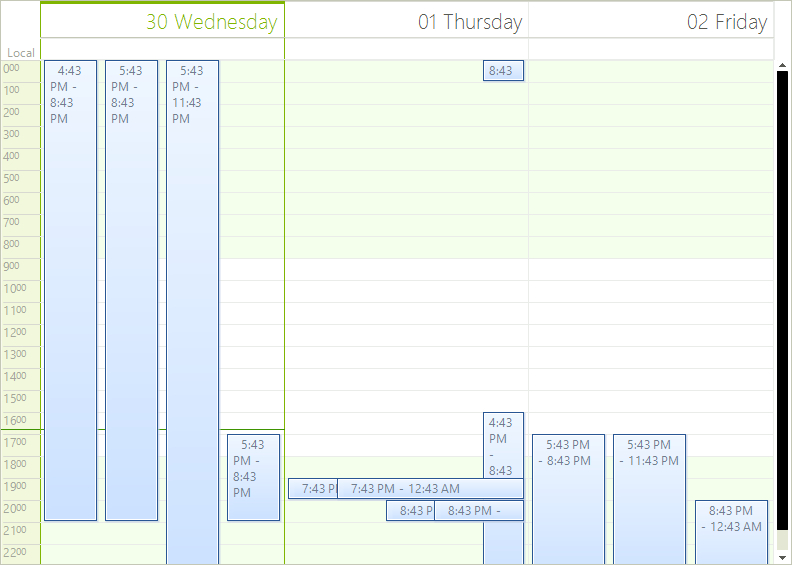
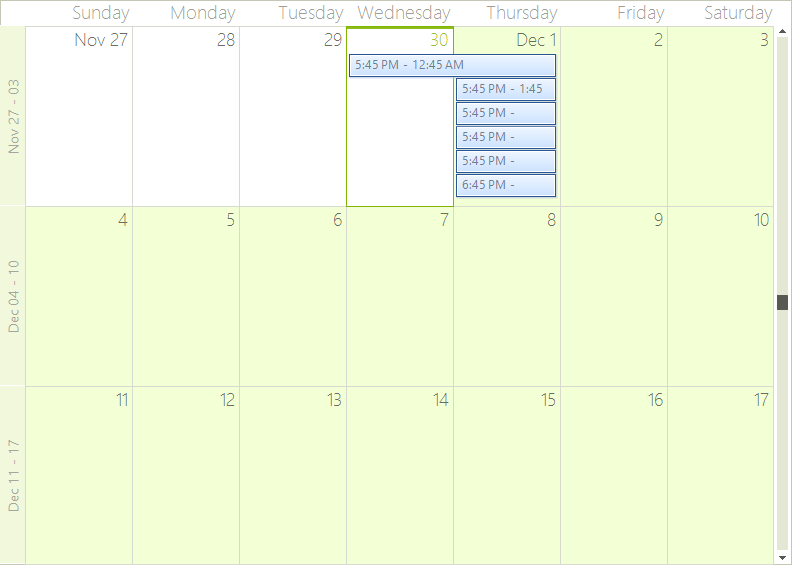
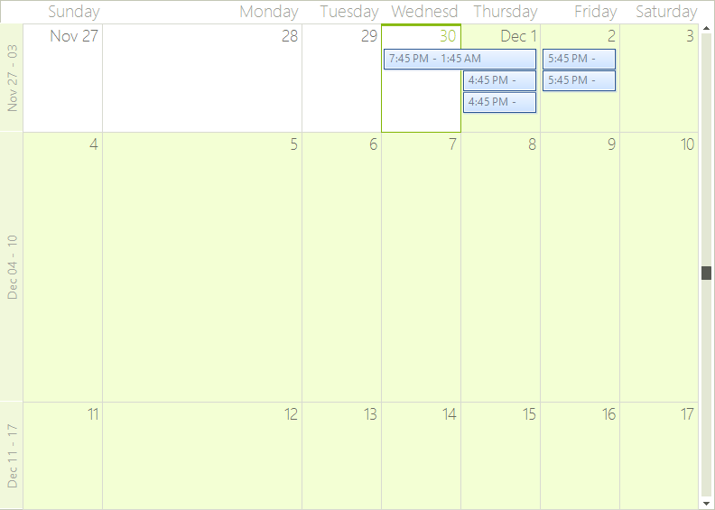
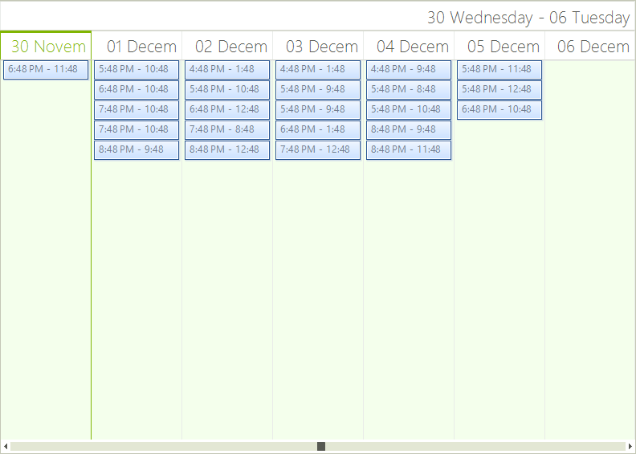
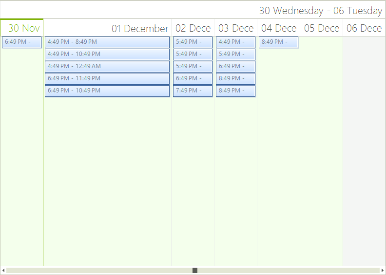
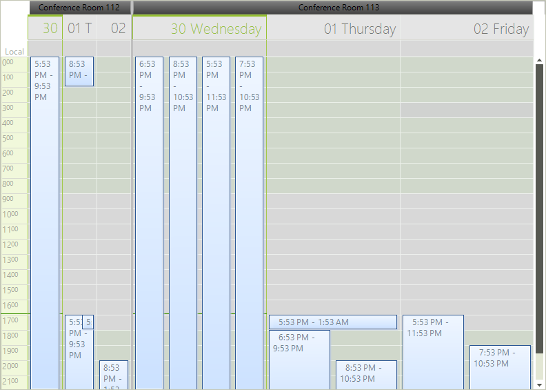

# Modify Size of Rows, Columns and Resources

__RadScheduler__ 
        allows you to customize the size of the rows and the columns of the views where this is applicable. Below you can see how to customize each of the available views:

## DayView, WeekView and WorkWeekView

On the day view you can resize the columns which represent a given day (16 Friday, 17 Saturday, 18 Sunday on the figure above).

Here is how you can make the middle columns three times bigger:

#### __[C#]__

{{region DayView}}
	            scheduler.ActiveViewType = SchedulerViewType.Day; // this can be changed to either Week or WorkWeek, the ViewElement is always SchedulerDayViewElement
	            (scheduler.ViewElement as SchedulerDayViewElement).SetColumnWidth(1, 3);
	{{endregion}}

#### __[VB.NET]__

{{region DayView}}
	        scheduler.ActiveViewType = SchedulerViewType.Day
	        ' this can be changed to either Week or WorkWeek, the ViewElement is always SchedulerDayViewElement
	        TryCast(scheduler.ViewElement, SchedulerDayViewElement).SetColumnWidth(1, 3)
	{{endregion}}

>importantThe actual width of a column will be calculated proportionally according to the values other columns have. The default value of each column is 1. This means that setting a value of 2 for a given column will make it twice as large compared to other columns.
          

## MonthView

In month view both rows and columns are resizable. The rows on the screenshots are May 11-17, May 18-24, May 25-31 and  the columns are May 11, 12, 13 ,14 ,15 ,16 ,17 for the first row and 18, 19 and so on for the second row.
        

The approach for this view is similar:
        

#### __[C#]__

{{region MonthView}}
	            scheduler.ActiveViewType = SchedulerViewType.Month;
	            (scheduler.ViewElement as SchedulerMonthViewElement).SetColumnWidth(1, 2.5f);
	            (scheduler.ViewElement as SchedulerMonthViewElement).SetRowHeight(1, 2.5f);
	{{endregion}}

#### __[VB.NET]__

{{region MonthView}}
	        scheduler.ActiveViewType = SchedulerViewType.Month
	        TryCast(scheduler.ViewElement, SchedulerMonthViewElement).SetColumnWidth(1, 2.5F)
	        TryCast(scheduler.ViewElement, SchedulerMonthViewElement).SetRowHeight(1, 2.5F)
	{{endregion}}

## TimelineView

Here we see the columns named as 19-25 may. The same approach can be applied here as well:
        

#### __[C#]__

{{region TimelineView}}
	            scheduler.ActiveViewType = SchedulerViewType.Timeline;
	            (scheduler.ViewElement as SchedulerTimelineViewElement).SetColumnWidth(1, 3f);
	{{endregion}}

#### __[VB.NET]__

{{region TimelineView}}
	        scheduler.ActiveViewType = SchedulerViewType.Timeline
	        TryCast(scheduler.ViewElement, SchedulerTimelineViewElement).SetColumnWidth(1, 3.0F)
	{{endregion}}

## ResourceView

Here we see the resources - *"Conference Room 112/113"*. Resizing them can happen as follows:
        

#### __[C#]__

{{region ResourceView}}
	            scheduler.GroupType = GroupType.Resource;
	            scheduler.ActiveViewType = SchedulerViewType.Day;
	            (scheduler.ViewElement as SchedulerDayViewGroupedByResourceElement).SetResourceSize(0, 0.25f);
	{{endregion}}

#### __[VB.NET]__

{{region ResourceView}}
	        scheduler.GroupType = GroupType.Resource
	        scheduler.ActiveViewType = SchedulerViewType.Day
	        TryCast(scheduler.ViewElement, SchedulerDayViewGroupedByResourceElement).SetResourceSize(0, 0.25F)
	{{endregion}}

