# Themes and appearance

## 

The control is shipped with a rich set of themes that allow you to easily build slick interfaces with the look-and-feel of Windows, Office, Outlook, etc. The themes can be easily switched using a single property:
        
| Themes appearance |  |
| ------ | ------ |
|VisualStudio2012Dark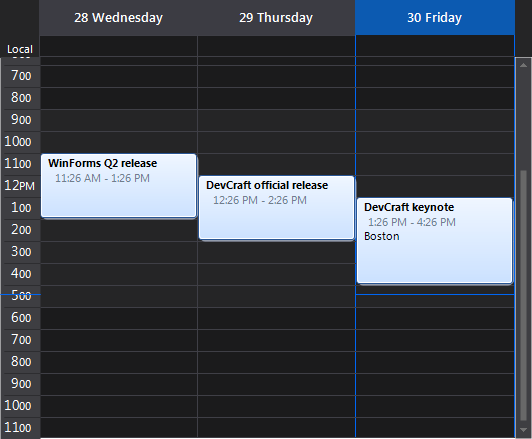|Office2013Light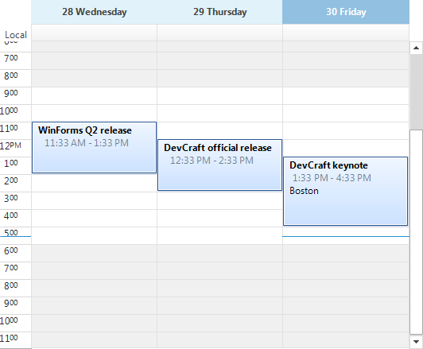|
|Breeze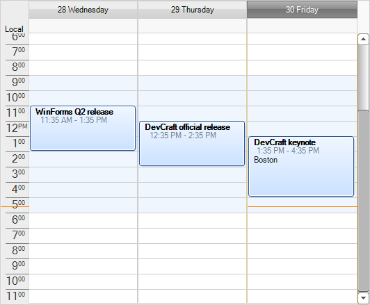|Windows 7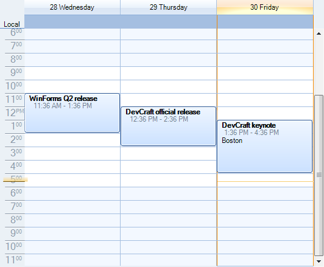|
|Aqua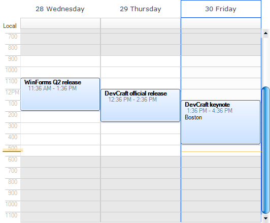|TelerikMetroBlue|
|Windows 8|HighContrastBlack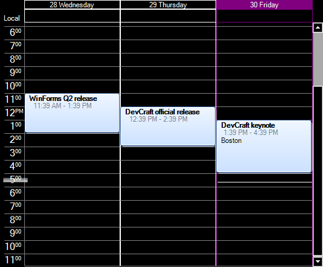|
|Desert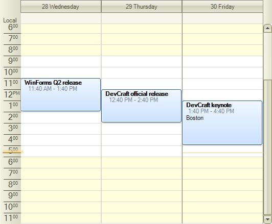|Office2010Black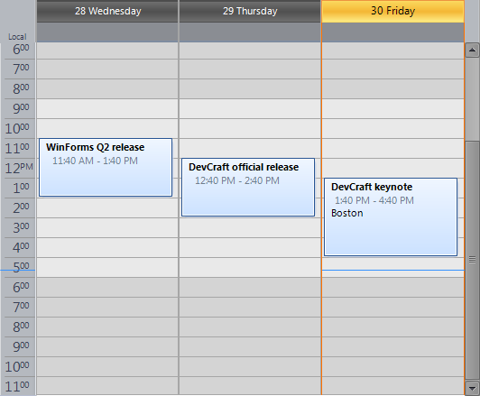|
|Office2007Silver|Office2013Dark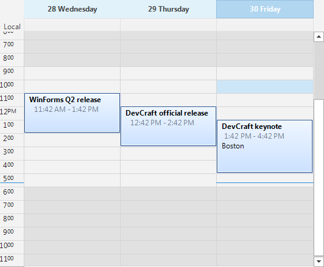|
|Office2007Black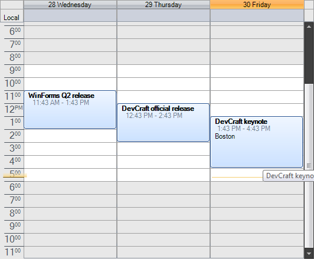|Office2010Blue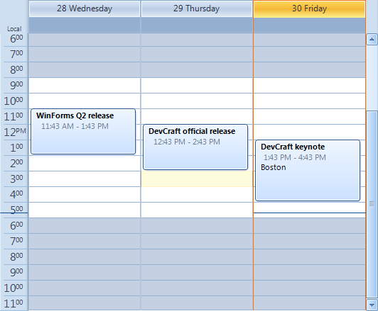|
|TelerikMetro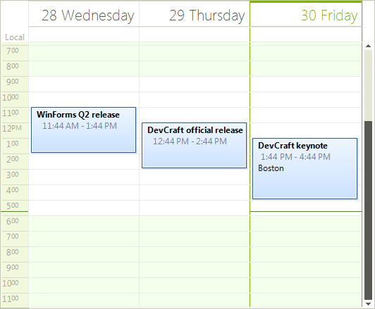|VisualStudio2012Light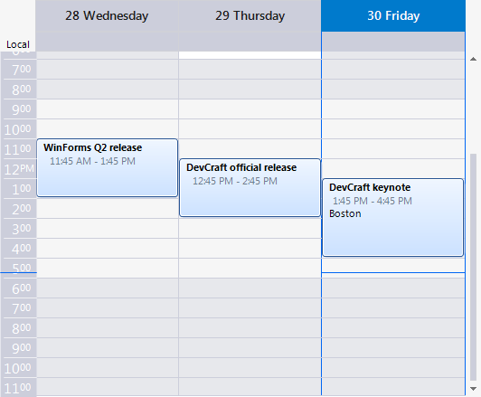|
|Office2010Silver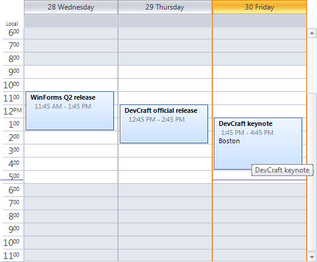|TelerikMetroTouch|

In addition to the built-in themes for the scheduler navigator, every single area do the Scheduler can be customized, including but not 
          limited to appointments, status indicators (busy, tentative, etc), background (indicating the category it belongs to), text format and 
          positioning, date/time indicators, headers, working time, etc. This is done by using the 
          [Visual Style Builder productivity tool](http://www.telerik.com/help/winforms/vsb_overview.html).
        
