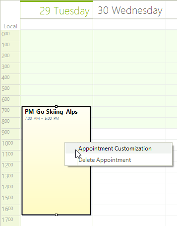

# Customize the ContextMenu


__RadScheduler__ gives you the ability to easily customize its default context menu. This can be achieve by using the __ContextMenuOppennig__ event.


## Replace the default and the appointments context menu.

1. Create a __RadContextMenu__ and add the necessary items to it. Create another __RadContextMenu__ and fill it with items.

1. Subscribe to the __ContextMenuOpening__ event.

1. In the __ContextMenuOpenning__ event handler replace the default context menus with the newly created ones.

{{source=..\SamplesCS\Scheduler\CustomizeContextMenu.cs region=contextMenuOpening}} 
{{source=..\SamplesVB\Scheduler\CustomizeContextMenu.vb region=contextMenuOpening}} 

````C#
void radScheduler1_ContextMenuOpening(object sender, SchedulerContextMenuOpeningEventArgs e)
{
    if (e.Element is AppointmentElement)
    {
        e.Menu = this.radContextMenu1;
    }
    else
    {
        e.Menu = this.radContextMenu2;
    }
}

````
````VB.NET
Private Sub radScheduler1_ContextMenuOpening(sender As Object, e As SchedulerContextMenuOpeningEventArgs) Handles RadScheduler1.ContextMenuOpening
    If TypeOf e.Element Is AppointmentElement Then
        e.Menu = Me.RadContextMenu1
    Else
        e.Menu = Me.RadContextMenu2
    End If
End Sub

````

{{endregion}} 


As you can see in the screenshots below, we can set different context menus depending on the element that invokes the context menu creation.




## Change the default items or and disable the context menu.

The __Menu__ property of the __SchedulerContextMenuOpeningEventArgs__ objects gives you the opportunity to change the existing items of the context menu. Also you can entirely disable the context menu by setting the *Cancel*  property to true.  For example you can change the context menu for the appointments and disable the default context menu as follows:

{{source=..\SamplesCS\Scheduler\CustomizeContextMenu.cs region=contextMenuOpening1}} 
{{source=..\SamplesVB\Scheduler\CustomizeContextMenu.vb region=contextMenuOpening1}} 

````C#
void radScheduler1_ContextMenuOpening1(object sender, SchedulerContextMenuOpeningEventArgs e)
{
    if (e.Element is AppointmentElement)
    {
        e.Menu.Items.RemoveAt(0);
    }
    else
    {
        e.Cancel = true;
    }
}

````
````VB.NET
Private Sub radScheduler1_ContextMenuOpening1(sender As Object, e As SchedulerContextMenuOpeningEventArgs)
    If TypeOf e.Element Is AppointmentElement Then
        e.Menu.Items.RemoveAt(0)
    Else
        e.Cancel = True
    End If
End Sub

````

{{endregion}} 


