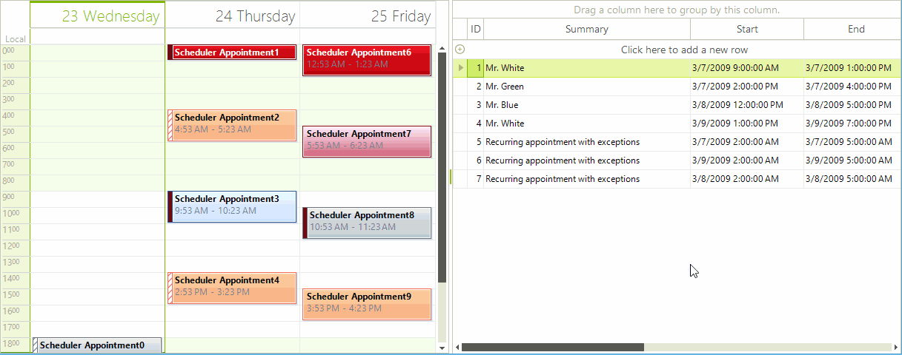
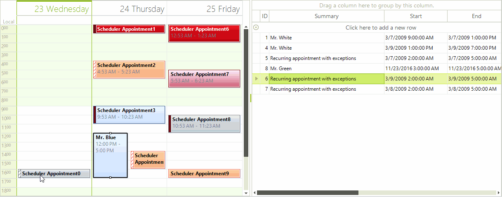

# Drag and Drop using RadDragDropService

This article will guide you through the process of achieving drag and drop functionality from __RadScheduler__ to __RadGridView__ and vice versa. For this purpose, we will use the __RadDragDropService__, supported by both of the controls.

Let’s assume that our __RadScheduler__ is in unbound mode and the __RadGridView__ control is bound to *Appointments* data table. 

## Drag and Drop from RadGridView to RadScheduler

1. The first thing we need to do is to start the __RadGridView__’s drag and drop service when a user clicks on a row with the left mouse down. For this purpose we should create a custom [grid behavior]():

{{source=..\SamplesCS\Scheduler\DragDrop\SchedulerToGrid.cs region=CustomRowGridBehavior}} 
{{source=..\SamplesVB\Scheduler\DragDrop\SchedulerToGrid.vb region=CustomRowGridBehavior}} 

````C#
        
        //initiates drag and drop service for clicked rows
        public class CustomRowGridBehavior : GridDataRowBehavior
        {
            protected override bool OnMouseDownLeft(MouseEventArgs e)
            {
                GridDataRowElement row = this.GetRowAtPoint(e.Location) as GridDataRowElement;
                if (row != null)
                {
                    RadGridViewDragDropService svc = this.GridViewElement.GetService<RadGridViewDragDropService>();
                    svc.Start(row);
                }
                return base.OnMouseDownLeft(e);
            }
        }
````
````VB.NET

    'initiates drag and drop service for clicked rows
    Public Class CustomRowGridBehavior
    Inherits GridDataRowBehavior
        Protected Overrides Function OnMouseDownLeft(e As MouseEventArgs) As Boolean
            Dim row As GridDataRowElement = TryCast(Me.GetRowAtPoint(e.Location), GridDataRowElement)
            If row IsNot Nothing Then
                Dim svc As RadGridViewDragDropService = Me.GridViewElement.GetService(Of RadGridViewDragDropService)()
                svc.Start(row)
            End If
            Return MyBase.OnMouseDownLeft(e)
        End Function
    End Class
````

{{endregion}} 

2\. Next, we should register this behavior in our grid:

{{source=..\SamplesCS\Scheduler\DragDrop\SchedulerToGrid.cs region=RegisterGridBehavior}} 
{{source=..\SamplesVB\Scheduler\DragDrop\SchedulerToGrid.vb region=RegisterGridBehavior}} 

````C#
            
            //register the custom row behavior
            BaseGridBehavior gridBehavior = this.radGridView1.GridBehavior as BaseGridBehavior;
            gridBehavior.UnregisterBehavior(typeof(GridViewDataRowInfo));
            gridBehavior.RegisterBehavior(typeof(GridViewDataRowInfo), new CustomRowGridBehavior());
````
````VB.NET

        'register the custom row behavior
        Dim gridBehavior As BaseGridBehavior = TryCast(Me.RadGridView1.GridBehavior, BaseGridBehavior)
        gridBehavior.UnregisterBehavior(GetType(GridViewDataRowInfo))
        gridBehavior.RegisterBehavior(GetType(GridViewDataRowInfo), New CustomRowGridBehavior())
        '
````

{{endregion}} 

3\. It is necessary to subscribe to the __PreviewDragStart__, __PreviewDragOver__ and __PreviewDragDrop__ events of the grid’s __RadDragDropService__. The __PreviewDragStart__ event is fired once the drag and drop service on the grid is started. We should notify the service that the drag and drop operation can move forward. In the __PreviewDragOver__ event you can control on what targets to allow dropping the dragged row. The __PreviewDragDrop__ event performs the actual move of the row from the __RadGridView__ to the __RadScheduler__.

{{source=..\SamplesCS\Scheduler\DragDrop\SchedulerToGrid.cs region=RadDragDropService}} 
{{source=..\SamplesVB\Scheduler\DragDrop\SchedulerToGrid.vb region=RadDragDropService}} 

````C#
            
            //handle drag and drop events for the grid through the DragDrop service
            RadDragDropService svc = this.radGridView1.GridViewElement.GetService<RadDragDropService>();
            svc.PreviewDragStart += svc_PreviewDragStart;
            svc.PreviewDragDrop += svc_PreviewDragDrop;
            svc.PreviewDragOver += svc_PreviewDragOver;
````
````VB.NET

        'handle drag and drop events for the grid through the DragDrop service
        Dim svc As RadDragDropService = Me.RadGridView1.GridViewElement.GetService(Of RadDragDropService)()
        AddHandler svc.PreviewDragStart, AddressOf svc_PreviewDragStart
        AddHandler svc.PreviewDragDrop, AddressOf svc_PreviewDragDrop
        AddHandler svc.PreviewDragOver, AddressOf svc_PreviewDragOver

        '
````

{{endregion}} 

{{source=..\SamplesCS\Scheduler\DragDrop\SchedulerToGrid.cs region=PerformGridToSchedulerDragDrop}} 
{{source=..\SamplesVB\Scheduler\DragDrop\SchedulerToGrid.vb region=PerformGridToSchedulerDragDrop}} 

````C#
        
        //required to initiate drag and drop when grid is in bound mode
        private void svc_PreviewDragStart(object sender, PreviewDragStartEventArgs e)
        {
            e.CanStart = true;
        }
        
        private void svc_PreviewDragOver(object sender, RadDragOverEventArgs e)
        {
            if (e.DragInstance is GridDataRowElement)
            {
                e.CanDrop = e.HitTarget is SchedulerCellElement;
            }
        }
        
        private void svc_PreviewDragDrop(object sender, RadDropEventArgs e)
        {
            SchedulerCellElement schedulerCell = e.HitTarget as SchedulerCellElement;
            if (schedulerCell == null)
            {
                DayViewAllDayHeader allDay = (this.radScheduler1.SchedulerElement.ViewElement as SchedulerDayViewElement).AllDayHeaderElement;
                schedulerCell = SchedulerUIHelper.GetCellAtPoint(e.DropLocation, allDay.Children);
            }
            if (schedulerCell == null)
            {
                return;
            }
            GridDataRowElement draggedRow = e.DragInstance as GridDataRowElement;
            if (draggedRow == null)
            {
                return;
            }
            
            DataRowView dataRowView = draggedRow.Data.DataBoundItem as DataRowView;
            if (dataRowView != null)
            {
                if (draggedRow.GridControl.DataSource != null && typeof(BindingSource).IsAssignableFrom(draggedRow.GridControl.DataSource.GetType()))
                {
                    Appointment appointment = new Appointment();
                    appointment.Start = (DateTime)draggedRow.RowInfo.Cells["Start"].Value;
                    appointment.End = (DateTime)draggedRow.RowInfo.Cells["End"].Value;
                    //adjust start/end according to target cell
                    appointment.End = schedulerCell.Date.AddMinutes(appointment.Duration.TotalMinutes);
                    appointment.Start = schedulerCell.Date;
                    appointment.Summary = string.Empty + draggedRow.RowInfo.Cells["Summary"].Value;
                    appointment.Description = string.Empty + draggedRow.RowInfo.Cells["Description"].Value;
                    appointment.Location = string.Empty + draggedRow.RowInfo.Cells["Location"].Value;
                    appointment.StatusId = (int)draggedRow.RowInfo.Cells["StatusId"].Value;
                    appointment.BackgroundId = (int)draggedRow.RowInfo.Cells["BackgroundId"].Value;
                    this.radScheduler1.Appointments.Add(appointment);
                    
                    dataRowView.Row.Table.Rows.Remove(dataRowView.Row);
                }
                else
                {
                    throw new ApplicationException("Unhandled Scenario");
                }
            }
        }
````
````VB.NET

    'required to initiate drag and drop when grid is in bound mode
    Private Sub svc_PreviewDragStart(sender As Object, e As PreviewDragStartEventArgs)
        e.CanStart = True
    End Sub

    Private Sub svc_PreviewDragOver(sender As Object, e As RadDragOverEventArgs)
        If TypeOf e.DragInstance Is GridDataRowElement Then
            e.CanDrop = TypeOf e.HitTarget Is SchedulerCellElement
        End If
    End Sub

    Private Sub svc_PreviewDragDrop(sender As Object, e As RadDropEventArgs)
        Dim schedulerCell As SchedulerCellElement = TryCast(e.HitTarget, SchedulerCellElement)
        If schedulerCell Is Nothing Then
            Dim allDay As DayViewAllDayHeader = TryCast(Me.RadScheduler1.SchedulerElement.ViewElement, SchedulerDayViewElement).AllDayHeaderElement
            schedulerCell = SchedulerUIHelper.GetCellAtPoint(e.DropLocation, allDay.Children)
        End If
        If schedulerCell Is Nothing Then
            Return
        End If
        Dim draggedRow As GridDataRowElement = TryCast(e.DragInstance, GridDataRowElement)
        If draggedRow Is Nothing Then
            Return
        End If

        Dim dataRowView As DataRowView = TryCast(draggedRow.Data.DataBoundItem, DataRowView)
        If dataRowView IsNot Nothing Then
            If draggedRow.GridControl.DataSource IsNot Nothing AndAlso GetType(BindingSource).IsAssignableFrom(draggedRow.GridControl.DataSource.[GetType]()) Then
                Dim appointment As New Appointment()
                appointment.Start = DirectCast(draggedRow.RowInfo.Cells("Start").Value, DateTime)
                appointment.[End] = DirectCast(draggedRow.RowInfo.Cells("End").Value, DateTime)
                'adjust start/end according to target cell
                appointment.[End] = schedulerCell.[Date].AddMinutes(appointment.Duration.TotalMinutes)
                appointment.Start = schedulerCell.[Date]
                appointment.Summary = String.Empty + draggedRow.RowInfo.Cells("Summary").Value
                appointment.Description = String.Empty + draggedRow.RowInfo.Cells("Description").Value
                appointment.Location = String.Empty + draggedRow.RowInfo.Cells("Location").Value
                appointment.StatusId = CInt(draggedRow.RowInfo.Cells("StatusId").Value)
                appointment.BackgroundId = CInt(draggedRow.RowInfo.Cells("BackgroundId").Value)
                Me.RadScheduler1.Appointments.Add(appointment)

                dataRowView.Row.Table.Rows.Remove(dataRowView.Row)
            Else
                Throw New ApplicationException("Unhandled Scenario")
            End If
        End If
    End Sub
````

{{endregion}} 

>note The start date of the created appointment is in correspondence with the cell where the row is dropped. The appointment’s duration is relevant to the original duration.
>



## Drag and Drop from RadScheduler to RadGridView

To implement drag and drop functionality for this scenario, we will use the SchedulerElement.__DragDropBehavior__, which is a derivative of the __RadDragDropService__. Subscribe to its __PreviewDragOver__ and __PreviewDragDrop__ events. In the __PreviewDragOver__ event allow dropping over a row element or over the table element. The __PreviewDragDrop__ event performs the actual inserting of the dragged appointment into the __RadGridView__’s data source:

{{source=..\SamplesCS\Scheduler\DragDrop\SchedulerToGrid.cs region=SchedulerToGrid}} 
{{source=..\SamplesVB\Scheduler\DragDrop\SchedulerToGrid.vb region=SchedulerToGrid}} 

````C#
        
        private void DragDropBehavior_PreviewDragOver(object sender, Telerik.WinControls.RadDragOverEventArgs e)
        {
            e.CanDrop = e.HitTarget is GridTableElement ||
                        e.HitTarget is GridDataRowElement;
        }
        
        private void DragDropBehavior_PreviewDragDrop(object sender, Telerik.WinControls.RadDropEventArgs e)
        {
            DragFeedbackElement draggedInstance = e.DragInstance as DragFeedbackElement;
            if (draggedInstance == null)
            {
                return;
            }
            GridDataRowElement rowElement = e.HitTarget as GridDataRowElement;
            GridTableElement tableElement = e.HitTarget as GridTableElement;
            RadGridView targetGrid;
            if (rowElement == null && tableElement == null)
            {
                return;
            }
            if (rowElement != null)
            {
                targetGrid = rowElement.GridViewElement.GridControl;
            }
            else
            {
                targetGrid = tableElement.GridViewElement.GridControl;
            }
            
            if (targetGrid == null)
            {
                return;
            }
            e.Handled = true;
            
            int index = rowElement != null ? this.GetTargetRowIndex(rowElement, e.DropLocation) : targetGrid.RowCount;
            Appointment draggedAppointment = draggedInstance.AssociatedAppointment as Appointment;
            this.MoveRows(targetGrid, draggedAppointment, index);
        }
        
        private int GetTargetRowIndex(GridDataRowElement row, Point dropLocation)
        {
            int halfHeight = row.Size.Height / 2;
            int index = row.RowInfo.Index;
            if (dropLocation.Y > halfHeight)
            {
                index++;
            }
            return index;
        }
        
        private void MoveRows(RadGridView dragGrid,
            Appointment draggedAppointment, int index)
        {
            dragGrid.BeginUpdate();
            
            if (dragGrid.DataSource != null && typeof(BindingSource).IsAssignableFrom(dragGrid.DataSource.GetType()))
            {
                //bound to a BindingSource scenario
                BindingSource sourceCollection = (BindingSource)dragGrid.DataSource;
                this.radScheduler1.Appointments.Remove(draggedAppointment);
                
                DataRowView newDataRowView = sourceCollection.AddNew() as DataRowView;
                if (newDataRowView != null)
                {
                    newDataRowView["Start"] = draggedAppointment.Start;
                    newDataRowView["End"] = draggedAppointment.End ;
                    newDataRowView["Summary"] = draggedAppointment.Summary;
                    newDataRowView["Description"] = draggedAppointment.Description ;
                    newDataRowView["Location"] = draggedAppointment.Location;
                    newDataRowView["StatusId"] = draggedAppointment.StatusId;
                    newDataRowView["BackgroundId"] = draggedAppointment.BackgroundId ;
                }
                newDataRowView.Row.Table.Rows.InsertAt(newDataRowView.Row, index);
            }
            else
            {
                throw new ApplicationException("Unhandled Scenario");
            }
            
            dragGrid.EndUpdate(true);
        }
````
````VB.NET

    Private Sub DragDropBehavior_PreviewDragOver(sender As Object, e As Telerik.WinControls.RadDragOverEventArgs)
        e.CanDrop = TypeOf e.HitTarget Is GridTableElement OrElse TypeOf e.HitTarget Is GridDataRowElement
    End Sub

    Private Sub DragDropBehavior_PreviewDragDrop(sender As Object, e As Telerik.WinControls.RadDropEventArgs)
        Dim draggedInstance As DragFeedbackElement = TryCast(e.DragInstance, DragFeedbackElement)
        If draggedInstance Is Nothing Then
            Return
        End If
        Dim rowElement As GridDataRowElement = TryCast(e.HitTarget, GridDataRowElement)
        Dim tableElement As GridTableElement = TryCast(e.HitTarget, GridTableElement)
        Dim targetGrid As RadGridView
        If rowElement Is Nothing AndAlso tableElement Is Nothing Then
            Return
        End If
        If rowElement IsNot Nothing Then
            targetGrid = rowElement.GridViewElement.GridControl
        Else
            targetGrid = tableElement.GridViewElement.GridControl
        End If

        If targetGrid Is Nothing Then
            Return
        End If
        e.Handled = True

        Dim index As Integer = If(rowElement IsNot Nothing, Me.GetTargetRowIndex(rowElement, e.DropLocation), targetGrid.RowCount)
        Dim draggedAppointment As Appointment = TryCast(draggedInstance.AssociatedAppointment, Appointment)
        Me.MoveRows(targetGrid, draggedAppointment, index)
    End Sub

    Private Function GetTargetRowIndex(row As GridDataRowElement, dropLocation As Point) As Integer
        Dim halfHeight As Integer = row.Size.Height / 2
        Dim index As Integer = row.RowInfo.Index
        If dropLocation.Y > halfHeight Then
            index += 1
        End If
        Return index
    End Function

    Private Sub MoveRows(dragGrid As RadGridView, draggedAppointment As Appointment, index As Integer)
        dragGrid.BeginUpdate()

        If dragGrid.DataSource IsNot Nothing AndAlso GetType(BindingSource).IsAssignableFrom(dragGrid.DataSource.[GetType]()) Then
            'bound to a BindingSource scenario
            Dim sourceCollection As BindingSource = DirectCast(dragGrid.DataSource, BindingSource)
            Me.RadScheduler1.Appointments.Remove(draggedAppointment)

            Dim newDataRowView As DataRowView = TryCast(sourceCollection.AddNew(), DataRowView)
            If newDataRowView IsNot Nothing Then
                newDataRowView("Start") = draggedAppointment.Start
                newDataRowView("End") = draggedAppointment.[End]
                newDataRowView("Summary") = draggedAppointment.Summary
                newDataRowView("Description") = draggedAppointment.Description
                newDataRowView("Location") = draggedAppointment.Location
                newDataRowView("StatusId") = draggedAppointment.StatusId
                newDataRowView("BackgroundId") = draggedAppointment.BackgroundId
            End If
            newDataRowView.Row.Table.Rows.InsertAt(newDataRowView.Row, index)
        Else
            Throw New ApplicationException("Unhandled Scenario")
        End If

        dragGrid.EndUpdate(True)
    End Sub
````

{{endregion}} 


