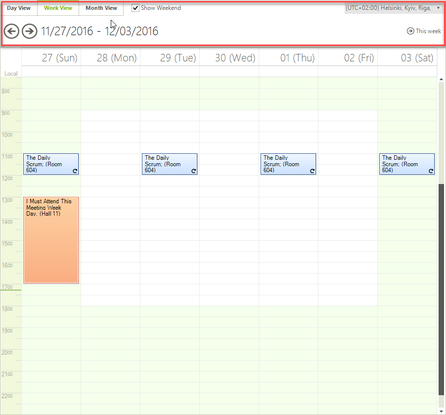
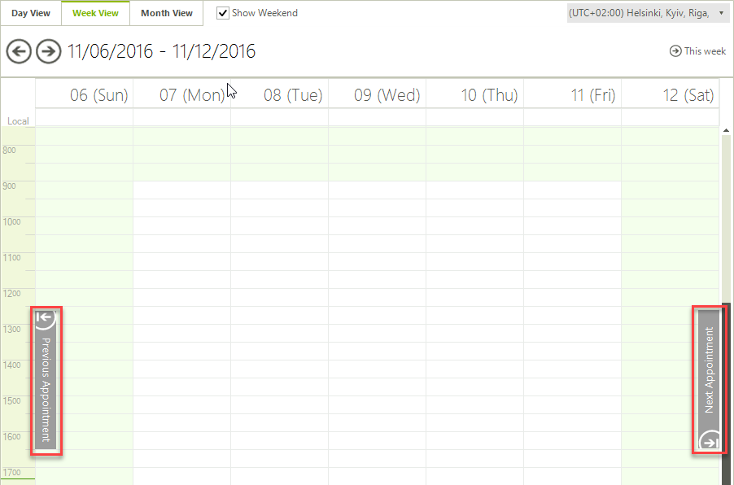

# Scheduler Navigation

## 

Built with usability in mind, Telerik Scheduler grants the user with familiar Microsoft Office-like UI and behavior, which means that no learning is required to work with the control.

A __Scheduler Navigator__ control at the top allows for quick switching between the available scheduler views ([Day](),[Week](), [Month](), [Timeline]()), and to toggle weekends on/off. It also navigates back and forth within a view and shows the current dates in a fully customizable and localizable Date Header. The time zones drop down list of RadSchedulerNavigator allows the user to see the appointments according to a time zone different than the local time zone.[RadSchedulerNavigator]() can easily be bound to a RadScheduler instance both in the Visual Studio Designer and in runtime:

__Navigation to appointments outside of the active view__ - If there are no appointments for a particular period, RadScheduler shows smart navigation buttons which to take the user to the previous/next appointment:

__Keyboard support__ - In addition to using the mouse, date browsing can also be done using the keyboard, so your end-users can work with that data more easily; 
