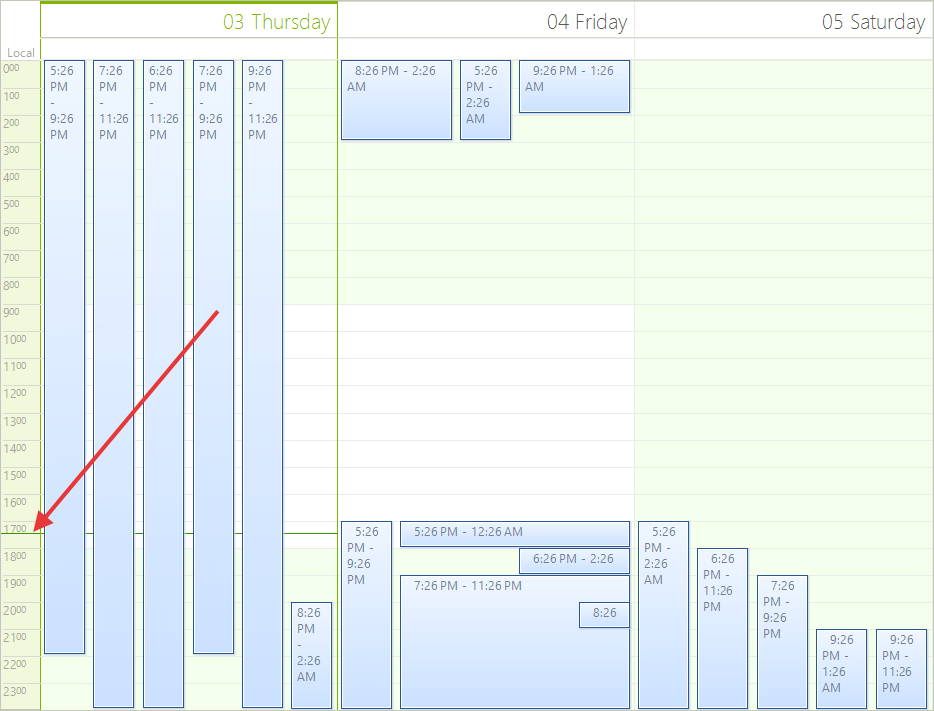
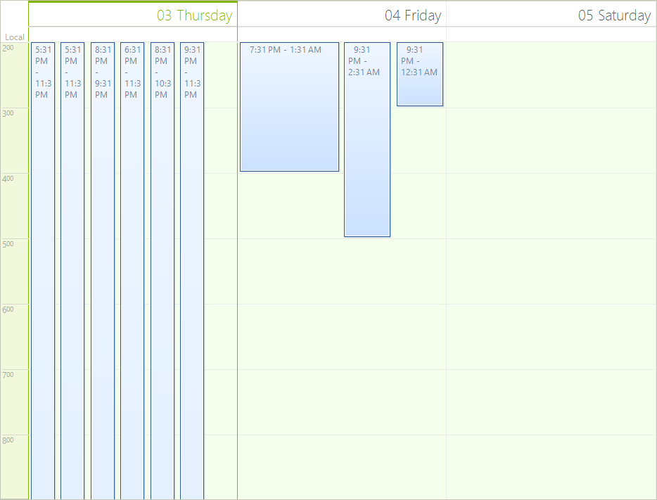
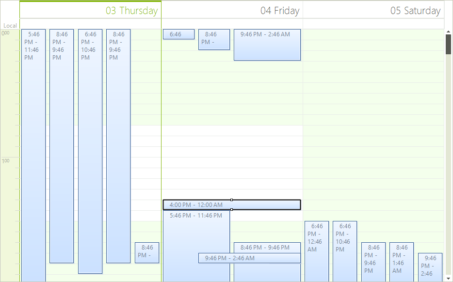
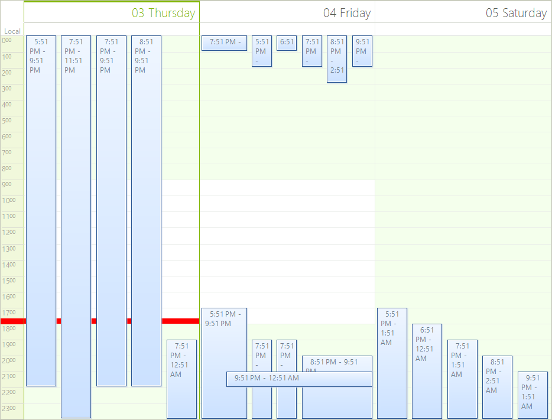
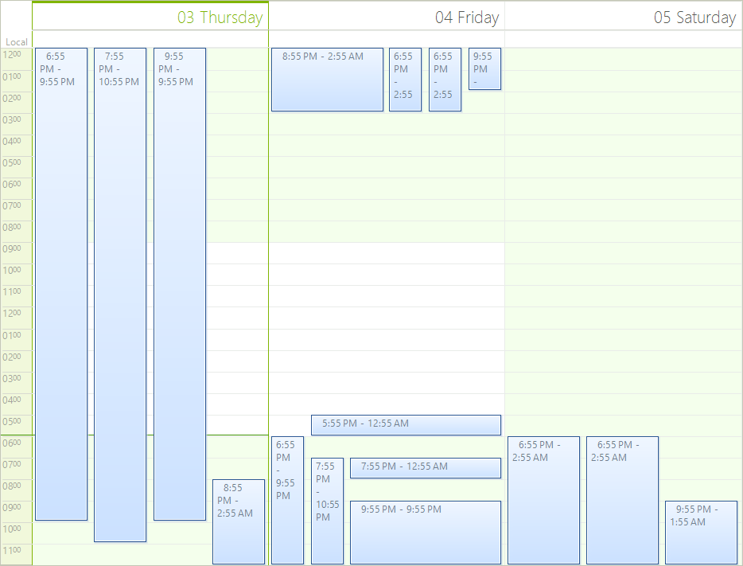
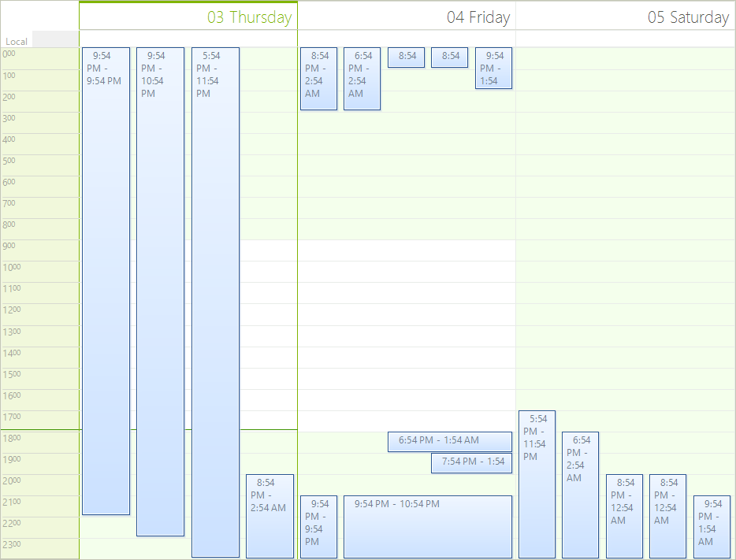

# Scheduler Ruler

The ruler in RadScheduler is used to show the time intervals of the current view.

## 

The ruler has various properties which can be used to modify its appearance. Below you can see examples for the most useful of these properties.

The ruler can be accessed as follows:

{{source=..\SamplesCS\Scheduler\Fundamentals\Ruler.cs region=GetRuller}} 
{{source=..\SamplesVB\Scheduler\Fundamentals\Ruler.vb region=GetRuller}} 

````C#
            RulerPrimitive ruler = (this.scheduler.SchedulerElement.ViewElement as SchedulerDayViewElement).DataAreaElement.Ruler;
````
````VB.NET
        Dim ruler As RulerPrimitive = TryCast(Me.scheduler.SchedulerElement.ViewElement, SchedulerDayViewElement).DataAreaElement.Ruler
        '
````

{{endregion}} 




* __TimePointerStyle__ - Sets the style of the pointer which shows the current time. Can be *Arrow, Line or SimpleLine*.

{{source=..\SamplesCS\Scheduler\Fundamentals\Ruler.cs region=TimePointerStyle}} 
{{source=..\SamplesVB\Scheduler\Fundamentals\Ruler.vb region=TimePointerStyle}} 

````C#
            ruler.TimePointerStyle = RulerCurrentTimePointer.Arrow;
````
````VB.NET
        ruler.TimePointerStyle = RulerCurrentTimePointer.Arrow
        '
````

{{endregion}} 


* __Start__ and __EndScale__ - Sets the time when the ruler starts and ends.

{{source=..\SamplesCS\Scheduler\Fundamentals\Ruler.cs region=StartEndScale}} 
{{source=..\SamplesVB\Scheduler\Fundamentals\Ruler.vb region=StartEndScale}} 

````C#
            ruler.StartScale = 2;
            ruler.EndScale = 9;
````
````VB.NET
        ruler.StartScale = 2
        ruler.EndScale = 9
        '
````

{{endregion}} 




* __RangeFactor__ - The range factor determines whether the units in the ruler will be devided in *FiveMinutes, HalfHour, Hour, QuarterHour, SixMinutes or TenMinutes*.

{{source=..\SamplesCS\Scheduler\Fundamentals\Ruler.cs region=RangeFactor}} 
{{source=..\SamplesVB\Scheduler\Fundamentals\Ruler.vb region=RangeFactor}} 

````C#
            ruler.RangeFactor = ScaleRange.Hour;
````
````VB.NET
        ruler.RangeFactor = ScaleRange.Hour
        '
````

{{endregion}} 




* __CurrentTimePointerWidth__ and __CurrentTimePointerColor__ - Sets the size and the color of the pointer which shows the current time.

{{source=..\SamplesCS\Scheduler\Fundamentals\Ruler.cs region=CurrentTimePointerWidthAndColor}} 
{{source=..\SamplesVB\Scheduler\Fundamentals\Ruler.vb region=CurrentTimePointerWidthAndColor}} 

````C#
            ruler.CurrentTimePointerWidth = 10;
            ruler.CurrentTimePointerColor = Color.Red;
````
````VB.NET
        ruler.CurrentTimePointerWidth = 10
        ruler.CurrentTimePointerColor = Color.Red
        '
````

{{endregion}} 




* __RulerFormatStrings__ and the __RulerTextFormatting__ event - They are used to format the text in the ruler. For example here is how to display the hours in a 12 hours format:

{{source=..\SamplesCS\Scheduler\Fundamentals\Ruler.cs region=FormatStrings}} 
{{source=..\SamplesVB\Scheduler\Fundamentals\Ruler.vb region=FormatStrings}} 

````C#
            ruler.FormatStrings = new RulerFormatStrings("hh", "mm", "hh", "mm");
````
````VB.NET
        ruler.FormatStrings = New RulerFormatStrings("hh", "mm", "hh", "mm")
        '
````

{{endregion}} 


The RulerTextFormatting event can be used to manually format the text. You can prepend a "0" in front of the text if it contains only one digit:

{{source=..\SamplesCS\Scheduler\Fundamentals\Ruler.cs region=RulerFormattingSubscribe}} 
{{source=..\SamplesVB\Scheduler\Fundamentals\Ruler.vb region=RulerFormattingSubscribe}} 

````C#
            this.scheduler.RulerTextFormatting += Scheduler_RulerTextFormatting;
````
````VB.NET
        '
````

{{endregion}} 


{{source=..\SamplesCS\Scheduler\Fundamentals\Ruler.cs region=RulerFormattingHandler}} 
{{source=..\SamplesVB\Scheduler\Fundamentals\Ruler.vb region=RulerFormattingHandler}} 

````C#
        void Scheduler_RulerTextFormatting(object sender, RulerTextFormattingEventArgs e)
        {
            if (e.Text.Length == 1)
            {
                e.Text = "0" + e.Text;
            }
        }
````
````VB.NET
    Private Sub Scheduler_RulerTextFormatting(sender As Object, e As RulerTextFormattingEventArgs)
        If e.Text.Length = 1 Then
            e.Text = "0" & e.Text
        End If
    End Sub
````

{{endregion}} 

* __RulerWidth__ - Sets the width of the ruler.

{{source=..\SamplesCS\Scheduler\Fundamentals\Ruler.cs region=RulerWidth}} 
{{source=..\SamplesVB\Scheduler\Fundamentals\Ruler.vb region=RulerWidth}} 

````C#
            ruler.RulerWidth = 100;
````
````VB.NET
        ruler.RulerWidth = 100
        '
````

{{endregion}} 



