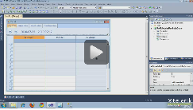
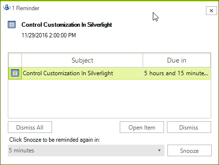

# RadReminder

| RELATED VIDEOS |  |
| ------ | ------ |
|[Getting Started with RadSchedulerReminder](http://tv.telerik.com/watch/winforms/getting-started-with-radschedulerreminder) In this video, you will learn how to notify users of upcoming appointments through the use of RadSchedulerReminder.||

## Overview

__RadReminder__ is a component that reminds you of an object that you pass to it. This object should implement __IRemindObject__ and depending on the values that you set in the implementation of the __IRemindObject__ interface, __RadReminder__ throws an event. When the event is fired, you can show an appropriate message to the user using [RadDesktopAlert](http://www.telerik.com/help/winforms/alert_overview.html) or another alert implementation of your choice.

## Properties

* __TimeInterval__: Determines the interval in which __IRemindObject__ should be notified. The default value is 60000 milliseconds (a minute).
            

* __ThemeName__: Determines the theme which should be applied to the alarm form.
            

## Public Methods

* __StartReminder:__ Starts the reminder.
            

* __StopReminder__: Stops the reminder.
            

* __ClearRemindObjects__: Clear all reminder objects.
            

* __AddRemindObject__: Adds an IRemindObject to the reminder and returns the RadReminderBindableObject.
            

* __AddRemindObjects__: Adds IRemindObjects collection to the reminder and returns RadReminderBindableObjects.
            

* __RemoveRemindObject__: Removes IRemindObject from the reminder.
            

* __GetRemindObjects__: Returns all added IRemindObjects.
            

## Protected Methods

* __GetDefaultOwner__: Returns the container form of the RadReminder events.
            

## Events

* __AlarmFormShowing__: This event is fired before the notification form is shown. *RadAlarmFormShowingArgs* are passed as a parameter of the event. You can use this event to replace the default notification form.
            
* __ItemOpened__: This event is fired when the user tries to open the item from the notification form. RadOpenItemArgs are passed as a parameter of the event. These arguments contain the IRemindObject.

* __DataFormatting__: This event is fired on each change of the DueIn property of the RadReminderBindableObject. DueInEventsArgs are passed as a parameter of the event. You can use this event to change the formatting of the DueIn that is represented on the notification form.

* __RemindObjectShown__: This event is fired for each IRemindObject that the reminder should show. RadShowRemindObjectArgs are passed as a parameter of the event. They contain the IRemindObject that should be shown.

## IRemindObject

The IRemindObject interface has the following properties that must be implemented in a descendant class.

* __Reminder__: Gets or sets a time span value indicating how much time before the StartDateTime the reminder event should be raised.
          

* __Snoozed__: Gets or sets a time span indicating the amount of time this reminder of this is snoozed for. If an appointment starts at 14:00 a reminder is set for 30min before the meeting the user can snooze this appointment for 10 minutes. This will result in another remind event being raised by RadReminder 20 minutes before the meeting.
          

* __Dismissed__: Gets or sets a value indicating whether this reminder is dismissed.
          

* __Subject__: Gets the subject of this remind object. This text is usually displayed when visualizing a reminder.
          

* __StartDateTime__: Gets the start date time for this remind object. This is the time when the event this remind object is created for will actually start e.g., start of a meeting, doctor appointment, etc.
          

* __RemindId__: Gets a unique identifier used for identifying the reminder.
