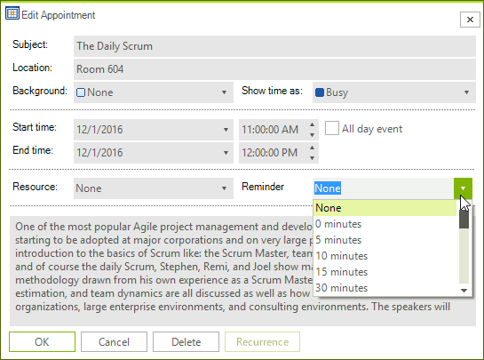

# RadSchedulerReminder

## Overview

__RadSchedulerReminder__ represents a special reminder object for the
          appointments that are collected in __RadScheduler__. This component inherits from
          RadReminder.
        

## Properties

* __AssociatedScheduler__: Gets the RadScheduler object
              associated with the RadSchedulerReminder.
            

* __StartReminderInterval__ and
              __EndReminderInterval__: Determines the time interval of the
              reminder. RadSchedulerReminder reminds you of only those appointments which
              are started in the defined interval. The default interval is Today.
            

## Getting Started

In order to incorporate __RadSchedulerReminder__ in your application, please
          follow to the steps below.
        

1. Initialize the RadSchedulerReminder from code or in the designer.
            

#### __[C#]__

{{source=..\SamplesCS\Scheduler\Reminders\SchedulerReminder.cs region=creating}}
	            RadSchedulerReminder schedulerReminder = new RadSchedulerReminder();
	{{endregion}}

#### __[VB.NET]__

{{source=..\SamplesVB\Scheduler\Reminders\SchedulerReminder.vb region=creating}}
	        Dim schedulerReminder As New RadSchedulerReminder()
	{{endregion}}

1. Set __AssociatedScheduler__ property.
            

#### __[C#]__

{{source=..\SamplesCS\Scheduler\Reminders\SchedulerReminder.cs region=associatedScheduler}}
	            schedulerReminder.AssociatedScheduler = this.radScheduler1;
	{{endregion}}

#### __[VB.NET]__

{{source=..\SamplesVB\Scheduler\Reminders\SchedulerReminder.vb region=associatedScheduler}}
	        schedulerReminder.AssociatedScheduler = Me.RadScheduler1
	{{endregion}}

1. Set StartReminderInterval and EndReminderInterval.

#### __[C#]__

{{source=..\SamplesCS\Scheduler\Reminders\SchedulerReminder.cs region=interval}}
	            schedulerReminder.StartReminderInterval = DateTime.Now;
	            schedulerReminder.EndReminderInterval = DateTime.Now.AddDays(1);
	{{endregion}}

#### __[VB.NET]__

{{source=..\SamplesVB\Scheduler\Reminders\SchedulerReminder.vb region=interval}}
	        schedulerReminder.StartReminderInterval = Date.Now
	        schedulerReminder.EndReminderInterval = Date.Now.AddDays(1)
	{{endregion}}

1. You should set the reminder property of the appointment. This property indicates how much time before the appointment start, the reminder will be shown. 
              For example you can initialize and add an appointment with the following code.
            

#### __[C#]__

{{source=..\SamplesCS\Scheduler\Reminders\SchedulerReminder.cs region=reminder}}
	
	            DateTime dtStart = DateTime.Now.AddMinutes(1);
	            DateTime dtEnd = dtStart.AddHours(1);
	            Appointment appointment = new Appointment(dtStart, dtEnd, "Appointment description");
	            this.radScheduler1.Appointments.Add(appointment);
	            
	            appointment.Reminder = new TimeSpan(10000);
	{{endregion}}

#### __[VB.NET]__

{{source=..\SamplesVB\Scheduler\Reminders\SchedulerReminder.vb region=reminder}}
	
	        Dim dtStart As DateTime = DateTime.Now.AddMinutes(1)
	        Dim dtEnd As DateTime = dtStart.AddHours(1)
	        Dim appointment As New Appointment(dtStart, dtEnd, "Appointment description")
	        Me.RadScheduler1.Appointments.Add(appointment)
	
	        appointment.Reminder = New TimeSpan(10000)
	{{endregion}}

Also you can set this in AppointmentEditDialog at runtime.

When you start RadSchedulerReminder it will be filled with the appointment that starts in this interval.
          When you stop it all reminders will be cleared from the RadSchedulerReminder.
        
