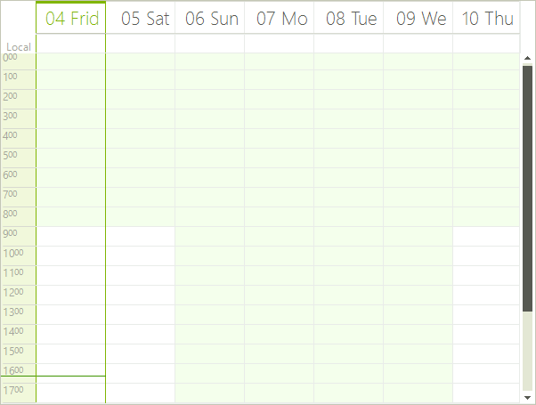
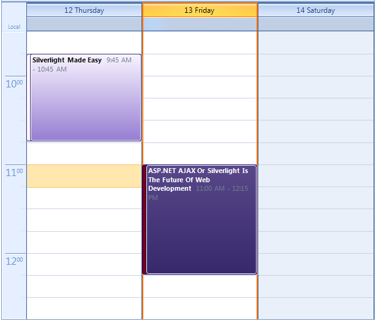
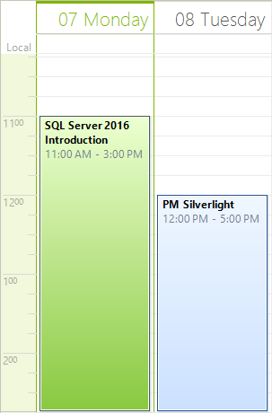
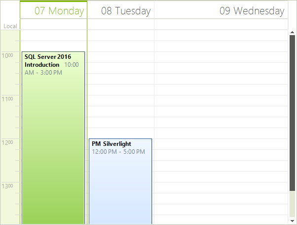

# Day View

## Overview

The Day view shows one or more days at a time. To move to the next or previous day, you can use the back and forward keyboard arrows, or the [SchedulerNavigator]() control.
        


## Setting Day View

The Day View is the default RadScheduler view, but you can explicitly set it to be the view which the user sees:

{{source=..\SamplesCS\Scheduler\Views\DayView.cs region=activeViewType}} 
{{source=..\SamplesVB\Scheduler\Views\DayView.vb region=activeViewType}} 

````C#
            this.radScheduler1.ActiveViewType = SchedulerViewType.Day;
````
````VB.NET
        Me.RadScheduler1.ActiveViewType = SchedulerViewType.Day
        '
````

{{endregion}} 

## Getting Day View

To get the instance to the SchedulerDayView from the RadScheduler object, either:
* use the __GetDayView__ method:

{{source=..\SamplesCS\Scheduler\Views\DayView.cs region=getDayView}} 
{{source=..\SamplesVB\Scheduler\Views\DayView.vb region=getDayView}} 

````C#
            SchedulerDayView dayView = this.radScheduler1.GetDayView();
````
````VB.NET
        Dim dayView As SchedulerDayView = Me.RadScheduler1.GetDayView()
        '
````

{{endregion}} 

>note This method returns null if the active view of the scheduler is not SchedulerDayView.
>

* use the the RadScheduler __ActiveView__ property:

{{source=..\SamplesCS\Scheduler\Views\DayView.cs region=activeView}} 
{{source=..\SamplesVB\Scheduler\Views\DayView.vb region=activeView}} 

````C#ype
            this.radScheduler1.ActiveViewType = SchedulerViewType.Day;
````
````VB.NEType
        Me.RadScheduler1.ActiveViewType = SchedulerViewType.Day
        '
````

{{endregion}}

## Changing the number of days visible

The Day View can show a predefined number of days through the __DayCount__ property. The default value is 3 days, whereas the minimum value is 1 day and the maximum is 10 days:

{{source=..\SamplesCS\Scheduler\Views\DayView.cs region=dayCount}} 
{{source=..\SamplesVB\Scheduler\Views\DayView.vb region=dayCount}} 

````C#
            dayView.DayCount = 3;
````
````VB.NET
        dayView.DayCount = 3
        '
````

{{endregion}} 


## Changing the work time

The work time hours is a predefined range of hours, which can be specified within the timeline to make it easier for end-users to carry out scheduling. They are properly indicated by a lighter color, similar to Microsoft Outlook, and are controled from the __TimeInterval__ property.

{{source=..\SamplesCS\Scheduler\Views\DayView.cs region=workTime}} 
{{source=..\SamplesVB\Scheduler\Views\DayView.vb region=workTime}} 

````C#
            dayView.WorkTime = TimeInterval.DefaultWorkTime;
````
````VB.NET
        dayView.WorkTime = TimeInterval.DefaultWorkTime
        '
````

{{endregion}} 

Example when you set 4 hours working day:



Additionally, you can specify which week days are part of the working week. This can be achieved by setting the __WorkWeekStart__ and __WorkWeekEnd__ properties.


{{source=..\SamplesCS\Scheduler\Views\DayView.cs region=workWeek}} 
{{source=..\SamplesVB\Scheduler\Views\DayView.vb region=workWeek}} 

````C#
            dayView.WorkWeekStart = DayOfWeek.Thursday;
            dayView.WorkWeekEnd = DayOfWeek.Saturday;
````
````VB.NET
        dayView.WorkWeekStart = DayOfWeek.Thursday
        dayView.WorkWeekEnd = DayOfWeek.Saturday

        '
````

{{endregion}} 

## Showing and hiding the Day Headers

Showing/hiding the day headers is done through the __ShowHeader__ property (the default setting is True):

{{source=..\SamplesCS\Scheduler\Views\DayView.cs region=showHeader}} 
{{source=..\SamplesVB\Scheduler\Views\DayView.vb region=showHeader}} 

````C#
            dayView.ShowHeader = true;
````
````VB.NET
        dayView.ShowHeader = True
        '
````

{{endregion}} 

## Customizing the day header format

RadScheduler uses the [.NET Standard DateTime Format Strings](http://msdn.microsoft.com/en-us/library/az4se3k1(VS.71).aspx), which can be set through the __HeaderFormat__ property (either in design time or through code). The default value is "MMMM dd":

{{source=..\SamplesCS\Scheduler\Views\DayView.cs region=headerFormat}} 
{{source=..\SamplesVB\Scheduler\Views\DayView.vb region=headerFormat}} 

````C#
            dayView.HeaderFormat = "MMMM dd";
````
````VB.NET
        dayView.HeaderFormat = "MMMM dd"
        '
````

{{endregion}} 


## Customizing the time ruler area

## Ruler Scale

The default __scale of the ruler__ can be set with a single property (__RangeFactor__) to any of the predefined values, or the user can select a new scale by simply right-clicking in the time ruler and selecting the preferable setting. The Range factor modes are (the default is 60 minutes):
        

* 5 minutes

* 6 minutes

* 10 minutes

* 15 minutes (quarter hour)

* 30 minutes (half hour)

* 60 minutes (one hour) - this is the default value.

{{source=..\SamplesCS\Scheduler\Views\DayView.cs region=rangeFactor}} 
{{source=..\SamplesVB\Scheduler\Views\DayView.vb region=rangeFactor}} 

````C#
            dayView.RangeFactor = ScaleRange.Hour;
````
````VB.NET
        dayView.RangeFactor = ScaleRange.Hour
        '
````

{{endregion}} 

## Ruler Height and Row Height

The size of the ruler height (and row height respectively) is controlled by the __RulerScaleSize__ property, for example 50px:

{{source=..\SamplesCS\Scheduler\Views\DayView.cs region=rulerScaleSize}} 
{{source=..\SamplesVB\Scheduler\Views\DayView.vb region=rulerScaleSize}} 

````C#
            dayView.RulerScaleSize = 50;
````
````VB.NET
        dayView.RulerScaleSize = 50
        '
````

{{endregion}} 

## Start and End Times

You can control which hours are visible in the view by using __RulerStartScale__ and __RulerEndScale__ properties, where the start time cannot be bigger than the end time. The minimum and maximum values should are between 0 and 24. Setting the start and end times is needed when you do not want to show all hours in a day. Additionally, you can use the __RulerStartScaleMinutes__ and __RulerEndScaleMinutes__ properties to go into more detail and specify the minutes part of the starting and ending times. Note that the minutes are automatically rounded down to the previous ruler tick. You can use the __RulerScale__ property to set the frequency of the ruler ticks. The following example shows how you can show the time between 9:30 and 14:45:

{{source=..\SamplesCS\Scheduler\Views\DayView.cs region=rulerStartScale}} 
{{source=..\SamplesVB\Scheduler\Views\DayView.vb region=rulerStartScale}} 

````C#
            dayView.RangeFactor = ScaleRange.QuarterHour;
            dayView.RulerStartScale = 9;
            dayView.RulerStartScaleMinutes = 30;
            dayView.RulerEndScale = 14; 
            dayView.RulerEndScaleMinutes = 45;
````
````VB.NET
        dayView.RangeFactor = ScaleRange.QuarterHour
        dayView.RulerStartScale = 9
        dayView.RulerStartScaleMinutes = 30
        dayView.RulerEndScale = 14
        dayView.RulerEndScaleMinutes = 45
        '
````

{{endregion}} 




## Ruler Time Format (am/pm)

The __RulerFormatStrings__ property changes the time format in the ruler between am and pm.   The properties of the __RulerFormatStrings__ class allow you to specify the hour and minute formats for both types of ticks (whole hour ticks and sub hour ticks). The following example demonstrates the usage of __RulerFormatStrings__:

{{source=..\SamplesCS\Scheduler\Views\DayView.cs region=12rulerTimeFormat}} 
{{source=..\SamplesVB\Scheduler\Views\DayView.vb region=12rulerTimeFormat}} 

````C#
            dayView.RulerStartScale = 9;
            dayView.RulerEndScale = 14;
            dayView.RulerFormatStrings = new RulerFormatStrings("%h", "mm", "", "");
````
````VB.NET
        dayView.RulerStartScale = 9
        dayView.RulerEndScale = 14
        dayView.RulerFormatStrings = New RulerFormatStrings("%h", "mm", "", "")
        '
````

{{endregion}} 



{{source=..\SamplesCS\Scheduler\Views\DayView.cs region=24rulerTimeFormat}} 
{{source=..\SamplesVB\Scheduler\Views\DayView.vb region=24rulerTimeFormat}} 

````C#
            dayView.RulerStartScale = 9;
            dayView.RulerEndScale = 14;
            dayView.RulerFormatStrings = new RulerFormatStrings("%H", "mm", "", "");
````
````VB.NET
        dayView.RulerStartScale = 9
        dayView.RulerEndScale = 14
        dayView.RulerFormatStrings = New RulerFormatStrings("%H", "mm", "", "")
        '
````

{{endregion}} 

## Showing and Hiding the Ruler

To show and hide the ruler, use the __ShowRuler__ property:

{{source=..\SamplesCS\Scheduler\Views\DayView.cs region=showRuler}} 
{{source=..\SamplesVB\Scheduler\Views\DayView.vb region=showRuler}} 

````C#
            dayView.ShowRuler = true;
````
````VB.NET
        dayView.ShowRuler = True
        '
````

{{endregion}} 

## Ruler Width 

The width of the ruler is controlled from the __RulerWidth__ property, whereas the minimum value is 0, and the default value is 40px:

{{source=..\SamplesCS\Scheduler\Views\DayView.cs region=rulerWidth}} 
{{source=..\SamplesVB\Scheduler\Views\DayView.vb region=rulerWidth}} 

````C#
            dayView.RulerWidth = 40;
````
````VB.NET
        dayView.RulerWidth = 40
        '
````

{{endregion}} 

## Current Time Pointer

The current time pointer is a thin line on the ruler and on the today’s column in the appointments area and it visually represents the current time. The current time pointer belongs to the __RulerPrimitive__ which is a visual element, part of the element tree of __SchedulerDayViewElement__. You can manipulate this line in two ways – by setting its style or by setting its width. The following code snippet demonstrates this:

{{source=..\SamplesCS\Scheduler\Views\DayView.cs region=currentTimePointer}} 
{{source=..\SamplesVB\Scheduler\Views\DayView.vb region=currentTimePointer}} 

````C#
            SchedulerDayViewElement dayViewElement = (SchedulerDayViewElement)this.radScheduler1.ViewElement;
            dayViewElement.DataAreaElement.Ruler.TimePointerStyle = RulerCurrentTimePointer.Arrow;
            dayViewElement.DataAreaElement.Ruler.CurrentTimePointerWidth = 3;
            dayViewElement.DataAreaElement.Ruler.CurrentTimePointerColor = Color.Red;
````
````VB.NET
        Dim dayViewElement As SchedulerDayViewElement = DirectCast(Me.RadScheduler1.ViewElement, SchedulerDayViewElement)
        dayViewElement.DataAreaElement.Ruler.TimePointerStyle = RulerCurrentTimePointer.Arrow
        dayViewElement.DataAreaElement.Ruler.CurrentTimePointerWidth = 3
        dayViewElement.DataAreaElement.Ruler.CurrentTimePointerColor = Color.Red
        '
````

{{endregion}} 

## The AllDay area

The AllDay area contains appointments that are either defined as AllDay appointments or their duration is greater than 24 hours. The appointments in this area are displayed with a fixed height (unless __AutoSizeAppointments__ is enabled). When the total height of the appointments reaches a certain value, a vertical scrollbar is displayed. Using the properties of the __AllDayHeaderElement__ you can manipulate the height of the appointments and the maximum height before the scrollbar appears:

{{source=..\SamplesCS\Scheduler\Views\DayView.cs region=allDayArea}} 
{{source=..\SamplesVB\Scheduler\Views\DayView.vb region=allDayArea}} 

````C#
            dayViewElement.AllDayHeaderElement.HeaderHeight = 50;
            dayViewElement.AllDayHeaderElement.MaxHeaderHeight = 200;
````
````VB.NET
        dayViewElement.AllDayHeaderElement.HeaderHeight = 50
        dayViewElement.AllDayHeaderElement.MaxHeaderHeight = 200
        '
````

{{endregion}}

## Modifying the size of day view columns

The __SchedulerDayViewElement__ allows you to specify different size for the different columns. To manipulate the size of the columns, you can use the __SetColumnWidth__ and __GetColumnWidth__ methods. The values passed to the __SetColumnWidth__ method are proportional and the actual width of the columns is calculated based on them. By default all columns have a value of 1 and therefore if you set a value of 2 to any column, it will stay twice as bigger compared to the others.

{{source=..\SamplesCS\Scheduler\Views\DayView.cs region=resizeColumns}} 
{{source=..\SamplesVB\Scheduler\Views\DayView.vb region=resizeColumns}} 

````C#
            dayViewElement.SetColumnWidth(2, 2);
````
````VB.NET
        dayViewElement.SetColumnWidth(2, 2)
        '
````

{{endregion}} 


