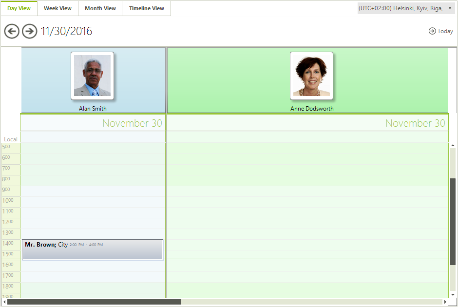

# Grouping by Resources


|RELATED VIDEOS|RELATED BLOGS|
|Resource Grouping in the RadSchedulerIn this webinar, Telerik Developer Support Specialist Robert Shoemate will introduce RadScheduler and demonstrate how to utilize its powerful feature set in your own applications. By attending this webinar, you will learn about features such as codeless data binding, adding custom fields, and UI customization.(Runtime: 55:58)[http://tv.telerik.com/winforms/radscheduler/resource-grouping-radscheduler](http://tv.telerik.com/winforms/radscheduler/resource-grouping-radscheduler)|Telerik UI for WinForms Q3 2009 - RadScheduler Resource GroupingQ3 marks the release of some fantastic new features in the Telerik UI for WinForms. I know many of you have been waiting for one feature in particular... resource grouping. Well, I'm happy to say, the wait is over, resource grouping is here! Today, I am going to take some time out to explain to you how it works.[Read full post ...](http://blogs.telerik.com/RobertShoemate/Posts/09-11-05/radcontrols_for_winforms_q3_2009_-_radscheduler_resource_grouping.aspx)|

## Setting up grouping

RadScheduler control allows you to define custom resources that can be assigned to the appointments. Custom resources let you associate additional information with your appointments. Since custom resources have a limited number of values, RadScheduler can group appointments based on the resources associated with them. For example, you can book different facilities for a variety of events.

If you want to group RadScheduler by resources you can use the GroupType property. It has two available values – None and Resources.

{{source=..\SamplesCS\Scheduler\Views\GroupingByResources.cs region=groupType}} 
{{source=..\SamplesVB\Scheduler\Views\GroupingByResources.vb region=groupType}} 

````C#
            this.radScheduler1.GroupType = GroupType.Resource;
````
````VB.NET
        Me.RadScheduler1.GroupType = GroupType.Resource
        '
````

{{endregion}} 

You can add/remove resources using the RadScheduler’s Resources collection. The resources in RadScheduler for Winforms are represented by the Resource class and you can assign it text, color and image values.

{{source=..\SamplesCS\Scheduler\Views\GroupingByResources.cs region=addingResources}} 
{{source=..\SamplesVB\Scheduler\Views\GroupingByResources.vb region=addingResources}} 

````C#
            Color[] colors = new Color[]{Color.LightBlue, Color.LightGreen, Color.LightYellow,
               Color.Red, Color.Orange, Color.Pink, Color.Purple, Color.Peru, Color.PowderBlue};

            string[] names = new string[]{"Alan Smith", "Anne Dodsworth",
               "Boyan Mastoni", "Richard Duncan", "Maria Shnaider"};

            for (int i = 0; i < names.Length; i++)
            {
                Resource resource = new Resource();
                resource.Id = new EventId(i);
                resource.Name = names[i];
                resource.Color = colors[i];

                resource.Image = this.imageList1.Images[i];
                this.radScheduler1.Resources.Add(resource);
            }
````
````VB.NET
        Dim colors() As Color = {Color.LightBlue, Color.LightGreen, Color.LightYellow, Color.Red, Color.Orange, Color.Pink, Color.Purple, Color.Peru, Color.PowderBlue}

        Dim names() As String = {"Alan Smith", "Anne Dodsworth", "Boyan Mastoni", "Richard Duncan", "Maria Shnaider"}

        For i As Integer = 0 To names.Length - 1
            Dim resource As New Telerik.WinControls.UI.Resource()
            resource.Id = New EventId(i)
            resource.Name = names(i)
            resource.Color = colors(i)

            resource.Image = Me.imageList1.Images(i)
            Me.RadScheduler1.Resources.Add(resource)
        Next i
        '
````

{{endregion}} 

## Setting the number of displayed resources

You can use the SchedulerView’s ResourcesPerView property to change the number of visible resources.

{{source=..\SamplesCS\Scheduler\Views\GroupingByResources.cs region=getDayView}} 
{{source=..\SamplesVB\Scheduler\Views\GroupingByResources.vb region=getDayView}} 

````C#
            this.radScheduler1.ActiveView.ResourcesPerView = 2;
````
````VB.NET
        Me.RadScheduler1.ActiveView.ResourcesPerView = 2
        '
````

{{endregion}} 

## Navigating through resources

Navigating through resources To navigate to a specific resource you can use the __ResourceStartIndex__ property. To access it, you first need to cast the ViewElement to the base type for all grouped views – __SchedulerViewGroupedByResourceElementBase__.

{{source=..\SamplesCS\Scheduler\Views\GroupingByResources.cs region=resourceNavigation}} 
{{source=..\SamplesVB\Scheduler\Views\GroupingByResources.vb region=resourceNavigation}} 

````C#
            ((SchedulerViewGroupedByResourceElementBase)this.radScheduler1.ViewElement).ResourceStartIndex = 2;
````
````VB.NET
        CType(Me.RadScheduler1.ViewElement, SchedulerViewGroupedByResourceElementBase).ResourceStartIndex = 2
        '
````

{{endregion}}

To track when the resource index is changed, you can use the ResourceStartIndexChanging and ResourceStartIndexChanged events. The first one is fired before the index is actually changed and allows you to cancel the action. The second one is fired when the index has changed and the view was updated.

{{source=..\SamplesCS\Scheduler\Views\GroupingByResources.cs region=resourceNavigationEvents}} 
{{source=..\SamplesVB\Scheduler\Views\GroupingByResources.vb region=resourceNavigationEvents}} 

````C#
            this.radScheduler1.ResourceStartIndexChanging += radScheduler1_ResourceStartIndexChanging;
            this.radScheduler1.ResourceStartIndexChanged += radScheduler1_ResourceStartIndexChanged;
````
````VB.NET
        AddHandler Me.RadScheduler1.ResourceStartIndexChanging, AddressOf radScheduler1_ResourceStartIndexChanging
        AddHandler Me.RadScheduler1.ResourceStartIndexChanged, AddressOf radScheduler1_ResourceStartIndexChanged
        '
````

{{endregion}}

{{source=..\SamplesCS\Scheduler\Views\GroupingByResources.cs region=resourceNavigationHandlers}} 
{{source=..\SamplesVB\Scheduler\Views\GroupingByResources.vb region=resourceNavigationHandlers}} 

````C#
        void radScheduler1_ResourceStartIndexChanging(object sender, ResourceIndexChangingEventArgs e)
        {
            if (e.NewStartIndex > 5)
            {
                e.Cancel = true;
            }
        }

        void radScheduler1_ResourceStartIndexChanged(object sender, EventArgs e)
        {
            RadMessageBox.Show("Resource Index has changed");
        }
````
````VB.NET
    Private Sub radScheduler1_ResourceStartIndexChanging(sender As Object, e As ResourceIndexChangingEventArgs)
        If e.NewStartIndex > 5 Then
            e.Cancel = True
        End If
    End Sub

    Private Sub radScheduler1_ResourceStartIndexChanged(sender As Object, e As EventArgs)
        RadMessageBox.Show("Resource Index has changed")
    End Sub
    '
````

{{endregion}} 

## Modifying the size of the resources

RadScheduler allows you to specify different size for the different resources. To manipulate the size of the resources, you can use the SetResourceSize and GetResourceSize methods. The values passed to the SetResourceSize method are proportional and the actual size of the resources is calculated based on them. By default all resources have a value of 1 and therefore if you set a value of 2 to any resource, it will stay twice as bigger compared to the others.#_[C#]_

{{source=..\SamplesCS\Scheduler\Views\GroupingByResources.cs region=resourceResizing}} 
{{source=..\SamplesVB\Scheduler\Views\GroupingByResources.vb region=resourceResizing}} 

````C#
            ((SchedulerViewGroupedByResourceElementBase)this.radScheduler1.ViewElement).SetResourceSize(1, 2);
````
````VB.NET
        CType(Me.RadScheduler1.ViewElement, SchedulerViewGroupedByResourceElementBase).SetResourceSize(1, 2)
        '
````

{{endregion}} 



