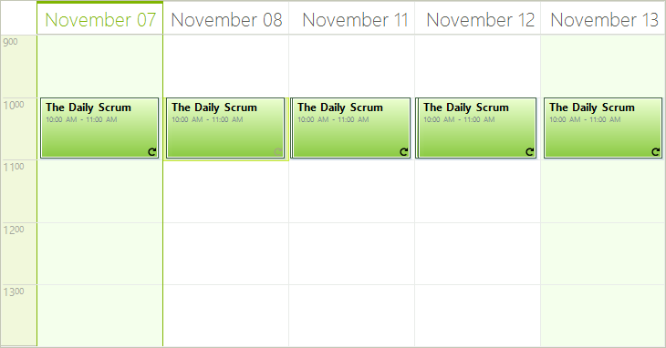

# MultiDay View

## Overview

MultidayView shows multiple date-time intervals with appointments arranged one next to another. In the screenshot below we have MultidayView with two intervals – the first one starts from July 03 with duration of two days and the second on starts from July 07 with duration of 3 days.

## Using MultidayView

1. In order to set the current view of RadScheduler to MultidayView, use the ActiveViewType or ActiveView properties:

#### __[C#] Setting the current view to MultiDayView__

{{source=..\SamplesCS\Scheduler\Views\MultiDayView.cs region=multiDay}}
	            this.radScheduler1.ActiveViewType = SchedulerViewType.MultiDay;
	            //or
	            SchedulerMultiDayView multiDayView = new SchedulerMultiDayView();
	            DateTime startDate = DateTime.Today;
	            multiDayView.Intervals.Add(startDate, 2);
	            multiDayView.Intervals.Add(startDate.AddDays(4), 3);
	            this.radScheduler1.ActiveView = multiDayView;
	{{endregion}}

#### __[VB.NET] Setting the current view to MultiDayView__

{{source=..\SamplesVB\Scheduler\Views\MultiDayView.vb region=multiDay}}
	        Me.RadScheduler1.ActiveViewType = SchedulerViewType.MultiDay
	        'or
	        Dim multiDayView As New SchedulerMultiDayView()
	        Dim startDate As Date = Date.Today
	        multiDayView.Intervals.Add(startDate, 2)
	        multiDayView.Intervals.Add(startDate.AddDays(4), 3)
	        Me.RadScheduler1.ActiveView = multiDayView
	{{endregion}}

1. To add, remove or modify a date-time __Interval__ in SchedulerMultiDayView instance use the __Intervals__ collection.

1. To get all appointments in a particular interval, use the __GetAppointmentsInInterval__ helper method:

#### __[C#] Getting all appointments in a particular interval__

{{source=..\SamplesCS\Scheduler\Views\MultiDayView.cs region=interval}}
	            DateTimeInterval interval = new DateTimeInterval();
	            interval.Duration = new TimeSpan(20, 5, 25);
	            multiDayView.GetAppointmentsInInterval(interval);
	{{endregion}}

#### __[VB.NET] Getting all appointments in a particular interval__

{{source=..\SamplesVB\Scheduler\Views\MultiDayView.vb region=interval}}
	        Dim interval As New DateTimeInterval()
	        interval.Duration = New TimeSpan(20, 5, 25)
	        multiDayView.GetAppointmentsInInterval(interval)
	{{endregion}}

1. To get all appointments in the view, use the __Appointments__ collection.
