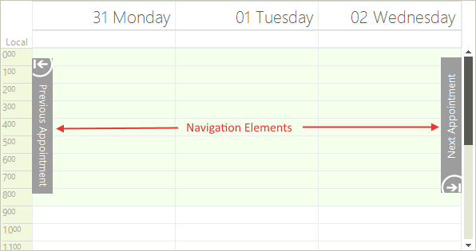
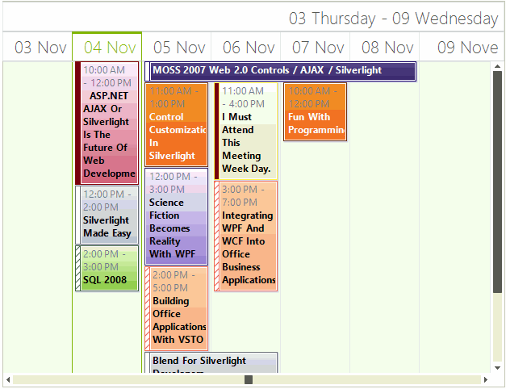

# Overview and Structure

## Overview

|Related Videos|  |
|-------|------|
|[Using RadScheduler for WinForms](http://tv.telerik.com/watch/winforms/radscheduler/scheduler) Have you had a need to build scheduler functionality into your applications? If so, then this webinar is for you, where Telerik Evangelist John Kellar shows a variety of features like iCal support, multiple view options, strong data binding support, and an out of the box appointment dialogs. (Runtime: 32:46)||

A first-rate scheduling component should offer intuitive, simple, and familiar interface, to help the user review all events in  a fast and efficient manner. Telerik Windows Forms Scheduler provides simplistic, but powerful interface, following closely the established UI standards.
        

The structure of the __RadScheduler__ control varies slightly, depending on the view type. When the view type changes, the main __ViewElement__ of __RadScheduler__ is also changed. The view element for [Day](), [MultiDay](), [Week](), and [Work Week]()  views is the same - __SchedulerDayViewElement__. This ensures simplified deployment, much better flexibility and saves the need to write  or modify the logic behind all the different view types. Added to that, you can set your preferences from one place to apply to all views. The [Month]() and [Timeline]() Views use a different presentation elements – __SchedulerMonthViewElement__ and __SchedulerTimelineViewElement__ respectively.

All view elements inherit from the base __SchedulerViewElement__ type, which defines common methods and properties for all views. The current view element can be accessed via the __ViewElement__ property of __RadScheduler__.

__RadScheduler__ also provides grouping by resource mode in which appointments for several resources (e.g. rooms, employees, etc.) are displayed simultaneously on a single view. In this case the view element is one of the following: __SchedulerDayViewGroupedByResourceElement__, __SchedulerMonthViewGroupedByResourceElement__, __TimelineGroupingByResourcesElement__ which contain a collection of __SchedulerDayViewElements__, __SchedulerMonthViewElements__ and __SchedulerTimelineViewElements__ correspondingly. All grouped views inherit from the base type __SchedulerViewGroupedByResourceElementBase__.
        

## Structure of Day, MultiDay, Week, and Work Week views

RadScheduler displays all of its events in a __Time table__. The time table consists of:
        

* The top of the scheduler is the __Header__ and displays dates that appointments can be created in.
            

* Below the Header are the __All Day Appointments__ that have no specific duration in hours.

* Underneath the All Day Appointments is the __Appointment Area__ that contains any number of __Appointments__.
            

* In the left border of the scheduler is the __Ruler__ area. The current time is marked within the ruler by the __Current Time Thumb__. The default scale of the ruler can be set with a single property to any of the predefined values, or the user can select a new scale by simply right-clicking in the time ruler and selecting the preferable setting;
            

* __Workday hours__ can be specified within the timeline to make it easier for end-users to carry out scheduling. They are properly indicated by a lighter color, similar to Microsoft Outlook.
            

* __Current Day__ is highlighted in most scheduler views for a better visual presentation.

* In addition, __Navigation Elements__ let the user jump forward or backwards to the nearest appointment.

## Structure of Month View

The [Month View]() of the scheduler simply has a __Header__, __Month Cells__ for every day in the month and zero or more __Appointment Cells__ in each month cell.

## Structure of Timeline View

The [Timeline View]() of the scheduler has a __Header__, __Columns (scales)__ and __Appointment Cells:__
           

The supported __scales__ can be set to any of the predefined values, or the user can select a new scale by simply right-clicking in the time table and selecting the preferable setting from the context menu.

* Year

* Month

* Week

* Day - this is the default value

* Hour

* 15 minutes.

## Scheduler Navigator 

A [Scheduler Navigator]() control can be placed at the top of the scheduler for easy navigation between the different views and dates;

