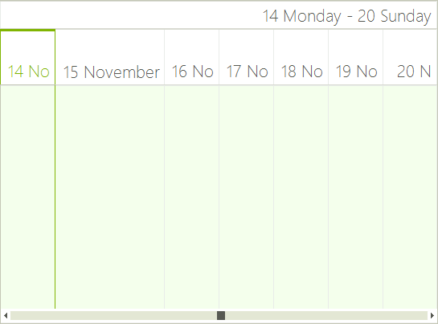

# Timeline View


## Timeline View Overview

RadScheduler's __Timeline__ view allows you to display appointments in horizontally arranged time slots. Consequently, time slots can be configured by duration and the time scale can be set for minutes to years. User capabilities include creating, adding, and modifying appointments at run-time, appointment and cell selection, resizing, drag and drop, keyboard navigation, a customizable timeline context menu and resource grouping support. To move to the next day or previous month, you can use the back and forward keyboard arrows, or the[SchedulerNavigator]() control.
        

## Structure of Timeline View

The [Timeline View]() of the scheduler simply has a __Header__, __Columns__ for every hour/day/week/month and zero or more __Appointment Cells__. 


## Setting the Timeline View

The Timeline View can be set it to be the default view which the user sees:

{{source=..\SamplesCS\Scheduler\Views\TimelineView.cs region=activeViewType}} 
{{source=..\SamplesVB\Scheduler\Views\TimelineView.vb region=activeViewType}} 

````C#
            
this.radScheduler1.ActiveViewType = Telerik.WinControls.UI.SchedulerViewType.Timeline;

````
````VB.NET
Me.RadScheduler1.ActiveViewType = Telerik.WinControls.UI.SchedulerViewType.Timeline

````

{{endregion}} 

## Getting Timeline View

To get the instance to the Scheduler Timeline View from the RadScheduler object, either:

* the __GetTimelineView__ method:

{{source=..\SamplesCS\Scheduler\Views\TimelineView.cs region=timelineView}} 
{{source=..\SamplesVB\Scheduler\Views\TimelineView.vb region=timelineView}} 

````C#
SchedulerTimelineView timelineView = this.radScheduler1.GetTimelineView();

````
````VB.NET
Dim timelineView As SchedulerTimelineView = Me.RadScheduler1.GetTimelineView()

````

{{endregion}} 

>note This method returns null if the active view of the scheduler is not SchedulerTimelineView.
>

* use the the RadScheduler __ActiveView__ property:

{{source=..\SamplesCS\Scheduler\Views\TimelineView.cs region=activeView}} 
{{source=..\SamplesVB\Scheduler\Views\TimelineView.vb region=activeView}} 

````C#
ype
            
            this.radScheduler1.ActiveViewType = Telerik.WinControls.UI.SchedulerViewType.Timeline;

````
````VB.NET
ype
        Me.RadScheduler1.ActiveViewType = Telerik.WinControls.UI.SchedulerViewType.Timeline

````

{{endregion}} 

## Setting the time range and first date

The time range that the timeline shows can be set with the __RangeStartDate__ and __RangeEndDate__ 
          properties, where __RangeEndDate__ must be bigger than __RangeStartDate__. The scheduler will 
          not be able to navigate outside this range.
        

The __StartDate__ property sets the first date that is shown in the timeline  __RangeStartDate__ and __RangeEndDate__.


{{source=..\SamplesCS\Scheduler\Views\TimelineView.cs region=getTimelineView}} 
{{source=..\SamplesVB\Scheduler\Views\TimelineView.vb region=getTimelineView}} 

````C#
            
this.radScheduler1.GetTimelineView().RangeStartDate = new DateTime(2010, 1, 20);
this.radScheduler1.GetTimelineView().RangeEndDate = new DateTime(2010, 2, 20);
this.radScheduler1.GetTimelineView().StartDate = new DateTime(2010, 2, 1);

````
````VB.NET
Me.RadScheduler1.GetTimelineView().RangeStartDate = New Date(2010, 1, 20)
Me.RadScheduler1.GetTimelineView().RangeEndDate = New Date(2010, 2, 20)
Me.RadScheduler1.GetTimelineView().StartDate = New Date(2010, 2, 1)

````

{{endregion}} 

To get the duration between __RangeStartDate__ and __RangeEndDate__ you can use the duration __property__:

{{source=..\SamplesCS\Scheduler\Views\TimelineView.cs region=duration}} 
{{source=..\SamplesVB\Scheduler\Views\TimelineView.vb region=duration}} 

````C#
            
TimeSpan duration = timelineView.Duration;

````
````VB.NET
Dim duration As TimeSpan = timelineView.Duration
'			#End Region
'#Region showTimescale
Dim scale As Timescales = Timescales.Hours
timelineView.ShowTimescale(scale)

````

{{endregion}} 

## Setting the default time scale

The default __time scale__ can be set to any of the predefined values, or the user can select a new scale by simply right-clicking in the time table and selecting the preferable setting from the context menu.
        
* Year

* Month

* Week

* Day - this is the default value

* Hour

* 15 minutes

To change the time scaling to HOUR, for example, you need to use the __ShowTimescale__ method:

{{source=..\SamplesCS\Scheduler\Views\TimelineView.cs region=showTimescale}} 
{{source=..\SamplesVB\Scheduler\Views\TimelineView.vb region=showTimescale}} 

````C#
            
Timescales scale = Timescales.Hours;
timelineView.ShowTimescale(scale);

````
````VB.NET
Dim scale As Timescales = Timescales.Hours
timelineView.ShowTimescale(scale)

````

{{endregion}} 

## Getting the scale

To get the currently selected scale, use the __GetScaling__ method. After this you can modify properties of the current scale such as the Format property, which specifies the date-time format of the header cells, and the __DisplayedCellsCount__ property, which specifies the number of cells to be displayed in the view.

{{source=..\SamplesCS\Scheduler\Views\TimelineView.cs region=getTimescale}} 
{{source=..\SamplesVB\Scheduler\Views\TimelineView.vb region=getTimescale}} 

````C#
            
SchedulerTimescale currentScaling = timelineView.GetScaling();
currentScaling.Format = "dd MMM";
currentScaling.DisplayedCellsCount = 8;

````
````VB.NET
Dim currentScaling As SchedulerTimescale = timelineView.GetScaling()
currentScaling.Format = "dd MMM"
currentScaling.DisplayedCellsCount = 8

````

{{endregion}} 

## Navigation and scrolling

In TimelineView there are two scrollbars which stand for navigation between dates and scrolling through appointments. The horizontal one allows you to scroll fast through the dates in the range specified by the RangeStartDate and RangeEndDate properties. The vertical one appears when there is a cell which contains more appointments than it can fit. This scrollbar allows you to scroll the presenter area so you can view the appointments. You can show or hide any of these scrollbars by using the following properties.

{{source=..\SamplesCS\Scheduler\Views\TimelineView.cs region=navigationElements}} 
{{source=..\SamplesVB\Scheduler\Views\TimelineView.vb region=navigationElements}} 

````C#
            
timelineView.ShowNavigationElement = false;
timelineView.ShowVerticalScrollBar = false;

````
````VB.NET
timelineView.ShowNavigationElement = False
timelineView.ShowVerticalScrollBar = False

````

{{endregion}} 

## Modifying the size of the columns

The SchedulerTimelineViewElement allows you to specify different size for the different columns. To manipulate the size of the columns, you can use the  __SetColumnWidth__ and __GetColumnWidth__ methods. The values passed to the __SetColumnWidth__  method are proportional and the actual width of the columns is calculated based on them. By default all columns have a value of 1 and therefore if you set a value of 2 to any column, it will stay twice as bigger compared to the others.

{{source=..\SamplesCS\Scheduler\Views\TimelineView.cs region=resizeColumns}} 
{{source=..\SamplesVB\Scheduler\Views\TimelineView.vb region=resizeColumns}} 

````C#
SchedulerTimelineViewElement viewElement = (SchedulerTimelineViewElement)this.radScheduler1.ViewElement;
viewElement.SetColumnWidth(1, 2);

````
````VB.NET
Dim viewElement As SchedulerTimelineViewElement = CType(RadScheduler1.ViewElement, SchedulerTimelineViewElement)
viewElement.SetColumnWidth(1, 2)

````

{{endregion}} 

## Modifying the size of the headers

TimelineView contains two header rows. The first one displays the date range of the view that is currently displayed. The second one holds the header cells  for each column and each of them displays the date that corresponds to this column. You can modify the height of both of these headers by using the  following properties of the __SchedulerTimelineViewElement__.

{{source=..\SamplesCS\Scheduler\Views\TimelineView.cs region=headerSizing}} 
{{source=..\SamplesVB\Scheduler\Views\TimelineView.vb region=headerSizing}} 

````C#
viewElement.ColumnHeaderHeight = 70;
viewElement.ViewHeaderHeight = 35;

````
````VB.NET
viewElement.ColumnHeaderHeight = 70
viewElement.ViewHeaderHeight = 35

````

{{endregion}}

The following picture demonstrates the result of setting the header sizes and resizing the column with index 1.


