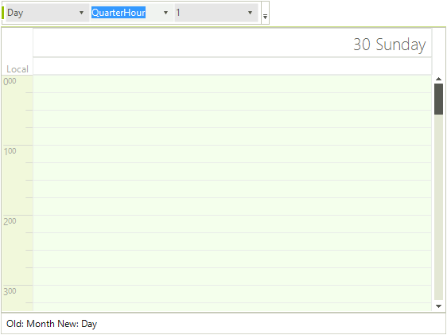

# Views Walkthrough


In this walkthrough (part of the [Telerik UI for WinForms Step-by-step Tutorial](http://www.telerik.com/support/documentation-and-tutorials/step-by-step-tutorial-for-winforms.aspx)) you will dynamically change the view, change some of the view specific properties and handle the ActiveViewChanging event.
      

## Project Setup

1. Create a new Windows Forms application.

1. In the Solution Explorer, delete the default form.

1. Also in the Solution Explorer, right-click the project and select __Add | New Item...__ from the context menu.
            
1. Select the "Telerik RadForm" template and click the __Add__ button to close the dialog.

1. Add the __DesertTheme__ from the ToolBox to the form.

1. In the Properties window, set the form __ThemeName__ to __Desert__.

1. Add a __RadStatusStrip__ to the form. Set the __ThemeName__ to __Desert__. Add a RadLabelElement to the status strip. Set the __Name__ property to "lblStatus" and the __Text__ to "".     

1. Add a RadCommandBar to the form. Add elements to the bar:
    - Add a __RadCommandBarDropDownListItem__. Set the  __Name__ to "ddlActiveViewType" and __Text__ to "".
    - Add a __RadCommandBarDropDownListItem__. Set the __Name__ to "ddlRange" and __Text__ to "".
    - Add a __RadCommandBarDropDownListItem__. Set the __Name__ to "ddlACount" and __Text__ to "".              
1. Change the new RadForm1 to be the startup form.

1. From the Toolbox, add a __RadScheduler__ to the form and set the __Dock__ property to "Fill" and the __ThemeName__ to __Desert__.

1. Add code to the form load that will add values to the combo boxes in the tool strip for __SchedulerViewType__ and __ScaleRange__ enumerations. Also, add a simple range of integers to the "count" combo box.

{{source=..\SamplesCS\Scheduler\Views\ViewsWalkthrough.cs region=addingValues}} 
{{source=..\SamplesVB\Scheduler\Views\ViewsWalkthrough.vb region=addingValues}} 

````C#
foreach (SchedulerViewType viewType in Enum.GetValues(typeof(SchedulerViewType)))
{
    RadListDataItem item = new RadListDataItem();
    item.Text = viewType.ToString();
    item.Value = viewType;
    ddlActiveViewType.Items.Add(item);
}
foreach (ScaleRange range in Enum.GetValues(typeof(ScaleRange)))
{
    RadListDataItem item = new RadListDataItem();
    item.Text = range.ToString();
    item.Value = range;
    ddlRange.Items.Add(item);
}
for (int i = 1; i < 10; i++)
{
    RadListDataItem item = new RadListDataItem();
    item.Text = i.ToString();
    item.Value = i;
    ddlCount.Items.Add(item);
}

````
````VB.NET
For Each viewType As SchedulerViewType In System.Enum.GetValues(GetType(SchedulerViewType))
    Dim item As New RadListDataItem()
    item.Text = viewType.ToString()
    item.Value = viewType
    ddlActiveViewType.Items.Add(item)
Next viewType
For Each range As ScaleRange In System.Enum.GetValues(GetType(ScaleRange))
    Dim item As New RadListDataItem()
    item.Text = range.ToString()
    item.Value = range
    ddlRange.Items.Add(item)
Next range
For i As Integer = 1 To 9
    Dim item As New RadListDataItem()
    item.Text = i.ToString()
    item.Value = i
    ddlCount.Items.Add(item)
Next i

````

{{endregion}} 

12\. Next add a SelectedIndexChanged event handler for the ddlActiveViewType combo box:

{{source=..\SamplesCS\Scheduler\Views\ViewsWalkthrough.cs region=selectedIndexChanged}} 
{{source=..\SamplesVB\Scheduler\Views\ViewsWalkthrough.vb region=selectedIndexChanged}} 

````C#
void ddlActiveViewType_SelectedIndexChanged(object sender, Telerik.WinControls.UI.Data.PositionChangedEventArgs e)
{
    RadDropDownListElement dropDownList = sender as RadDropDownListElement;
    radScheduler1.ActiveViewType = (SchedulerViewType)(dropDownList.SelectedValue);
}

````
````VB.NET
Private Sub ddlActiveViewType_SelectedIndexChanged(ByVal sender As Object, ByVal e As Telerik.WinControls.UI.Data.PositionChangedEventArgs)
    Dim dropDownList As RadDropDownListElement = TryCast(sender, RadDropDownListElement)
    RadScheduler1.ActiveViewType = CType(dropDownList.SelectedValue, SchedulerViewType)
End Sub

````

{{endregion}} 

13\. Add another SelectedIndexChanged event handler for the ddlRange combo box element:

{{source=..\SamplesCS\Scheduler\Views\ViewsWalkthrough.cs region=rangeChanged}} 
{{source=..\SamplesVB\Scheduler\Views\ViewsWalkthrough.vb region=rangeChanged}} 

````C#
void ddlRange_SelectedIndexChanged(object sender, Telerik.WinControls.UI.Data.PositionChangedEventArgs e)
{
    RadDropDownListElement dropDownList = sender as RadDropDownListElement;
    ScaleRange range = (ScaleRange)(dropDownList.SelectedValue);
    // set the appropriate range factor based on the type of view
    switch (radScheduler1.ActiveViewType)
    {
        case SchedulerViewType.Day:
            (radScheduler1.ActiveView as SchedulerDayView).RangeFactor = range;
            break;
        case SchedulerViewType.MultiDay:
            (radScheduler1.ActiveView as SchedulerMultiDayView).RangeFactor = range;
            break;
        case SchedulerViewType.Week:
        case SchedulerViewType.WorkWeek:
            (radScheduler1.ActiveView as SchedulerWeekView).RangeFactor = range;
            break;
    }
}

````
````VB.NET
Private Sub ddlRange_SelectedIndexChanged(ByVal sender As Object, ByVal e As Telerik.WinControls.UI.Data.PositionChangedEventArgs)
    Dim dropDownList As RadDropDownListElement = TryCast(sender, RadDropDownListElement)
    Dim range As ScaleRange = CType(dropDownList.SelectedValue, ScaleRange)
    ' set the appropriate range factor based on the type of view
    Select Case RadScheduler1.ActiveViewType
        Case SchedulerViewType.Day
            TryCast(RadScheduler1.ActiveView, SchedulerDayView).RangeFactor = range
        Case SchedulerViewType.MultiDay
            TryCast(RadScheduler1.ActiveView, SchedulerMultiDayView).RangeFactor = range
        Case SchedulerViewType.Week, SchedulerViewType.WorkWeek
            TryCast(RadScheduler1.ActiveView, SchedulerWeekView).RangeFactor = range
    End Select
End Sub

````

{{endregion}} 

14\. Add another SelectedIndexChanged event handler for the ddlCount combo box element:

{{source=..\SamplesCS\Scheduler\Views\ViewsWalkthrough.cs region=countChanged}} 
{{source=..\SamplesVB\Scheduler\Views\ViewsWalkthrough.vb region=countChanged}} 

````C#
void ddlCount_SelectedIndexChanged(object sender, Telerik.WinControls.UI.Data.PositionChangedEventArgs e)
{
    RadDropDownListElement dropDownList = sender as RadDropDownListElement;
    int count = (int)dropDownList.SelectedValue;
    // set the Day or WeekCount based on the current view
    switch (radScheduler1.ActiveViewType)
    {
        case SchedulerViewType.Day:
            (radScheduler1.ActiveView as SchedulerDayView).DayCount = count;
            break;
        case SchedulerViewType.MultiDay:
            (radScheduler1.ActiveView as SchedulerMultiDayView).DayCount = count;
            break;
        case SchedulerViewType.Month:
            (radScheduler1.ActiveView as SchedulerMonthView).WeekCount = count;
            break;
    }
}

````
````VB.NET
Private Sub ddlCount_SelectedIndexChanged(ByVal sender As Object, ByVal e As Telerik.WinControls.UI.Data.PositionChangedEventArgs)
    Dim dropDownList As RadDropDownListElement = TryCast(sender, RadDropDownListElement)
    Dim count As Integer = CInt(Fix(dropDownList.SelectedValue))
    ' set the Day or WeekCount based on the current view
    Select Case RadScheduler1.ActiveViewType
        Case SchedulerViewType.Day
            TryCast(RadScheduler1.ActiveView, SchedulerDayView).DayCount = count
        Case SchedulerViewType.MultiDay
            TryCast(RadScheduler1.ActiveView, SchedulerMultiDayView).DayCount = count
        Case SchedulerViewType.Month
            TryCast(RadScheduler1.ActiveView, SchedulerMonthView).WeekCount = count
    End Select
End Sub

````

{{endregion}} 

15\. Handle the RadScheduler ActiveViewChanging event. Use the SchedulerViewChangingEventArgs OldView and NewView to display in the status label.

{{source=..\SamplesCS\Scheduler\Views\ViewsWalkthrough.cs region=activeViewChanging}} 
{{source=..\SamplesVB\Scheduler\Views\ViewsWalkthrough.vb region=activeViewChanging}} 

````C#
void radScheduler1_ActiveViewChanging(object sender, SchedulerViewChangingEventArgs e)
{
    lblStatus.Text = String.Format("Old: {0} New: {1}",
    e.OldView.ViewType.ToString(), e.NewView.ViewType.ToString());
}

````
````VB.NET
Private Sub radScheduler1_ActiveViewChanging(ByVal sender As Object, ByVal e As SchedulerViewChangingEventArgs)
    lblStatus.Text = String.Format("Old: {0} New: {1}", e.OldView.ViewType.ToString(), e.NewView.ViewType.ToString())
End Sub

````

{{endregion}} 

16\. Run the application and test the various combinations of settings.


