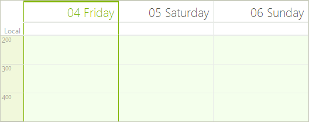
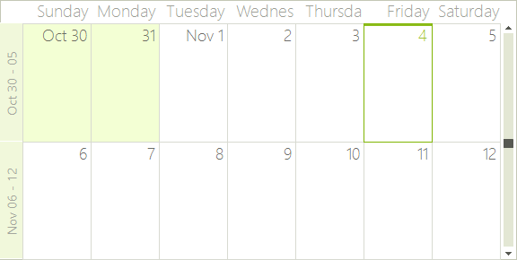

# Working with Views

## Working with Views

The scheduler displays dates and times using a "view" that can be [Day](), [MultiDay](), [Week](),  [Work Week](), [Month]() and [Timeline]().
        

>note The difference between a day view and a multi-day view is that while the day view is constrained to showing a single sequence of consecutive days (for example 7th through 10th, or 10th through 12th, or just the 15th), the multi-day view can display all of the above sequences at once.
>

At any one time the scheduler displays a view using a descendant of the SchedulerView class: __SchedulerDayView, SchedulerWeekView, SchedulerMonthView__ and __SchedulerTimelineView__. Each view has special properties particular to the view. Use the RadScheduler __GetDayView()__, __GetWeekView(),__  __GetMonthView()__ and __GetTimelineView()__ methods to get the respective views. Here's an example that retrieves the day view and sets the ruler to start at the second hour and stop at the fifth hour:

{{source=..\SamplesCS\Scheduler\Views\WorkingWithViews.cs region=getDayView}} 
{{source=..\SamplesVB\Scheduler\Views\WorkingWithViews.vb region=getDayView}} 

````C#
            SchedulerDayView dayView = radScheduler1.GetDayView();
            dayView.RulerStartScale = 2;
            dayView.RulerEndScale = 5;
````
````VB.NET
        Dim dayView As SchedulerDayView = RadScheduler1.GetDayView()
        dayView.RulerStartScale = 2
        dayView.RulerEndScale = 5
        '
````

{{endregion}} 

After running the code, the day view for the scheduler looks like this screenshot:



Change between views by changing the __ActiveViewType__ property to one of the __SchedulerViewType__ enumeration members.

{{source=..\SamplesCS\Scheduler\Views\WorkingWithViews.cs region=activeViewType}} 
{{source=..\SamplesVB\Scheduler\Views\WorkingWithViews.vb region=activeViewType}} 

````C#
            radScheduler1.ActiveViewType = SchedulerViewType.Day;
````
````VB.NET
        RadScheduler1.ActiveViewType = SchedulerViewType.Day
        '
````

{{endregion}} 

Retrieve the view that is currently being displayed by using the ActiveView property, cast it to be the ActiveViewType

{{source=..\SamplesCS\Scheduler\Views\WorkingWithViews.cs region=weekCount}} 
{{source=..\SamplesVB\Scheduler\Views\WorkingWithViews.vb region=weekCount}} 

````C#
            radScheduler1.ActiveViewType = SchedulerViewType.Month;
            (radScheduler1.ActiveView as SchedulerMonthView).WeekCount = 2;
````
````VB.NET
        RadScheduler1.ActiveViewType = SchedulerViewType.Month
        TryCast(RadScheduler1.ActiveView, SchedulerMonthView).WeekCount = 2
        '
````

{{endregion}} 




Detect changes to the view by handling the __ActiveViewChanging__ and __ActiveViewChanged__ events. As always, the "Changing" event arguments provide the ability to cancel the view change, but also the "old" and "new" views before and after the view changes transpires:

{{source=..\SamplesCS\Scheduler\Views\WorkingWithViews.cs region=activeViewChanging}} 
{{source=..\SamplesVB\Scheduler\Views\WorkingWithViews.vb region=activeViewChanging}} 

````C#
        void radScheduler1_ActiveViewChanging(object sender, SchedulerViewChangingEventArgs e)
        {
            this.Text = String.Format("Old: {0} New: {1}",
            e.OldView.ViewType.ToString(), e.NewView.ViewType.ToString());
        }
````
````VB.NET
    Private Sub radScheduler1_ActiveViewChanging(ByVal sender As Object, ByVal e As SchedulerViewChangingEventArgs)
        Me.Text = String.Format("Old: {0} New: {1}", e.OldView.ViewType.ToString(), e.NewView.ViewType.ToString())
    End Sub
    '
````

{{endregion}} 
