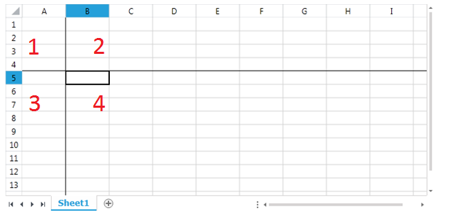
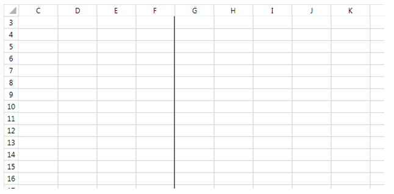

# Freeze Panes


This article briefly describes what frozen panes are, and how to create and work with them. It contains the following sections:

* [What are frozen panes?](#what-are-frozen-panes?)

* [Types of panes](#types-of-panes)

* [What defines the panes positioning?](#what-defines-the-panes-positioning?)

* [Freezing panes](#freezing-panes)

* [Unfreezing panes](#unfreezing-panes)

## What are frozen panes?

Frozen panes are a method to keep part of the worksheet visible at all times when scrolling. The image below shows a document with frozen top rows and first left column.

## Types of panes

Shapes have the following properties:

There are four types of panes, as marked on the image below:

1. Fixed
            

1. Horizontal scrollable
            

1. Vertical scrollable
            

1. Scrollable 

When the panes are split only horizontally the panes present are horizontal scrollable and scrollable. When the panes are split vertically, the two panes are vertical scrollable and scrollable.

        

## What defines the panes positioning?

In order to describe fully the state of the frozen panes the following need to be specified:

* __Top left cell index of the fixed pane__: This property determines the position to which the viewport is scrolled. When this is different from A1, any areas above and to the left of the index become unreachable. In the image below this is C3.
            

* __Frozen rows count__: The number of visible rows contained by the horizontal scrollable pane. In the image below this value is 1.
            

* __Frozen columns count__: The number of visible columns contained by the vertical scrollable pane. In the image below this value is 4.
            

* __Top left cell index of the scrollable pane__: This property determines the scroll position of the scrollable pane. In the image below this is I6. Note that this index is different from the topmost and leftmost point of the scrollable pane.


## Freezing panes

* __FreezePanes methods__ Panes can be frozen through the ViewState property of the Worksheet. It is of type WorksheetViewState and exposes the following overloads of the FreezePanes method:

    - void FreezePanes(int frozenRowsCount, int frozenColumnsCount)

    - void FreezePanes(CellIndex fixedPaneTopLeftCellIndex, int frozenRowsCount, int frozenColumnsCount)

    - void FreezePanes(CellIndex fixedPaneTopLeftCellIndex, int frozenRowsCount, int frozenColumnsCount, CellIndex scrollableTopLeftCellIndex)If the top left cell indices of the fixed pane and of the scrollable pane are not specified, it will be assumed that the top left index of the fixed pane is the current top left index of the viewport and that the scrollable pane is not scrolled.The result from the image above can be achieved with the following code:

{{source=..\SamplesCS\RadSpreadProcessing\Features\RadSpreadProcessingFreezePanes.cs region=FreezingPanes}} 
{{source=..\SamplesVB\RadSpreadProcessing\Features\RadSpreadProcessingFreezePanes.vb region=FreezingPanes}} 

````C#
            
            CellIndex fixedPaneTopLeftCellIndex = new CellIndex(2, 2);
            CellIndex scrollableTopLeftCellIndex = new CellIndex(5, 8);
            workbook.ActiveWorksheet.ViewState.FreezePanes(fixedPaneTopLeftCellIndex, 1, 4, scrollableTopLeftCellIndex);
````
````VB.NET
        Dim fixedPaneTopLeftCellIndex As New CellIndex(2, 2)
        Dim scrollableTopLeftCellIndex As New CellIndex(5, 8)
        workbook.ActiveWorksheet.ViewState.FreezePanes(fixedPaneTopLeftCellIndex, 1, 4, scrollableTopLeftCellIndex)
        '
````

{{endregion}} 

* __Horizontal and vertical split__ If you would like to create a vertical or horizontal split, all you need to do is  specify either the row count or the column count to be equal to zero.

{{source=..\SamplesCS\RadSpreadProcessing\Features\RadSpreadProcessingFreezePanes.cs region=HorizontalVerticalSplit}} 
{{source=..\SamplesVB\RadSpreadProcessing\Features\RadSpreadProcessingFreezePanes.vb region=HorizontalVerticalSplit}} 

````C#
            
            CellIndex fixedPaneTopLeftCellIndex = new CellIndex(2, 2);
            workbook.ActiveWorksheet.ViewState.FreezePanes(fixedPaneTopLeftCellIndex, 0, 4);
````
````VB.NET

        Dim fixedPaneTopLeftCellIndex As New CellIndex(2, 2)
        workbook.ActiveWorksheet.ViewState.FreezePanes(fixedPaneTopLeftCellIndex, 0, 4)

        '
````
{{endregion}} 

This code will result in the following:Since the two panes present are only vertical scrollable and scrollable the columns A and B will remain unreachable. However, the user will be able to scroll to the first two rows. Even though there are two rows from the start of the document at the time of freezing, the document will not be split horizontally.

* __The Pane class__ Another option to freeze the panes in a worksheet is to use the Pane property of type Pane of the WorksheetViewState. The functionality you can achieve is almost identical to the FreezePanes() methods. The Pane class has the following properties:

* __TopLeftCellIndex__: The top left cell index of the scrollable pane
                
* __XSplit__: The number of visible columns contained by the vertical scrollable pane

* __YSplit__: The number of visible rows contained by the horizontal scrollable pane.

* __ActivePane__: The current active pane.

* __State__: The state of the frozen panes. At the moment only the Frozen state is supported. The state from the image in the  [What defines the panes positioning section](#what-defines-the-panes-positioning?) can be achieved with the following code:

{{source=..\SamplesCS\RadSpreadProcessing\Features\RadSpreadProcessingFreezePanes.cs region=Pane}} 
{{source=..\SamplesVB\RadSpreadProcessing\Features\RadSpreadProcessingFreezePanes.vb region=Pane}} 

````C#
            
            CellIndex scrollableTopLeftCellIndex = new CellIndex(5, 8);
            Pane pane = new Pane(scrollableTopLeftCellIndex, 4, 1, ViewportPaneType.Scrollable);
            workbook.ActiveWorksheet.ViewState.Pane = pane;
````
````VB.NET

        Dim scrollableTopLeftCellIndex As New CellIndex(5, 8)
        Dim pane As New Pane(scrollableTopLeftCellIndex, 4, 1, ViewportPaneType.Scrollable)
        workbook.ActiveWorksheet.ViewState.Pane = pane

        '
````

{{endregion}} 

>note Regardless of the method used to freeze the panes of a worksheet, you should take care not to place the top left index of the frozen pane below or to the right of the index determined by the frozen row count and the frozen column count. Doing so may result in an invalid document and unexpected behavior.
>

## Unfreezing panes

In order to unfreeze the panes of the worksheet you need to use the same methods as above but specify zero for number of frozen rows and columns.

{{source=..\SamplesCS\RadSpreadProcessing\Features\RadSpreadProcessingFreezePanes.cs region=UnfreezingPanes}} 
{{source=..\SamplesVB\RadSpreadProcessing\Features\RadSpreadProcessingFreezePanes.vb region=UnfreezingPanes}} 

````C#
        
            workbook.ActiveWorksheet.ViewState.FreezePanes(0, 0);
````
````VB.NET

        workbook.ActiveWorksheet.ViewState.FreezePanes(0, 0)

        '
````

{{endregion}} 

Another option is to set the Pane property of the ViewState to null.

{{source=..\SamplesCS\RadSpreadProcessing\Features\RadSpreadProcessingFreezePanes.cs region=AlternativeUnfreezingPanes}} 
{{source=..\SamplesVB\RadSpreadProcessing\Features\RadSpreadProcessingFreezePanes.vb region=AlternativeUnfreezingPanes}} 

````C#
        
            workbook.ActiveWorksheet.ViewState.Pane = null;
````
````VB.NET

        workbook.ActiveWorksheet.ViewState.Pane = Nothing

        '
````

{{endregion}} 

# See Also

 * [What is a Worksheet?]()
