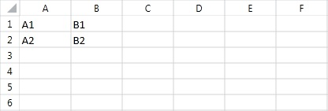
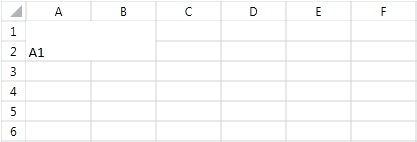
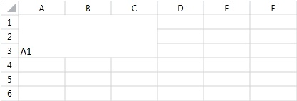
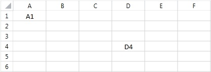

# Merge and Unmerge Cells


You have the ability to merge two or more adjacent cells into a single cell that spans over multiple rows and columns. The content of the top-left cell is displayed in the newly created merged cell. The content of the rest of the cells in the merged region is cleared. Once merged, a cell can be easily unmerged back to its compound cells.
      

## Merge Cells

To merge cells you have to create a __CellSelection__ object which determines the region of cells that will be merged. The __CellSelection__ class offers two methods that perform different types of merge: __Merge()__ and __MergeAcross()__. The former method joins all cells to create one big cell, while the latter combines all cells that appear in the same row, thus, creating a merged cell for every row in the selected region.
        

Let's take a closer look at how the two methods for merging change the following worksheet.
        

__Example 1__ constructs a worksheet that will be used as a starting point in the next few examples:
       
#### Example 1: Construct worksheet

{{source=..\SamplesCS\RadSpreadProcessing\Features\RadSpreadProcessingMergeAndUnmergeCells.cs region=radspreadprocessing-features-merge-unmerge-cells_8}} 
{{source=..\SamplesVB\RadSpreadProcessing\Features\RadSpreadProcessingMergeAndUnmergeCells.vb region=radspreadprocessing-features-merge-unmerge-cells_8}} 

````C#
Workbook workbook = new Workbook();
Worksheet worksheet = workbook.Worksheets.Add();
worksheet.Cells[0, 0].SetValue("A1");
worksheet.Cells[1, 0].SetValue("A2");
worksheet.Cells[0, 1].SetValue("B1");
worksheet.Cells[1, 1].SetValue("B2");

````
````VB.NET
Dim workbook As New Workbook()
Dim worksheet As Worksheet = workbook.Worksheets.Add()
worksheet.Cells(0, 0).SetValue("A1")
worksheet.Cells(1, 0).SetValue("A2")
worksheet.Cells(0, 1).SetValue("B1")
worksheet.Cells(1, 1).SetValue("B2")

````

{{endregion}} 

__Figure 1__ shows the result of the snippet in __Example 1__.
        
>caption Figure 1: Worksheet



__Example 2__ illustrates how to perform a merge operation on the cell region *A1:B2*.

#### Example 2: Perform merge operation

{{source=..\SamplesCS\RadSpreadProcessing\Features\RadSpreadProcessingMergeAndUnmergeCells.cs region=radspreadprocessing-features-merge-unmerge-cells_0}} 
{{source=..\SamplesVB\RadSpreadProcessing\Features\RadSpreadProcessingMergeAndUnmergeCells.vb region=radspreadprocessing-features-merge-unmerge-cells_0}} 

````C#
Workbook workbook = new Workbook();
Worksheet worksheet = workbook.Worksheets.Add();
CellIndex A1Cell = new CellIndex(0, 0);
CellIndex B2Cell = new CellIndex(1, 1);
worksheet.Cells[A1Cell, B2Cell].Merge();

````
````VB.NET
Dim workbook As New Workbook()
Dim worksheet As Worksheet = workbook.Worksheets.Add()
Dim A1Cell As New CellIndex(0, 0)
Dim B2Cell As New CellIndex(1, 1)
worksheet.Cells(A1Cell, B2Cell).Merge()

````

{{endregion}} 

As a result of the merge, the four cells appear as one. The content of the newly created cell is equal to the top left cell of the merged region, i.e. *A1*. At this point, the values of the rest of the cells in the merged region are cleared, so now cells *A2, B1 and B2* have no values.

__Figure 2__ demonstrates the result of __Example 2__ executed over the worksheet created in __Example 1__.
        
>caption Figure 2: Merge operation result



Let’s see how the __MergeAcross()__ method will change the same region in the original worksheet:
        

__Example 3__ illustrates how to perform a merge operation on the cell region *A1:B2*.

#### Example 3: Perform merge across

{{source=..\SamplesCS\RadSpreadProcessing\Features\RadSpreadProcessingMergeAndUnmergeCells.cs region=radspreadprocessing-features-merge-unmerge-cells_1}} 
{{source=..\SamplesVB\RadSpreadProcessing\Features\RadSpreadProcessingMergeAndUnmergeCells.vb region=radspreadprocessing-features-merge-unmerge-cells_1}} 

````C#
Workbook workbook = new Workbook();
Worksheet worksheet = workbook.Worksheets.Add();
CellIndex A1Cell = new CellIndex(0, 0);
CellIndex B2Cell = new CellIndex(1, 1);
worksheet.Cells[A1Cell, B2Cell].MergeAcross();

````
````VB.NET
Dim workbook As New Workbook()
Dim worksheet As Worksheet = workbook.Worksheets.Add()
Dim A1Cell As New CellIndex(0, 0)
Dim B2Cell As New CellIndex(1, 1)
worksheet.Cells(A1Cell, B2Cell).MergeAcross()

````

{{endregion}} 

Note that unlike __Merge()__, the __MergeAcross()__ method creates a new cell for every row. Each newly created cell contains the value of the leftmost cell that is in the same row and in the merged region. The value of the rest of the merged cells is cleared, so cells *B1* and *B2* have an empty value.

__Figure 3__ demonstrates the result of __Example 3__ executed over the worksheet created in __Example 1__.
        
>caption Figure 3: Merge across operation result


If you now try to merge a cell range that intersects with another merged cell range, a third merged cell range will be produced out of the top-left and bottom-right cells of the two ranges.
        

__Example 4__ merges across the region *A1:B2* and then performs another merge on the cells in the region *B2:C3*:

#### Example 4: Intersect cell range with merged cell range

{{source=..\SamplesCS\RadSpreadProcessing\Features\RadSpreadProcessingMergeAndUnmergeCells.cs region=radspreadprocessing-features-merge-unmerge-cells_2}} 
{{source=..\SamplesVB\RadSpreadProcessing\Features\RadSpreadProcessingMergeAndUnmergeCells.vb region=radspreadprocessing-features-merge-unmerge-cells_2}} 

````C#
Workbook workbook = new Workbook();
Worksheet worksheet = workbook.Worksheets.Add();
CellIndex B2Cell = new CellIndex(1, 1);
CellIndex C3Cell = new CellIndex(2, 2);
worksheet.Cells[B2Cell, C3Cell].Merge();

````
````VB.NET
Dim workbook As New Workbook()
Dim worksheet As Worksheet = workbook.Worksheets.Add()
Dim B2Cell As New CellIndex(1, 1)
Dim C3Cell As New CellIndex(2, 2)
worksheet.Cells(B2Cell, C3Cell).Merge()

````

{{endregion}} 

The result is a merged cell that ranges from *A1* to *C3*.

__Figure 4__ demonstrates the result of __Example 4__ executed over the worksheet created in __Example 1__.

>caption Figure 4: Merge cell range with merged cell range result



## Get Merged Cell Ranges

In some scenarios you may want to know if a particular cell is part of a merged region. In others, you may need to retrieve all merged ranges. This section outlines the possible approaches for getting the merged regions.

### How to check if a cell is merged? 

The Cells class exposes a __GetIsMerged()__ method that allows you to determine if a cell belongs to a merged cell. The method takes a single parameter of type __CellIndex__ which designates a cell you would like to inspect and returns a Boolean value that indicates whether the cell is contained in a merged cell.

__Example 5__ checks if cell A1 is in a merged region.

#### Example 5: Check if cell is in merged cell range

{{source=..\SamplesCS\RadSpreadProcessing\Features\RadSpreadProcessingMergeAndUnmergeCells.cs region=radspreadprocessing-features-merge-unmerge-cells_3}} 
{{source=..\SamplesVB\RadSpreadProcessing\Features\RadSpreadProcessingMergeAndUnmergeCells.vb region=radspreadprocessing-features-merge-unmerge-cells_3}} 

````C#
CellIndex A1CellIndex = new CellIndex(0, 0);
bool isA1merged = worksheet.Cells.GetIsMerged(A1CellIndex);

````
````VB.NET
Dim A1CellIndex As New CellIndex(0, 0)
Dim isA1merged As Boolean = Worksheet.Cells.GetIsMerged(A1CellIndex)

````

{{endregion}} 

### How to get the containing merged cell range, if the cell is merged?

Another way to check if a cell belongs to a merged range is to use the __TryGetContainingMergedRange()__ method of the __Cells__ class. Similarly to the GetIsMerged(), this method returns a Boolean value which indicates if the cell actually is contained in a merged cell. It requires a __CellIndex__ parameter that points the cell to be checked. The method also has one additional out parameter of type CellRange that holds the merged range of the cell, if the cell belongs to such.
            

__Example 6__ shows how to use TryGetContainingMergedRange() method.

#### Example 6: Try get merged cell range

{{source=..\SamplesCS\RadSpreadProcessing\Features\RadSpreadProcessingMergeAndUnmergeCells.cs region=radspreadprocessing-features-merge-unmerge-cells_4}} 
{{source=..\SamplesVB\RadSpreadProcessing\Features\RadSpreadProcessingMergeAndUnmergeCells.vb region=radspreadprocessing-features-merge-unmerge-cells_4}} 

````C#
CellIndex A1CellIndex = new CellIndex(0, 0);
CellRange mergedCellRange;
bool canGetContainingMergedCellRange = worksheet.Cells.TryGetContainingMergedRange(A1CellIndex, out mergedCellRange);

````
````VB.NET
Dim workbook As New Workbook()
Dim worksheet As Worksheet = workbook.Worksheets.Add()
Dim A1CellIndex As New CellIndex(0, 0)
Dim mergedCellRange As CellRange
Dim canGetContainingMergedCellRange As Boolean = worksheet.Cells.TryGetContainingMergedRange(A1CellIndex, mergedCellRange)

````

{{endregion}} 

### How to get all merged cell ranges contained in a given cell range?

Use the __GetContainingMergedRanges()__ method of the __Cells__ class to retrieve all merged cells in a specified range. The method takes a single argument of type __CellRange__ that determines the range of the search and returns an enumerable that contains all merged cell ranges.

__Example 7__ shows how to use GetContainingMergedRanges() method.

#### Example 7: Get all containing merged ranges in a range

{{source=..\SamplesCS\RadSpreadProcessing\Features\RadSpreadProcessingMergeAndUnmergeCells.cs region=radspreadprocessing-features-merge-unmerge-cells_5}} 
{{source=..\SamplesVB\RadSpreadProcessing\Features\RadSpreadProcessingMergeAndUnmergeCells.vb region=radspreadprocessing-features-merge-unmerge-cells_5}} 

````C#
CellIndex A1CellIndex = new CellIndex(0, 0);
CellIndex N33CellIndex = new CellIndex(32, 13);
CellRange A1N33CellRange = new CellRange(A1CellIndex, N33CellIndex);
IEnumerable<CellRange> containingMergedCellRanges = worksheet.Cells.GetContainingMergedRanges(A1N33CellRange);

````
````VB.NET
Dim workbook As New Workbook()
Dim worksheet As Worksheet = workbook.Worksheets.Add()
Dim A1CellIndex As New CellIndex(0, 0)
Dim N33CellIndex As New CellIndex(32, 13)
Dim A1N33CellRange As New CellRange(A1CellIndex, N33CellIndex)
Dim containingMergedCellRanges As IEnumerable(Of CellRange) = worksheet.Cells.GetContainingMergedRanges(A1N33CellRange)

````

{{endregion}} 

### How to get all merged ranges?

The __GetMergedCellRanges()__ method of the __Cells__ class returns an enumeration holding all merged cell ranges in the worksheet.
            

__Example 8__ shows how to get all merged ranges in a worksheet.

#### Example 8: Get all merged ranges

{{source=..\SamplesCS\RadSpreadProcessing\Features\RadSpreadProcessingMergeAndUnmergeCells.cs region=radspreadprocessing-features-merge-unmerge-cells_6}} 
{{source=..\SamplesVB\RadSpreadProcessing\Features\RadSpreadProcessingMergeAndUnmergeCells.vb region=radspreadprocessing-features-merge-unmerge-cells_6}} 

````C#
Workbook workbook = new Workbook();
Worksheet worksheet = workbook.Worksheets.Add();
IEnumerable<CellRange> mergedCellRanges = worksheet.Cells.GetMergedCellRanges();

````
````VB.NET
Dim workbook As New Workbook()
Dim worksheet As Worksheet = workbook.Worksheets.Add()
Dim mergedCellRanges As IEnumerable(Of CellRange) = worksheet.Cells.GetMergedCellRanges()

````

{{endregion}} 

## Unmerge Cells

Once a cell is merged, the API offers an easy way to split it back to its composing cells. This is achieved through the __Unmerge()__ method of the __CellSelection__ class. When this method is invoked it unmerges all merged cell ranges that intersect with the selected cell range. For example, consider the worksheet in __Figure 5__ that has the regions *A1:B2* and *D4:E5* merged.
        
>caption Figure 5: Sample worksheet


__Example 9__ invokes the __Unmerge()__ method for the region *B2:D4* of the worksheet from __Figure 5__, which intersects with the two merged ranges.

#### Example 9: Unmerge cells 

{{source=..\SamplesCS\RadSpreadProcessing\Features\RadSpreadProcessingMergeAndUnmergeCells.cs region=radspreadprocessing-features-merge-unmerge-cells_7}} 
{{source=..\SamplesVB\RadSpreadProcessing\Features\RadSpreadProcessingMergeAndUnmergeCells.vb region=radspreadprocessing-features-merge-unmerge-cells_7}} 

````C#
CellIndex B2CellIndex = new CellIndex(1, 1);
CellIndex D4CellIndex = new CellIndex(3, 3);
CellRange B2D4CellSelection = new CellRange(B2CellIndex, D4CellIndex);
worksheet.Cells[B2D4CellSelection].Unmerge();

````
````VB.NET
Dim workbook As New Workbook()
Dim worksheet As Worksheet = workbook.Worksheets.Add()
Dim B2CellIndex As New CellIndex(1, 1)
Dim D4CellIndex As New CellIndex(3, 3)
Dim B2D4CellSelection As New CellRange(B2CellIndex, D4CellIndex)
worksheet.Cells(B2D4CellSelection).Unmerge()

````

{{endregion}} 

__Figure 6__ shows that as a result, the two ranges are unmerged.

>caption Figure 6: Result of unmerge action


