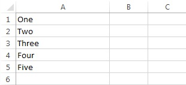
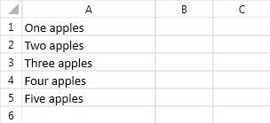

# Number Formatting

Applying different formats to a number changes the appearance of the number. It is important to note, however, that a format does not change the value it is applied to. It only changes the way the value appears in the cell.

## Available Number Formats

The document model exposes the following categories of predefined formats:

* __General format__: The default number format applied to a number. Typically, numbers formatted with this format are displayed exactly as they are typed. If the number is 12 or more digits, however, the General number format applies scientific notation.
            

* __Number format__: Used for the general display of numbers. The format specifies the number of decimal places and indicates whether a thousands separator is used. Additionally, the Number format specifies how negative numbers are displayed.
            

* __Currency format__: Used for general monetary values. Numbers in this format are displayed with the default currency symbol. The format specifies the number of decimal places and indicates whether a thousands separator is used. Additionally, the Currency format specifies how negative numbers are displayed.
            

* __Accounting format__: Ussed for monetary values. Unlike the Currency format it aligns the currency symbols and the values in a column. The format specifies the number of decimal places used.
            

* __Date format__: Treats a number as date and time serial number and displays it as a date value.
            

* __Time format__: Treats a number as date and time serial number and displays it as a time value.
            

* __Percentage format__: Displays the cell value multiplied by 100 and followed by a percent (%) symbol. The format specifies the number of decimal places used.
            

* __Fraction format__: Displays a cell value as a fraction.
            

* __Scientific format__: Displays a number in scientific notation. The number is transformed into a real number followed by E+n, where E (which stands for Exponent) multiplies the real number by 10 to the nth power. For example, a 2-decimal scientific format displays 12345678901 as 1.23E+10, which is 1.23 times 10 to the 10th power. The format specifies the number of decimal places used.
            

* __Text format__: Treats the content of a cell as text and displays the content exactly as it is typed.
            

* __Special format__: Designed to display numbers as postal codes (ZIP Code), phone numbers, or Social Security numbers.
            

* __Custom format__: Allows modifying any of the predefined formats. The format also allows creating a new custom number format that is added to the list of number format codes.
            

As previously explained, the number format does not change the value of the cell, only its appearance. In __Figure 1__ the value of the cell is set to a double number with a lot of digits after the decimal separator. When entered the default format here is __General__.
        
>caption Figure 1: General format


If you need to specify the amount of digits after the decimal separator, you can take advantage of __Number__ formatting. For example, applying a number format that uses a thousand separator and limits the decimal places produces the following result:
        
>caption Figure 2: Number format


The format string applied in __Figure 1__ is __#,##0.00__.
        

__Number__ formatting is not restricted to number values. The following example illustrates how to apply format to text values. Column *A* in the worksheet below contains the textual representation of the numbers 1-5:
        
>caption Figure 3: Textual representation in Number format



To alter the values, so that each of them contains the string "apple" after the number, you can use the "@ apples" format string. The "@" wild card is replaced with the text of the cell in the result string. The result will be the following:
        
>caption Figure 3: Textual representation in Number format with format string



## Applying a Number Format

The number format is represented by the __CellValueFormat__ class. You can set it to a given __CellSelection__ object using its __SetFormat()__ method.
        

__Exam0ple 1__ demonstrates how to apply scientific format to cell *A1* and percentage format to the *A2:B3* cell range in the __ActiveWorksheet__:

#### Example 1: Apply format

{{source=..\SamplesCS\RadSpreadProcessing\Features\RadSpreadProcessingNumberFormatting.cs region=radspreadprocessing-features-number-formats_0}} 
{{source=..\SamplesVB\RadSpreadProcessing\Features\RadSpreadProcessingNumberFormatting.vb region=radspreadprocessing-features-number-formats_0}} 

````C#
        public void ApplyFormat()
        {
            Workbook workbook = new Workbook();
            Worksheet worksheet = workbook.Worksheets.Add();

            CellSelection cellSelectionA1 = worksheet.Cells[new CellIndex(0, 0)];
            CellValueFormat scientificFormat = new CellValueFormat("0.00E+00");
            cellSelectionA1.SetFormat(scientificFormat);

            CellSelection cellSelectionA2B3 = worksheet.Cells[new CellRange(new CellIndex(1, 0), new CellIndex(2, 1))];
            CellValueFormat percentageFormat = new CellValueFormat("0.00%");
            cellSelectionA2B3.SetFormat(percentageFormat);
        }
````
````VB.NET
    Public Sub ApplyFormat()
        Dim workbook As New Workbook()
        Dim worksheet As Worksheet = workbook.Worksheets.Add()

        Dim cellSelectionA1 As CellSelection = worksheet.Cells(New CellIndex(0, 0))
        Dim scientificFormat As New CellValueFormat("0.00E+00")
        cellSelectionA1.SetFormat(scientificFormat)

        Dim cellSelectionA2B3 As CellSelection = worksheet.Cells(New CellRange(New CellIndex(1, 0), New CellIndex(2, 1)))
        Dim percentageFormat As New CellValueFormat("0.00%")
        cellSelectionA2B3.SetFormat(percentageFormat)
    End Sub

    '
````

{{endregion}} 

You can retrieve the number format of any cell selection using the __GetFormat()__ method of __CellSelection__ class. The method returns an object of type __RangePropertyValue<CellValueFormat>__, which exposes two properties:

* __IsIndeterminate__: Determines if the __CellValueFormat__ is consistent among all cells in the specified __CellSelection__. If the __CellValueFormat__ is one and the same for all cells, __IsIndeterminate__ is set to false. However, if the __CellValueFormat__ varies throughout the cells in the __CellSelection__, the __IsIndetermine__ property is set to true and the __Value__ property of the __RangePropertyValue<T>__ object is set to its default value.

* __Value__: Holds the __CellValueFormat__ for the cells. If the __IsIndeterminate__ property is set to false, __Value__ contains __CellValueFormat__ of the whole __CellSelection__ region. If the __IsIndeterminate__ property is set to true, this indicates that the __CellValueFormat__ is not the same for all cells in the __CellSelection__ and the __Value__ property is set to the default __CellValueFormat__.
            

__Example 2__ demonstrates how to get the __Number__ format of cell *A1* and cell range *A2:B3*:

#### Example 2: Get Number format

{{source=..\SamplesCS\RadSpreadProcessing\Features\RadSpreadProcessingNumberFormatting.cs region=radspreadprocessing-features-number-formats_1}} 
{{source=..\SamplesVB\RadSpreadProcessing\Features\RadSpreadProcessingNumberFormatting.vb region=radspreadprocessing-features-number-formats_1}} 

````C#
        public void GetFormat()
        {
            Workbook workbook = new Workbook();
            Worksheet worksheet = workbook.Worksheets.Add();

            CellSelection cellSelectionA1 = worksheet.Cells[new CellIndex(0, 0)];
            CellSelection cellSelectionA2B3 = worksheet.Cells[new CellRange(new CellIndex(1, 0), new CellIndex(2, 1))];

            CellValueFormat cellSelectioA1Format = cellSelectionA1.GetFormat().Value;
            CellValueFormat cellSelectioA2Format = cellSelectionA2B3.GetFormat().Value;
        }
````
````VB.NET
    Public Sub GetFormat()
        Dim workbook As New Workbook()
        Dim worksheet As Worksheet = workbook.Worksheets.Add()

        Dim cellSelectionA1 As CellSelection = worksheet.Cells(New CellIndex(0, 0))
        Dim cellSelectionA2B3 As CellSelection = worksheet.Cells(New CellRange(New CellIndex(1, 0), New CellIndex(2, 1)))

        Dim cellSelectioA1Format As CellValueFormat = cellSelectionA1.GetFormat().Value
        Dim cellSelectioA2Format As CellValueFormat = cellSelectionA2B3.GetFormat().Value
    End Sub
    '
````

{{endregion}}
