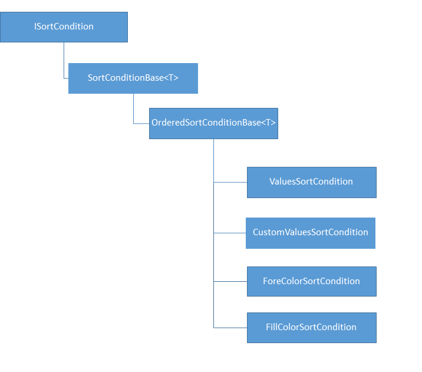
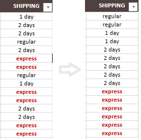
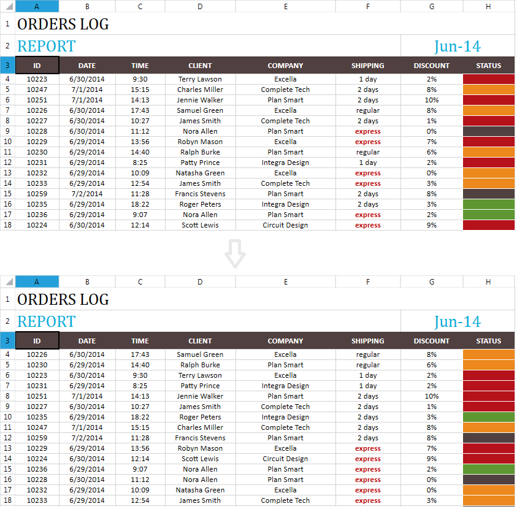

# Sorting


This article describes what is sorting and how to work with it through the document model. It contains the following sections:

* [What is Sorting?](#what-is-sorting?)

* [SortState](#SortState )

* [ISortCondition](#isortcondition)

* [OrderedSortCondition](#orderedsortcondition)

* [ValuesSortCondition](#valuessortcondition)

* [CustomValuesSortCondition](#customvaluessortcondition)

* [ForeColorSortCondition](#forecolorsortcondition)

* [ForeColorSortCondition](#forecolorsortcondition)

* [Setting Sorting Conditions](#setting-sorting-conditions)

* [Clearing the Sorting](#clearing-the-sorting)

## What is Sorting?

The sorting feature allows the user to arrange the data according to one or more sorting conditions.

The information about the sorting applied to a worksheet is contained in the worksheet property __SortState__ which is of type __SortState__. Through it you can set and modify the worksheet sorting conditions. The interface implemented by all sort conditions is __ISortCondition__.

## SortState

The __SortState__ class exposes the following public members:
        

* __Count__: The number of sorting conditions currently applied.
            

* __SortConditions__: The sorting conditions currently applied.
            

* __SortRange__: Property of type CellRange representing the sorting range to which the sorting conditions are applied. The worksheet can have only one range sorted at a time. If no sorting is applied, the sort range is null.


* __void Set(CellRange sortRange, params ISortCondition[] sortConditions)__: Sets the specified sorting conditions to the specified range.

* __void Clear()__: Removes all the sorting from the worksheet.

## ISortCondition

All sorting conditions which can be applied to the sorted range implement the __ISortCondition__ interface. The interface exposes the following members:

* __SortIndex__: Gets the index of the column to which the sort condition is applied. The index is relative to the beginning of the sorted range.

* __IComparer<SortValue> Comparer__: Determines the order of the sorted values.

* __object GetValue(Cells cells, int rowIndex, int columnIndex)__: Gets the value of the cell at the specified index. This value is used to determine how the cell containing the value should be ordered during the sorting.


The diagram in __Figure 1__ shows the different types of conditions, which inherit the __ISortCondition__ interface, and the classes which implement them:

>caption Figure 1



## OrderedSortCondition

The ordered sort condition is a type of condition which sorts the values in an ordered manner, in ascending or descending order. It is represented by the abstract class __OrderedSortConditionBase<T>__.

This class has one additional member, other than the members of the __ISortCondition__ interface:

* __SortOrder__: The sort order. It can have one of these values:

* Ascending

* Descending

## ValuesSortCondition

The values sort condition is a condition which uses the values of the cells to sort them.

__Example 1__ shows how to create a __ValuesSortCondition__.

#### Example 1: Create ValuesSortCondition

{{source=..\SamplesCS\RadSpreadProcessing\Features\RadSpreadProcessingSorting.cs region=radspreadprocessing-features-sorting_0}} 
{{source=..\SamplesVB\RadSpreadProcessing\Features\RadSpreadProcessingSorting.vb region=radspreadprocessing-features-sorting_0}} 

````C#
            ValuesSortCondition condition = new ValuesSortCondition(0, Telerik.Windows.Documents.Spreadsheet.Model.Sorting.SortOrder.Ascending);
````
````VB.NET
        Dim condition As New ValuesSortCondition(0, Telerik.Windows.Documents.Spreadsheet.Model.Sorting.SortOrder.Ascending)
        '
````

{{endregion}} 

This condition will use a predefined comparer to sort the values of the cells of the selected range in an intuitive ascending order. The result is visible from __Figure 2__.
        
>caption Figure 2: Values Sort Result


## CustomValuesSortCondition

Sometimes the behavior of the predefined comparers is not sufficient. In this case you may wish to use a custom values sort condition. With it, you can specify the order in which you'd like the values to be ordered.

__Example 2__ shows how to create a CustomValuesSortCondition.
        
#### Example 2: Create CustomValuesSortCondition

{{source=..\SamplesCS\RadSpreadProcessing\Features\RadSpreadProcessingSorting.cs region=radspreadprocessing-features-sorting_1}} 
{{source=..\SamplesVB\RadSpreadProcessing\Features\RadSpreadProcessingSorting.vb region=radspreadprocessing-features-sorting_1}} 

````C#
            CustomValuesSortCondition condition = new CustomValuesSortCondition(0, new string[] { "regular", "1 day", "2 days", "express" }, Telerik.Windows.Documents.Spreadsheet.Model.Sorting.SortOrder.Ascending);
````
````VB.NET
        Dim condition As New CustomValuesSortCondition(0, New String() {"regular", "1 day", "2 days", "express"}, Telerik.Windows.Documents.Spreadsheet.Model.Sorting.SortOrder.Ascending)
        '
````

{{endregion}} 

>caption Figure 3: Custom Value Sort Result



## ForeColorSortCondition

A fore color sort condition orders the cells according to the color of the text in them. Each condition can have one color which it sets on the top or on the bottom of the sorted order.
        

__Example 3__ demonstrates how to create a __ForeColorSortCondition__. This condition will sort the range by putting all cells with a red fore color on the top.

#### Example 3: Create ForeColorSortCondition_

{{source=..\SamplesCS\RadSpreadProcessing\Features\RadSpreadProcessingSorting.cs region=radspreadprocessing-features-sorting_2}} 
{{source=..\SamplesVB\RadSpreadProcessing\Features\RadSpreadProcessingSorting.vb region=radspreadprocessing-features-sorting_2}} 

````C#
            ForeColorSortCondition condition = new ForeColorSortCondition(0, new ThemableColor(Colors.Red), Telerik.Windows.Documents.Spreadsheet.Model.Sorting.SortOrder.Ascending);
````
````VB.NET
        Dim condition As New ForeColorSortCondition(0, New ThemableColor(Colors.Red), Telerik.Windows.Documents.Spreadsheet.Model.Sorting.SortOrder.Ascending)
        '
````

{{endregion}} 

## FillColorSortCondition

A fill color sort condition orders the cells according to their fill color. Each condition can have one fill which it sets on the top or on the bottom of the sorted order.
        

__Example 4__ shows how to create a __FillColorSortCondition__.

#### Example 4: Create FillColorSortCondition_

{{source=..\SamplesCS\RadSpreadProcessing\Features\RadSpreadProcessingSorting.cs region=radspreadprocessing-features-sorting_3}} 
{{source=..\SamplesVB\RadSpreadProcessing\Features\RadSpreadProcessingSorting.vb region=radspreadprocessing-features-sorting_3}} 

````C#
            FillColorSortCondition condition = new FillColorSortCondition(0, PatternFill.CreateSolidFill(Color.FromRgb(181, 18, 27)), Telerik.Windows.Documents.Spreadsheet.Model.Sorting.SortOrder.Ascending);
````
````VB.NET
        Dim condition As New FillColorSortCondition(0, PatternFill.CreateSolidFill(Color.FromRgb(181, 18, 27)), Telerik.Windows.Documents.Spreadsheet.Model.Sorting.SortOrder.Ascending)
        '
````

{{endregion}} 

__Figure 4__ shows that this condition will sort the range by putting all cells with a red color on the top.
        
>caption Figure 4: Fill Color Sort Result


## Setting Sorting Conditions

There are two ways to sort a range on a worksheet: using the __SortState__ property of the worksheet, or through the cell selection. In both cases you need to create a sort condition and then apply it.
        

Note that unlike the case with [Filtering]() , you can apply more than one sort condition on one column. In fact, this is what you need to do if you'd like to sort by more than one color.

__Example 5__ shows how to create three sorting conditions.

#### Example 5: Create Conditions

{{source=..\SamplesCS\RadSpreadProcessing\Features\RadSpreadProcessingSorting.cs region=radspreadprocessing-features-sorting_4}} 
{{source=..\SamplesVB\RadSpreadProcessing\Features\RadSpreadProcessingSorting.vb region=radspreadprocessing-features-sorting_4}} 

````C#
            Worksheet worksheet = workbook.ActiveWorksheet;

            CustomValuesSortCondition condition1 = new CustomValuesSortCondition(5, new string[] { "regular", "1 day", "2 days", "express" }, Telerik.Windows.Documents.Spreadsheet.Model.Sorting.SortOrder.Ascending);
            FillColorSortCondition condition2 = new FillColorSortCondition(7, PatternFill.CreateSolidFill(Color.FromRgb(181, 18, 27)), Telerik.Windows.Documents.Spreadsheet.Model.Sorting.SortOrder.Ascending);
            FillColorSortCondition condition3 = new FillColorSortCondition(7, PatternFill.CreateSolidFill(Color.FromRgb(94, 151, 50)), Telerik.Windows.Documents.Spreadsheet.Model.Sorting.SortOrder.Ascending);
````
````VB.NET
        Dim worksheet As Worksheet = workbook.ActiveWorksheet

        Dim condition1 As New CustomValuesSortCondition(5, New String() {"regular", "1 day", "2 days", "express"}, Telerik.Windows.Documents.Spreadsheet.Model.Sorting.SortOrder.Ascending)
        Dim condition2 As New FillColorSortCondition(7, PatternFill.CreateSolidFill(Color.FromRgb(181, 18, 27)), Telerik.Windows.Documents.Spreadsheet.Model.Sorting.SortOrder.Ascending)
        Dim condition3 As New FillColorSortCondition(7, PatternFill.CreateSolidFill(Color.FromRgb(94, 151, 50)), Telerik.Windows.Documents.Spreadsheet.Model.Sorting.SortOrder.Ascending)
        '
````

{{endregion}} 

Further, __Example 6__ shows how to apply the sorting conditions through the __SortState__ property.

#### Example 6: Set Conditions Through SortState_

{{source=..\SamplesCS\RadSpreadProcessing\Features\RadSpreadProcessingSorting.cs region=radspreadprocessing-features-sorting_5}} 
{{source=..\SamplesVB\RadSpreadProcessing\Features\RadSpreadProcessingSorting.vb region=radspreadprocessing-features-sorting_5}} 

````C#
            worksheet.SortState.Set(new CellRange(3, 0, 17, 7), condition1, condition2, condition3);
````
````VB.NET
        worksheet.SortState.[Set](New CellRange(3, 0, 17, 7), condition1, condition2, condition3)
        '
````

{{endregion}} 

Alternatively, __Example 7__ shows how to apply the sorting conditions through the cell selection property.

#### Example 7: Set Conditions Through Selection_

{{source=..\SamplesCS\RadSpreadProcessing\Features\RadSpreadProcessingSorting.cs region=radspreadprocessing-features-sorting_6}} 
{{source=..\SamplesVB\RadSpreadProcessing\Features\RadSpreadProcessingSorting.vb region=radspreadprocessing-features-sorting_6}} 

````C#
            worksheet.Cells[3, 0, 17, 7].Sort(condition1, condition2, condition3);
````
````VB.NET
        worksheet.Cells(3, 0, 17, 7).Sort(condition1, condition2, condition3)
        '
````

{{endregion}} 

Whichever option you chose, the result will be the same. The conditions will be applied in the order you set them. In __Figure 5__ you can see that in this example the rows are rearranged first by the custom list given for column F. After that the red color is placed on top and the green color is placed after it in each section formed by the rows with same values in column F.
        
>caption Figure 5: Set Conditions Result



## Clearing the Sorting

In order to clear the sorting, you can use the __Clear()__ method of the __SortState__ property. There is no need to clear the old sort conditions if you want to set new ones, they will be cleared internally.
        

__Example 8__ shows how to celar the sorting.

#### Example 8: Clear Sorting

{{source=..\SamplesCS\RadSpreadProcessing\Features\RadSpreadProcessingSorting.cs region=radspreadprocessing-features-sorting_7}} 
{{source=..\SamplesVB\RadSpreadProcessing\Features\RadSpreadProcessingSorting.vb region=radspreadprocessing-features-sorting_7}} 

````C#
            worksheet.SortState.Clear();
````
````VB.NET
        worksheet.SortState.Clear()
        '
````

{{endregion}} 

# See Also

* [Filtering]()
