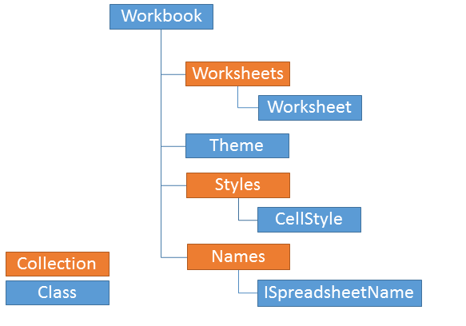

# Whats is a Workbook?

This article will help you get familiar with the concept of a workbook and its features.
      

## What is a Workbook?

The workbook lays in the core of the RadSpreadProcessing' and RadSpreadsheet document model. It is the primary document that you use to retrieve, manipulate and store data. The workbook can also be viewed as a collection of worksheets, where a worksheet is in turn defined as a collection of cells organized in rows and columns. Each workbook contains at least one worksheet and often holds several sheets with related information.
        

The workbook is designed to hold together multiple worksheets in order to allow efficient organization and consolidation of data. Typically, a workbook has a single theme and contains worksheets with related data. For example, an annual budget workbook may comprise four worksheets that break down the budget in quarters.
        

You can create a workbook from scratch or import an existing document. To save a document you can export its contents into a csv, txt or xlsx file.
          Further information is available in the [Create, Open and Save Workbooks]() article and the 
          [Formats and Conversion]() section.
        

## What is in it?

The workbook has several important characteristics:
        

* __Collection of Worksheets__: Each workbook maintains a collection of worksheets that allows you to add and delete worksheets. 
              It also allows you to move worksheets within the workbook or simply iterate through them. More information about worksheets is available in the
              [What is a Worksheet?]() section.
            

* __Active Worksheet__: The workbook exposes a property that indicates the active worksheet. Note that there is a single active worksheet
              in a workbook at a time. The [Activate a Worksheet]() article illustrates how to set the active worksheet.
            

* __History__: Each workbook maintains a history stack that records all changes introduced to its content. 
              That said, you can perform undo and redo operations effortlessly, replying on the built-in recorder. Although the tracking of changes 
              is done automatically, it also allows manual control over the recorded items. The history of the workbook also lets you to group several 
              actions into a one undo step. This feature is very handy, for example, when you replace the contents of multiple cells in a single action. 
              You will be able to find more information about the feature in the [History]()article.
            

* __Names (Named Ranges)__: the Workbook class exposes a Names property that of type NameCollection that
              allows you to create, update and manage names. More about the feature is available in the [Names]() article.
            

* __Collection of Cell Styles__: Each workbook contains a collection of cell styles. A cell style is a predefined set of formatting options,
              such as borders, fonts, fills and number formats, that you can apply to a cell. The concept of cell styles facilitates the process of formatting 
              cells since it allows you to set multiple properties in one step and also serves as means for achieving consistent look. 
              The collection of cell styles allows you to add, retrieve and delete styles. More information on the cell styles is available in the 
              [Cell Styles]() article.
            

* __Theme__: The workbook has a theme that allows you specify colors, fonts and a variety of graphic effect for the whole document.
              You will be able to find more information on the topic in the [Document Themes]() article.
            

* __Find and Replace__: The Workbook class offers friendly API that allows you to find and replace text and numbers in all worksheets it contains.
              For more information about the feature see the [Find and Replace]() article.
            

* __Protection__: The feature lets you prevent users from modifying the structure of the workbook: adding, removing, renaming or 
              reordering sheets. You can find more information on the topic in the [Worksheet Protection]() article.
            
