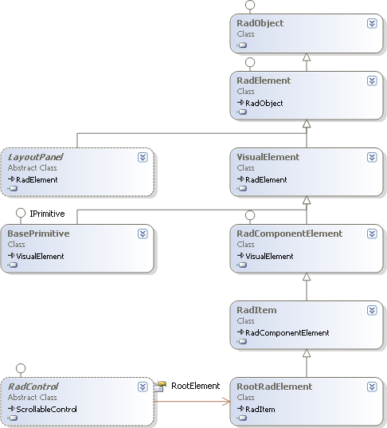

# Class Hierarchy Overview

The diagram below contains an abbreviated class diagram of the class inheritance starting with RadObject and building to RadControl. RadProperty and RadPropertyMetaData are not shown. See also the Choosing an Ancestor Class topic for information about selecting an ancestor for your TPF based control.

* [RadProperty]()encapsulates properties used in RadObject and support[dependency properties](). Each RadProperty has a name, type, owner and[metadata](), i.e. information about the property..

* [RadPropertyMetadata]()describes a property and de-couples the information about a property from the property itself.

* [RadObject]()represents the base class for all RadElement objects and has the ability to store all property values in a single structure.

* [RadElement]()is a key class that represents the smallest unit in a RadControl that can be painted or laid out on the screen. RadElement is the base class of all elements that take advantage of TPF features, e.g. property inheritance, layouts and styling. RadElement implements a tree-like structure of RadObjects, property value inheritance and automatic layout and display invalidation based on the options of the PropertyMetadata for each RadProperty. RadElement has a size and location specified in coordinates in relation to its parent.

* [VisualElement]()adds visual properties common to all elements that will be painted, e.g. back color, fore color, font, default size, smoothing mode, opacity.

* [LayoutPanel]()an abstract class descending from RadElement. LayoutPanel descendants coordinate sizing and position for a number of elements.

* [RadComponentElement]()implements IComponent  and introduces the ability to be contained.[BasePrimitive]()is a VisualElement descendant that adds a virtual PaintPrimitive() method that draws a primitive to the screen.

* [RadItem]()represents a visual element which could be added to an ItemsCollection and can be selected, deleted or moved during Visual Studio at design time. By default this class knows how to  handle user input.[RadControl]()is the abstract base class for  all RadControls. Each RadControl contains a tree of RadElements. The tree has a root, the __RadControl.RootElement__ (type  RootRadElement shown in the diagram) and children of the root element. RadControl acts as a bridge between the traditional Windows forms controls  and the RadElement tree. RadControl also defines properties common across all controls e.g. ThemeName, Style, ImageList, image scaling properties, minimum and maximum sizes.|

