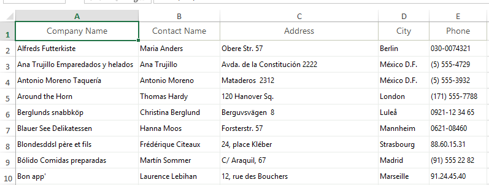

# SpreadExportRenderer


The __SpreadExportRenderer__ class gives you access to the exported document and provides you with the ability to change it before it is saved.
        

The __SpreadExportRenderer__ API gives you the ability to manipulate the document. The most important part is the __WorkbookCreated__ event. This event is triggered on the __SpreadExportRenderer__ object when the workbook is ready to be exported. Allows to introduce final customizations (for example you can add [header and footer]()). More information on how to work with Workbook is available here: [Working with Workbooks]().
        

The following example shows how you can subscribe to the event and use it to best fit the columns in the file:

{{source=..\SamplesCS\TPF\ExportData\SpreadExportRendererCode.cs region=AttachRenderer}} 
{{source=..\SamplesVB\TPF\ExportData\SpreadExportRendererCode.vb region=AttachRenderer}} 

````C#
          
SpreadExportRenderer exportRenderer = new SpreadExportRenderer();
exportRenderer.WorkbookCreated += exportRenderer_WorkbookCreated;

````
````VB.NET
Dim exportRenderer As New SpreadExportRenderer()
AddHandler exportRenderer.WorkbookCreated, AddressOf exportRenderer_WorkbookCreated

````

{{endregion}} 

{{source=..\SamplesCS\TPF\ExportData\SpreadExportRendererCode.cs region=WorbookCreated}} 
{{source=..\SamplesVB\TPF\ExportData\SpreadExportRendererCode.vb region=WorbookCreated}} 

````C#
void exportRenderer_WorkbookCreated(object sender, WorkbookCreatedEventArgs e)
{
    Worksheet worksheet = (Worksheet)e.Workbook.Sheets[0];
    worksheet.Columns[worksheet.UsedCellRange].AutoFitWidth();
}

````
````VB.NET
Private Sub exportRenderer_WorkbookCreated(ByVal sender As Object, ByVal e As WorkbookCreatedEventArgs)
    Dim worksheet As Worksheet = CType(e.Workbook.Sheets(0), Worksheet)
    worksheet.Columns(worksheet.UsedCellRange).AutoFitWidth()
End Sub

````

{{endregion}} 



