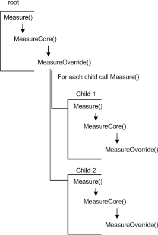
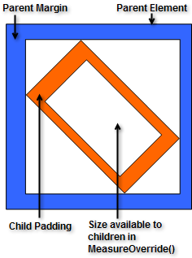
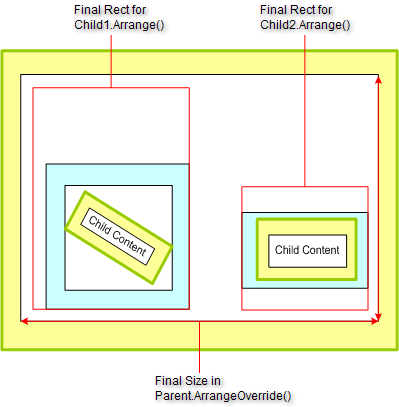

# Layout Logic

Layout of elements proceed in two stages: the measure stage that reserves size to accommodate element contents and the arrange stage that arranges elements in the 
      container. The order of execution is the following:

* All children are measured, recursively through the hierarchy, calling their implementations of __Measure()__, 
        __MeasureCore()__, __MeasureOverride()__.
          

* All children are arranged in the __Arrange()__,  __ArrangeCore()__, and __ArrangeOverride()__ methods.
          

* In case the size returned by the __ArrangeOverride()__ method differs from the size it was invoked with, the Measure stage is invoked again,
            due to the change in the size required for layout. The measure stage is followed by a second call to Arrange, which arranges the children taking into account the new measures
            of the children.
          

## Measure Stage

The measure stage calculates the RadElement __DesiredSize__ property. __DesiredSize__ is the minimum size that ensures 
        that element content will not be clipped.

>note  __DesiredSize__ 
>
* By default[FillPrimitive]()can be drawn without
                  clipping even with empty size. DesiredSize for FillPrimitive is (0, 0) by default.
* The DesiredSize for a[HostItem](E5579056-3A2D-43BA-A62E-D16F47051B66)(and indirectly
                  for RadTextBoxElement) is determined by the size of the hosted control. By default the DesiredSize of a RadTextBoxElement is determined by the default size of the
                  hosted TextBox.
* The DesiredSize of RadLabel is determined by the Font and the Text property.>

The measure stage recurses over the element hierarchy calling three functions: __Measure()__, __MeasureCore()__ and 
        __MeasureOverride()__. An element's __Measure()__ method calls __MeasureCore()__, which in turn calls 
          __MeasureOverride()__. __MeasureOverride()__ calls the __Measure()__ method of all element children.

## Measure()

The __Measure()__ function manages the progression of states in the layout mechanism, e.g. adding and removing the element from the "measure queue".

## MeasureCore()

__MeasureCore()__ ensures transparency for logic that calculates the desired size in __MeasureOverride()__. MeasureCore() tasks 
          are:

* Transform the size parameter passed to MeasureOverride() so that __Margins__, __Scale__ and 
          __AngleTransform__ are taken into account. The meaning of this parameter is "the size provided by the parent in which the desired size must fit".  
            

* Transform the MeasureOverride() return value, again taking __Margins__, __Scale__ and 
          __AngleTransform__ into account. __DesiredSize__ is assigned the result of this transformation. 
            

Padding is handled differently for each custom layout and so is not considered in the base MeasureCore() method. Padding should be handled in the
        MeasureOverride() method.

## MeasureOverride()

This method receives a parameter containing the size available for its children after transformations are applied (margin, rotation, scaling). 
        MeasureOverride() returns the minimum size of the area in which all child elements can be positioned according to their __DesiredSizes__
          and any other logic implemented. The default implementation returns the maximum dimension values of the child elements.

MeasureOverride() should call the Measure() method for any children. The Measure() method takes a single SizeF "availableSize" parameter. DesiredSize is 
        assigned availableSize or the MeasureOverride() return value, whichever is less. The diagram below shows how the size available to children is determined after 
        applying margin, padding and rotation transformations to the size available for the parent element.

## Arrange Stage

After the measuring stage of the layout process completes, the arrange stage is invoked to position child elements within the allocated area. The arrange stage
        calculates the size available to children, taking into account margins, transformations, alignment and stretching. The process is analogous to the measure stage. The methods 
        are __Arrange()__, __ArrangeCore()__ and __ArrangeOverride()__.

## ArrangeOverride()

This method receives a parameter containing the available size for children to be arranged in. Child elements must have their __Arrange()__
        method called to have their bounds set. The rectangle that is fed to each child __Arrange()__ call is the area where the child can position itself. 
        The child can be stretched within the available area or aligned within the area using the __Alignment__ property.

The DesiredSize of every child is valid in the parent's ArrangeOverride() method and may be used in the 
          calculations.
        

The rectangles allocated by ArrangeOverride() do not need to be next to each other or ordered in any particular fashion. The example below shows a 
        scenario where children are arranged with a size greater they request. The first child is aligned in the bottom-right corner of the size it has received 
        for layout, while the second child is stretched horizontally and aligned in the center.

>caution The __ArrangeOverride__ and __MeasureOverride__ implementations in the layout panel logic are to be used for
            reserving size and arranging elements within the available area. They are not meant to be used for setting layout properties, but rather for implementing the
            logic needed to achieve the desired visual appearance.
>Layout-affecting properties such as[Margin, Scale and 
            Padding]()are meant to be set outside of the layout panel logic code.
>

## Implementation Details

There are two static queues for the two layout stages: __MeasureQueue__ and __ArrangeQueue__. The layout consists
        of two cycles that loop through the elements in the queues. The first cycle is the measure cycle which loops over the measure queue and exits when the measure queue 
        is empty. The second cycle loops over the arrange queue and exits when the arrange queue is empty. During these two cycles, elements can be added to the two queues. 
        There is a cycle that encloses the two aforementioned cycles, which runs until the two queues are empties empty.

The measure cycle calls its Measure() method for each element in the measure queue. The Measure() method deletes the element from the queue if the Measure stage 
        is finished for the element. The arrange cycle calls the Arrange() method of each element in the arrange queue in a similar way. Each time the measure or arrange stage
        of an element is invalidated, the element is added to the appropriate layout queue. Then the layout cycle enclosing the measure and arrange loops is called asynchronously.
		
