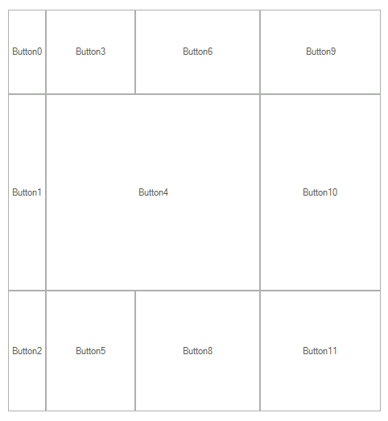

# GridLayout

## 



The GridLayout has to be populated with columns and rows when it is being initialized. Each column/row can be in one of three sizing modes:
        	
		

* __Fixed__:  The column/row is sized with a fixed width/height determined by the FixedWidth/FixedHeight property.

* __Proportional__: The column/row is sized proportionally according to the other proportional rows/columns. In this case the available width/height is split proportionally to each column/row according to the ProportionalWidthWeight/ProportionalHeightWeigh property.

* __Auto__: In this mode the column/row has the width/height of the largest item in it. To determine the cell coordinates of each element added to the GridLayout, you should set the RowIndex/ColumnIndex properties.Also, each element has a RowSpan/ColSpan property, which determines how many rows/columns the element occupies:
        

Here is a sample:

#### Using WrapLayoutPanel

{{source=..\SamplesCS\TPF\Layouts\PredefinedLayoutPanels\MyGridLayoutPanelElement.cs region=GridLayout}} 
{{source=..\SamplesVB\TPF\Layouts\PredefinedLayoutPanels\MyGridLayoutPanelElement.vb region=GridLayout}} 

````C#
    public class MyGridLayoutControl : RadControl
    {
        protected override void CreateChildItems(RadElement parent)
        {
            base.CreateChildItems(parent);
            parent.Children.Add(new MyGridLayoutPanelElement());
        }
    }

    class MyGridLayoutPanelElement : RadElement
    {
        GridLayout layoutPanel;

        protected override void CreateChildElements()
        {
            layoutPanel = new GridLayout();
            layoutPanel.StretchHorizontally = layoutPanel.StretchVertically = false;

            layoutPanel.Columns.Clear();
            layoutPanel.Rows.Clear();

            layoutPanel.Columns.Add(new GridLayoutColumn() { SizingType = GridLayoutSizingType.Auto });
            layoutPanel.Columns.Add(new GridLayoutColumn() { SizingType = GridLayoutSizingType.Proportional, ProportionalWidthWeight = 5 });
            layoutPanel.Columns.Add(new GridLayoutColumn() { SizingType = GridLayoutSizingType.Proportional, ProportionalWidthWeight = 7 });
            layoutPanel.Columns.Add(new GridLayoutColumn() { SizingType = GridLayoutSizingType.Fixed, FixedWidth = 150 });

            layoutPanel.Rows.Add(new GridLayoutRow() { SizingType = GridLayoutSizingType.Proportional, ProportionalHeightWeight = 3 });
            layoutPanel.Rows.Add(new GridLayoutRow() { SizingType = GridLayoutSizingType.Proportional, ProportionalHeightWeight = 7 });
            layoutPanel.Rows.Add(new GridLayoutRow() { SizingType = GridLayoutSizingType.Fixed, FixedHeight = 150 });

            for (int i = 0; i < 12; i++)
            {
                if (i == 7) continue;
                RadElement child = GetTextBoxElement(i);
                child.SetValue(GridLayout.RowIndexProperty, i % 3);
                child.SetValue(GridLayout.ColumnIndexProperty, (i / 3));
                if (i == 4)
                {
                    child.SetValue(GridLayout.ColSpanProperty, 2);
                }

                layoutPanel.Children.Add(child);
            }

            this.Children.Add(layoutPanel);
            base.CreateChildElements();
        }

        private RadElement GetTextBoxElement(int count)
        {
            RadButtonElement result = new RadButtonElement();
            result.ShowBorder = true;
            result.Text = "Button" + count.ToString();
            result.StretchHorizontally = true;
            result.StretchVertically = true;
            return result;
        }
    }
````
````VB.NET
Public Class MyGridLayoutControl
    Inherits RadControl

    Protected Overrides Sub CreateChildItems(parent As RadElement)
        MyBase.CreateChildItems(parent)
        parent.Children.Add(New MyGridLayoutPanelElement())
    End Sub
End Class

Class MyGridLayoutPanelElement
    Inherits RadElement

    Private layoutPanel As GridLayout

    Protected Overrides Sub CreateChildElements()
        layoutPanel = New GridLayout()
        layoutPanel.StretchHorizontally = False
        layoutPanel.StretchVertically = False

        layoutPanel.Columns.Clear()
        layoutPanel.Rows.Clear()

        layoutPanel.Columns.Add(New GridLayoutColumn() With {.SizingType = GridLayoutSizingType.Auto})
        layoutPanel.Columns.Add(New GridLayoutColumn() With {.SizingType = GridLayoutSizingType.Proportional, .ProportionalWidthWeight = 5})
        layoutPanel.Columns.Add(New GridLayoutColumn() With {.SizingType = GridLayoutSizingType.Proportional, .ProportionalWidthWeight = 7})
        layoutPanel.Columns.Add(New GridLayoutColumn() With {.SizingType = GridLayoutSizingType.Fixed, .FixedWidth = 150})

        layoutPanel.Rows.Add(New GridLayoutRow() With {.SizingType = GridLayoutSizingType.Proportional, .ProportionalHeightWeight = 3})
        layoutPanel.Rows.Add(New GridLayoutRow() With {.SizingType = GridLayoutSizingType.Proportional, .ProportionalHeightWeight = 7})
        layoutPanel.Rows.Add(New GridLayoutRow() With {.SizingType = GridLayoutSizingType.Fixed, .FixedHeight = 150})

        For i As Integer = 0 To 11
            If i = 7 Then
                Continue For
            End If
            Dim child As RadElement = GetTextBoxElement(i)
            child.SetValue(GridLayout.RowIndexProperty, i Mod 3)
            child.SetValue(GridLayout.ColumnIndexProperty, CInt(Fix(i / 3)))

            If i = 4 Then
                child.SetValue(GridLayout.ColSpanProperty, 2)
            End If

            layoutPanel.Children.Add(child)
        Next

        Me.Children.Add(layoutPanel)
        MyBase.CreateChildElements()
    End Sub

    Private Function GetTextBoxElement(count As Integer) As RadElement
        Dim result As New RadButtonElement()
        result.ShowBorder = True
        result.Text = "Button" + count.ToString()
        result.StretchHorizontally = True
        result.StretchVertically = True
        Return result
    End Function
End Class


'
````

{{endregion}}
