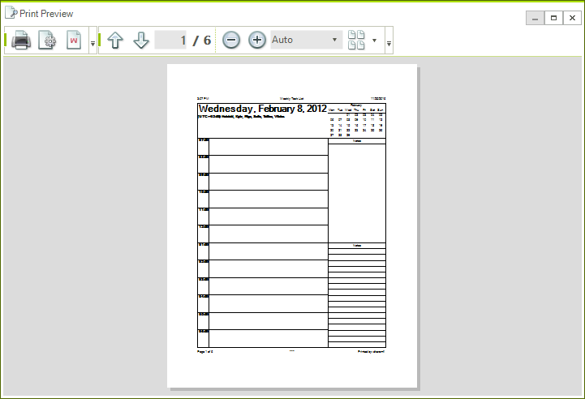
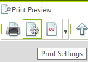

# Print Preview Dialog

## 

By using RadPrintPreviewDialog you can preview how the RadPrintDocument will appear when printed. 
        	To create and show a RadPrintPreviewDialog you can use:
        

#### __[C#]__

{{source=..\SamplesCS\TPF\Printing support\End-user functionality\RadPrintPreviewDialog1.cs region=CreateAndShow1}}
	            RadPrintPreviewDialog dialog = new RadPrintPreviewDialog();
	            dialog.Document = this.radPrintDocument1;
	            dialog.ShowDialog();
	{{endregion}}

#### __[VB.NET]__

{{source=..\SamplesVB\TPF\Printing support\End-user functionality\RadPrintPreviewDialog1.vb region=CreateAndShow1}}
	        Dim dialog As New RadPrintPreviewDialog
	        dialog.Document = Me.RadPrintDocument1
	        dialog.ShowDialog()
	{{endregion}}

You can also pass the RadPrintDocument to the RadPrintPreviewDialog via its constructor:

#### __[C#]__

{{source=..\SamplesCS\TPF\Printing support\End-user functionality\RadPrintPreviewDialog1.cs region=CreateAndShow2}}
	            RadPrintPreviewDialog printPreviewDialog = new RadPrintPreviewDialog(this.radPrintDocument1);
	            printPreviewDialog.ShowDialog();
	{{endregion}}

#### __[VB.NET]__

{{source=..\SamplesVB\TPF\Printing support\End-user functionality\RadPrintPreviewDialog1.vb region=CreateAndShow2}}
	        Dim printPreviewDialog As New RadPrintPreviewDialog(Me.RadPrintDocument1)
	        printPreviewDialog.ShowDialog()
	{{endregion}}

The User Interface of RadPrintPreviewDialog is built on top of RadMenu and RadCommandBar. 
    		By default the menu is hidden and the command bar is enabled. You can access and customize
    		both controls from the ToolMenu and ToolCommandBar properties. Here is a sample demonstrating
    		how to show the menu and hide the command bar:
    	

#### __[C#]__

{{source=..\SamplesCS\TPF\Printing support\End-user functionality\RadPrintPreviewDialog1.cs region=ShowHideMenuAndCommandBar}}
	            dialog.ToolMenu.Visible = true;
	            dialog.ToolCommandBar.Visible = false;
	{{endregion}}

#### __[VB.NET]__

{{source=..\SamplesVB\TPF\Printing support\End-user functionality\RadPrintPreviewDialog1.vb region=ShowHideMenuAndCommandBar}}
	        dialog.ToolMenu.Visible = True
	        dialog.ToolCommandBar.Visible = False
	{{endregion}}

RadPrintPreviewDialog allows zooming and navigating through the pages via the menu 
    		and the tool strips. In addition, the end user can use mouse drag to scroll through 
    		the current view and __Ctrl + Mouse Wheel__ to zoom in or out of it.
    	

The RadPrintPreviewDialog can also be used for editing the print document. When the 
    		__Print Settings__ button is clicked,
    		 [RadPrintSettingsDialog]()
    		is opened, allowing the end user to edit a variety of settings related to the printed object.
    		Also, when the __Watermark__ button is clicked, the end user can place a 
    		watermark on some of the pages by using the
    		 [WatermarkSettingsDialog]().
    	

>The RadPrintPreviewDialog is also used at design time to edit and serialize the properties of
		  	RadPrintDocument. For more information refer to the 
    		 [RadPrintDocument article.]()
