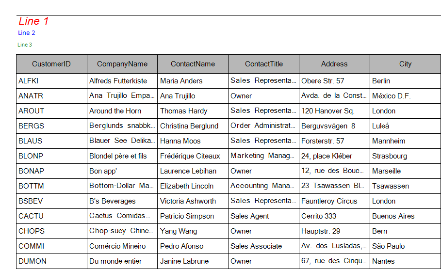

# Customize RadPrintDocument

The __RadPrintDocument__ class can be easily customized through inheritance. The following methods are virtual and they can be overridden with a custom implementation:

* __PrintHeader:__ Defines how the header will be printed.
* __PrintFooter:__ Responsible for painting the footer.
* __PrintWatermark:__ Paints the watermark. 
* __PrintLogo:__ Paints the logo.

>caption Fig. 1 Custom Header<br>

In this example we will modify the header of the print document by introducing new properties, defining fonts, color and a new layout. The control which we will be printing is going to be __RadGridView__ bound to the *Categories* table of the *Northwind* database. An example is available [here]().         

Let us first create a class extending __RadPrintDocument__ and define six new properties which will be used for painting a text with a specific font and size. We are also going to override the __PrintHeader__ method and draw the contents of the newly introduced properties at specific locations:

#### Inheriting RadPrintDocument

{{source=..\SamplesCS\TPF\Printing support\CustomHeaderExample.cs region=MyPrintDocument}} 
{{source=..\SamplesVB\TPF\Printing support\CustomHeaderExample.vb region=MyPrintDocument}}

````C#
public class MyPrintDocument : RadPrintDocument
{
    public string LeftUpperText { get; set; }
    public Font LeftUpperFont { get; set; }
    public string LeftMiddleText { get; set; }
    public Font LeftMiddleFont { get; set; }
    public string LeftLowerText { get; set; }
    public Font LeftLowerFont { get; set; }
    protected override void PrintHeader(System.Drawing.Printing.PrintPageEventArgs args)
    {
        base.PrintHeader(args);
        Rectangle headerRect = new Rectangle(args.MarginBounds.Location, new Size(args.MarginBounds.Width, this.HeaderHeight));
        StringFormat stringFormat = new StringFormat();
        stringFormat.Alignment = StringAlignment.Near;
        args.Graphics.DrawString(this.LeftUpperText, this.LeftUpperFont, Brushes.Red, new Rectangle(headerRect.X, headerRect.Y, headerRect.Width / 3, headerRect.Height / 3), stringFormat);
        args.Graphics.DrawString(this.LeftMiddleText, this.LeftMiddleFont, Brushes.Blue, new Rectangle(headerRect.X, headerRect.Y + headerRect.Height / 3, headerRect.Width / 3, headerRect.Height / 3), stringFormat);
        args.Graphics.DrawString(this.LeftLowerText, this.LeftLowerFont, Brushes.Green, new Rectangle(headerRect.X, headerRect.Y + (headerRect.Height) * 2 / 3, headerRect.Width / 3, headerRect.Height / 3), stringFormat);
        args.Graphics.DrawLine(new Pen(Brushes.Black), headerRect.Location, new Point(headerRect.Location.X + headerRect.Width, headerRect.Location.Y));
    }
}

````
````VB.NET
Public Class MyPrintDocument
    Inherits RadPrintDocument
    Public Property LeftUpperText() As String
        Get
            Return m_LeftUpperText
        End Get
        Set(value As String)
            m_LeftUpperText = value
        End Set
    End Property
    Private m_LeftUpperText As String
    Public Property LeftUpperFont() As Font
        Get
            Return m_LeftUpperFont
        End Get
        Set(value As Font)
            m_LeftUpperFont = value
        End Set
    End Property
    Private m_LeftUpperFont As Font
    Public Property LeftMiddleText() As String
        Get
            Return m_LeftMiddleText
        End Get
        Set(value As String)
            m_LeftMiddleText = value
        End Set
    End Property
    Private m_LeftMiddleText As String
    Public Property LeftMiddleFont() As Font
        Get
            Return m_LeftMiddleFont
        End Get
        Set(value As Font)
            m_LeftMiddleFont = value
        End Set
    End Property
    Private m_LeftMiddleFont As Font
    Public Property LeftLowerText() As String
        Get
            Return m_LeftLowerText
        End Get
        Set(value As String)
            m_LeftLowerText = value
        End Set
    End Property
    Private m_LeftLowerText As String
    Public Property LeftLowerFont() As Font
        Get
            Return m_LeftLowerFont
        End Get
        Set(value As Font)
            m_LeftLowerFont = value
        End Set
    End Property
    Private m_LeftLowerFont As Font
    Protected Overrides Sub PrintHeader(args As System.Drawing.Printing.PrintPageEventArgs)
        MyBase.PrintHeader(args)
        Dim headerRect As New Rectangle(args.MarginBounds.Location, New Size(args.MarginBounds.Width, Me.HeaderHeight))
        Dim stringFormat As New StringFormat()
        stringFormat.Alignment = StringAlignment.Near
        args.Graphics.DrawString(Me.LeftUpperText, Me.LeftUpperFont, Brushes.Red, New Rectangle(headerRect.X, headerRect.Y, headerRect.Width / 3, headerRect.Height / 3), stringFormat)
        args.Graphics.DrawString(Me.LeftMiddleText, Me.LeftMiddleFont, Brushes.Blue, New Rectangle(headerRect.X, headerRect.Y + headerRect.Height / 3, headerRect.Width / 3, headerRect.Height / 3), stringFormat)
        args.Graphics.DrawString(Me.LeftLowerText, Me.LeftLowerFont, Brushes.Green, New Rectangle(headerRect.X, headerRect.Y + (headerRect.Height) * 2 / 3, headerRect.Width / 3, headerRect.Height / 3), stringFormat)
        args.Graphics.DrawLine(New Pen(Brushes.Black), headerRect.Location, New Point(headerRect.Location.X + headerRect.Width, headerRect.Location.Y))
    End Sub
End Class

````

{{endregion}} 

After creating our custom class we can use it this way:

#### A Sample Usage 

{{source=..\SamplesCS\TPF\Printing support\CustomHeaderExample.cs region=SampleUsage}} 
{{source=..\SamplesVB\TPF\Printing support\CustomHeaderExample.vb region=SampleUsage}} 

````C#
MyPrintDocument doc = new MyPrintDocument();
doc.HeaderHeight = 60;
doc.Landscape = true;
doc.AssociatedObject = this.radGridView1;
doc.LeftUpperText = "Line 1";
doc.LeftUpperFont = new Font("Arial", 12, FontStyle.Italic);
doc.LeftMiddleText = "Line 2";
doc.LeftMiddleFont = new Font("Calibri", 8);
doc.LeftLowerText = "Line 3";
doc.LeftLowerFont = new Font("Tahoma", 6);
RadPrintPreviewDialog dialog = new RadPrintPreviewDialog(doc);
dialog.Show();

````
````VB.NET
Dim doc As New MyPrintDocument()
doc.HeaderHeight = 60
doc.Landscape = True
doc.AssociatedObject = Me.RadGridView1
doc.LeftUpperText = "Line 1"
doc.LeftUpperFont = New Font("Arial", 12, FontStyle.Italic)
doc.LeftMiddleText = "Line 2"
doc.LeftMiddleFont = New Font("Calibri", 8)
doc.LeftLowerText = "Line 3"
doc.LeftLowerFont = New Font("Tahoma", 6)
Dim dialog As New RadPrintPreviewDialog(doc)
dialog.Show()

````

{{endregion}}

# See Also
* [Create Prinatble Panel]()

