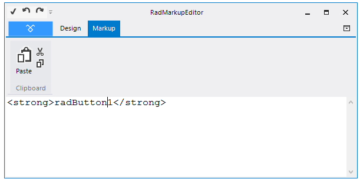

# RadMarkupDialog

RadMarkupEditor is a *__dialog__*used at Design time and Run time for creation of the formatted text supported by Telerik Controls for WinForms. As any other standard dialog in WinForms, this dialog inherits from *CommonDialog *class.

You can start the editor at Design Time by opening the drop down of some __Text__property and then clicking on *Start MarkupEditor *button:

Alternatively you can edit the *Plain Text *field if you need not Html-like formatting. 

When started at Design Time, the font *size *and *name *are taken from the edited control or visual element e.g. RibbonTab. No tags are added for this font in the generated markup although the font name or size can be explicitly set as well.

To start the editor at Run Time, create a new instance of the dialog and use *ShowDialog *method:

#### __[C#]__

{{source=..\SamplesCS\TPF\RadMarkupDialogForm.cs region=DialogGetValue}}
	            RadMarkupDialog dialog = new RadMarkupDialog();
	            DialogResult result = dialog.ShowDialog();
	            if (result == DialogResult.OK)
	            {
	                MessageBox.Show(dialog.Value);
	            }
	{{endregion}}

#### __[VB]__

{{source=..\SamplesVB\TPF\RadMarkupDialogForm.vb region=DialogGetValue}}
	        Dim dialog As New RadMarkupDialog()
	        Dim result As DialogResult = dialog.ShowDialog()
	        If result = DialogResult.OK Then
	            MessageBox.Show(dialog.Value)
	        End If
	        '#End Region
	    End Sub
	
	    Private Sub SecondDialog()
	        '#Region "DialogSetValue"
	        Dim dialog As New RadMarkupDialog()
	        dialog.Value = "Initial"
	        dialog.ShowDialog()
	        '#End Region
	    End Sub
	
	    Private Sub ThirdDialog()
	        '#Region "DialogSetFont"
	        Dim dialog As New RadMarkupDialog()
	        dialog.DefaultFont = SystemFonts.DefaultFont
	        dialog.ShowDialog()
	        '#End Region
	    End Sub
	
	    'Fake class so that we do not add reference to Telerik.WinControls.RadMarkupEditor
	    Private Class RadMarkupDialog
	        Inherits Form
	        Public Property Value() As String
	            Get
	                Return m_Value
	            End Get
	            Set(value As String)
	                m_Value = value
	            End Set
	        End Property
	        Private m_Value As String
	        Public Property DefaultFont() As Font
	            Get
	                Return m_DefaultFont
	            End Get
	            Set(value As Font)
	                m_DefaultFont = value
	            End Set
	        End Property
	        Private m_DefaultFont As Font
	    End Class
	
	End Class

* *

*ShowDialog* returns the *DialogResult* enumeration. The returned value is *DialogResult.OK* if one of the Apply buttons is pressed and *DialogResult.Cancel* if the Close button is pressed. The *Value* property contains the edited html as a string. 

The *Value* property can be set to the RadMarkupDialog before it is shown which will be the initial value of the dialog:

#### __[C#]__

{{source=..\SamplesCS\TPF\RadMarkupDialogForm.cs region=DialogSetValue}}
	            RadMarkupDialog dialog = new RadMarkupDialog();
	            dialog.Value = "Initial";
	            dialog.ShowDialog();
	{{endregion}}

#### __[VB]__

{{source=..\SamplesVB\TPF\RadMarkupDialogForm.vb region=DialogSetValue}}
	        Dim dialog As New RadMarkupDialog()
	        dialog.Value = "Initial"
	        dialog.ShowDialog()
	        '#End Region
	    End Sub
	
	    Private Sub ThirdDialog()
	        '#Region "DialogSetFont"
	        Dim dialog As New RadMarkupDialog()
	        dialog.DefaultFont = SystemFonts.DefaultFont
	        dialog.ShowDialog()
	        '#End Region
	    End Sub
	
	    'Fake class so that we do not add reference to Telerik.WinControls.RadMarkupEditor
	    Private Class RadMarkupDialog
	        Inherits Form
	        Public Property Value() As String
	            Get
	                Return m_Value
	            End Get
	            Set(value As String)
	                m_Value = value
	            End Set
	        End Property
	        Private m_Value As String
	        Public Property DefaultFont() As Font
	            Get
	                Return m_DefaultFont
	            End Get
	            Set(value As Font)
	                m_DefaultFont = value
	            End Set
	        End Property
	        Private m_DefaultFont As Font
	    End Class
	
	End Class

You can also set the default font size and name before showing the dialog using the DefaultSize property:

#### __[C#]__

{{source=..\SamplesCS\TPF\RadMarkupDialogForm.cs region=DialogSetFont}}
	            RadMarkupDialog dialog = new RadMarkupDialog();
	            dialog.DefaultFont = SystemFonts.DefaultFont;
	            dialog.ShowDialog();
	{{endregion}}

#### __[VB]__

{{source=..\SamplesVB\TPF\RadMarkupDialogForm.vb region=DialogSetFont}}
	        Dim dialog As New RadMarkupDialog()
	        dialog.DefaultFont = SystemFonts.DefaultFont
	        dialog.ShowDialog()
	        '#End Region
	    End Sub
	
	    'Fake class so that we do not add reference to Telerik.WinControls.RadMarkupEditor
	    Private Class RadMarkupDialog
	        Inherits Form
	        Public Property Value() As String
	            Get
	                Return m_Value
	            End Get
	            Set(value As String)
	                m_Value = value
	            End Set
	        End Property
	        Private m_Value As String
	        Public Property DefaultFont() As Font
	            Get
	                Return m_DefaultFont
	            End Get
	            Set(value As Font)
	                m_DefaultFont = value
	            End Set
	        End Property
	        Private m_DefaultFont As Font
	    End Class
	
	End Class

>RadMarkupDialog depends on Microsoft.mshtml assembly. Please refer to the Deployment section for further details.

## RadMarkupDialog user interface

The user interface of RadMarkupDialog should be fairly intuitive. The two tabs - Design and Markup - are used for navigation between design and markup views. 

## Design View 

The first RibbonBar group (Clipboard) contains the Paste, Cut, and Copy commands.

The second RibbonBar group (Font) contains the Font-Family, Font-Size, Bold, Italic, Underline, Highlight, and Font-Color commands.

The third RibbonBar group (Lists) contains the Unordered List, and Ordered List commands.

The fourth RibbonBar group (Link) contains the link command.

The fifth RibbonBar group (Apply) contains the *Apply *command. You should click this button to persist your editing at Design Time or to receive DialogResult.OK at Run Time. Otherwise (pressing the close button of RadMarkupDialog), the change will not be persisted at Design Time or DialogResult.Cancel will be returned at Run Time. 

## Markup View

Markup view contains only the clipboard commands. 
