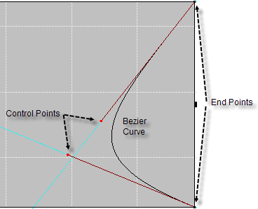

# Using Bezier Curves

You can use the Shape Editor to create curved designs using Bézier curves. A Bézier curve is created with two regular points and two control points. The position of the control points relative to the endpoints dictates the arc of the curve. 

In the screenshot below the two control points are dragged down below the middle of the horizontal center point, causing the curve to bulge in the lower half of the shape drawing area.

## Creating Bézier Curves

To create a Bézier curve, right-click on a line, and then click __Convert__. Two control points in the middle of the selected line will appear. You can adjust the arc of the curve with the mouse by selecting a control point and dragging it to the desired location on the grid. While dragging the control point, the line curves in relation to both control points.  

You can control the shape of the curve by setting the properties for the control points in the property grid of the line. To set the properties, select the Bézier curve line. There are two properties in the property grid that pertain to the control points: ControlPoint1 and ControlPoint2. The properties of the control points are similar to the properties of a regular point. Each of the control points can be expanded by clicking the + symbol to the left of the property name. To set the location, enter the numeric values of the desired coordinates into the X and Y properties of each control point. For more information about setting the location, see [Moving and Locking Points]().

## Removing Bézier Curves

To remove the Bézier curve, right-click on the curve, and then click __Convert__. This action will remove the two control points and restore a straight line between the two endpoints.
