# Styling RadRibbonBar

## Creating a custom Theme for the RadRibbonBar starting from an existing one

After introducing the new Visual Style Builder a lot of our customers asked how to open an existing theme so that it can be modified achieving a new visual style. Indeed, this is the preferred way to create a new theme if you do not want to begin from scratch by creating an entirely new repository and applying the items throughout the controls set.

In this article we are going to demonstrate how to create a new theme for the RadRibbonBar using the Windows 7 theme as a starting point. Many of the hints and approaches used here are also applicable when styling other controls. Please note that in this example the repository of the Windows 7 theme will be modified which will surely cause other controls to change their styles as well (remember that repository items are reused among controls). 

Let’s start by opening the Visual Style Builder with the Windows 7 theme:

>note The Following article shows how you can load the predefined themes: [Loadin Predefined Themes]()

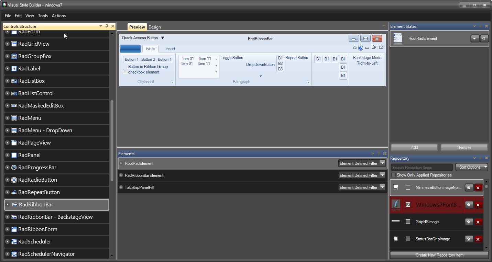

After selecting the RadRibbonBar control from the tree-view on the left, you will see a preview of the control with the opened theme applied. You can explore the hierarchy of the RadRibbonBar node which contains the items that can be styled. In general this hierarchy is divided into three main subtrees:

* RibbonBarCaption

* RibbonTabStripElement

* RadRibbonBarGroup

The screenshot below outlines the three categories:

These three categories contain subcategories for the corresponding elements. For instance, the RibbonBarCaption category contains ApplicationButton, QuickAccessToolbar and SystemButtons sub-nodes which can be used to style the corresponding elements.

Let’s start with changing the styles of the RibbonBarCaption. To do so, select the RibbonBarCaption node in the Visual Style Builder. After selecting it, the stylable elements will be listed in the Elements List which is usually situated below the Preview pane. In the Elements List select the RibbonCaptionFill element and take a look at the Element States window:

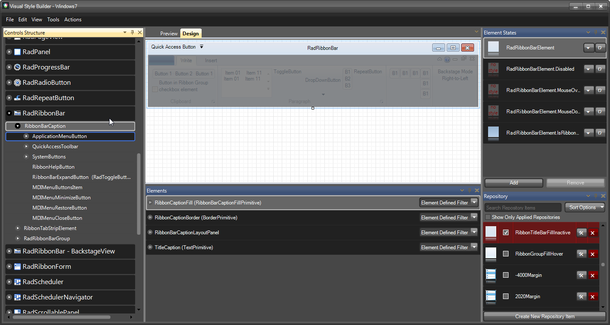

You will see that the RadRibbonBarElement and RadRibbonBarElement.IsRibbonFormActive states will have styles associated with them (there are previews generated for the corresponding states). So, we will change the styles for these two states. To do so, we need to find the repository items associated with them and modify their property settings. To do so, select the RadRibbonBarElement.IsRibbonFormActive state and take a look at the Repository window where the used repository items will be highlighted in red:

>note The RadRibbonBarElement.IsRibbonFormActive state is applied to the RadRibbonBar control when it is in a RadRibbonForm and the form is active. Otherwise the RadRibbonBarElement state is applied since it is the default state.
>

We see that a repository item named RibbonTitlebarFillNormal is highlighted and checked. That means that this repository item is associated with the current state. So we will need to modify this repository item to change the appearance for the RadRibbonBar when it is in this state. To do so, double-click on the repository item or click on the Edit Repository Item button. An editor will be opened in dialog mode which allows for modifying the parameters of the repository item:

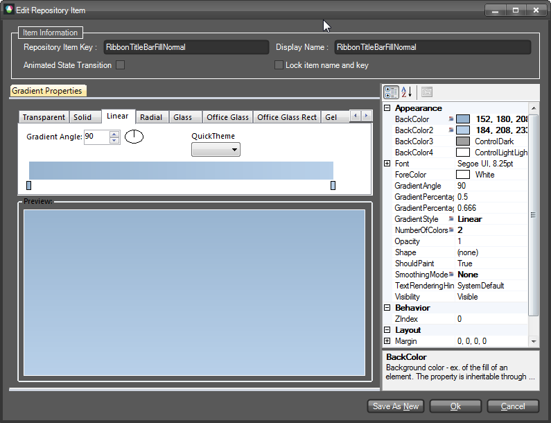

In this dialog you can change the parameters of the repository item (which is gradient type for the current element) and thus create another style for it. In our example we will add two more colors to the gradient and define its parameters so that it looks as follows:
		

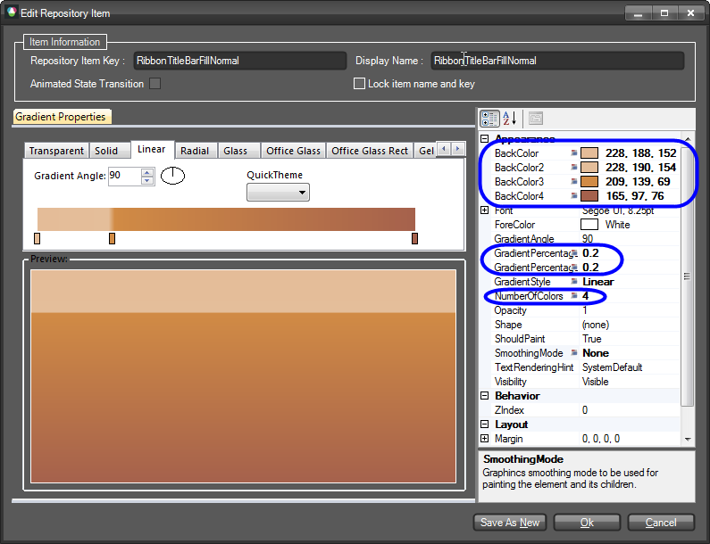

We will do the same for the RadRibbonBarElement state (the default state) by changing the already existing styles with similar to those we created for the Active state in pretty much the same way:

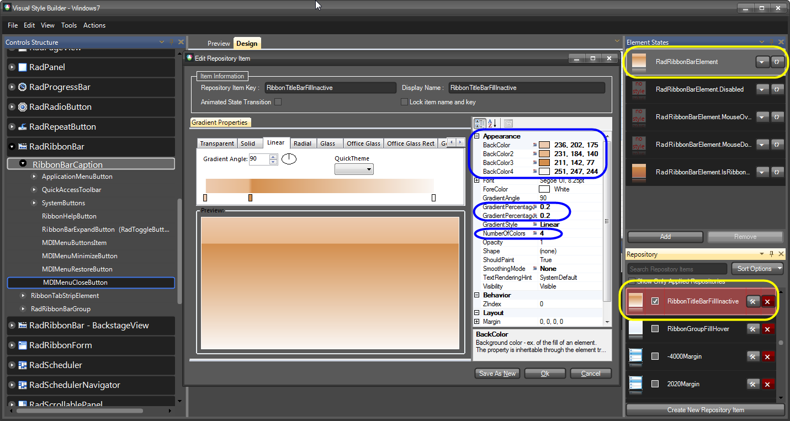

In this way we have defined styles for the Active and Inactive states of the RibbonBar’s caption fill. You can do this for the RibbonCaptionBorder element using the same approach.

Now we are going to change the styles of the Application Button by simply modifying the associated repository items as already shown. To do so, select the ApplicationMenuButton sub-node and after that select the OfficeButtonFill element in the Elements List. In the Element States window you will see that there are styles for the default, MouseOver.ActionPart, MouseOver.ArrowPart, Pressed and DropDownOpened states defined. Select the DropDownOpened state and find the highlighted repository item. Double-click the item to open its editor and modify the color settings as shown on the screenshot below:

This repository item is also used for the Pressed and MouseOver states. Save the changes and select the RibbonBarApplicationButton state. Find the used repository item and modify it accordingly:

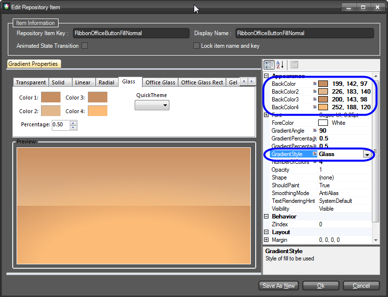

To completely change the styles of the button we need to also modify the repository items defining the appearance of the button’s border. To do so, select the OfficeButtonInnerBorder element and after that the DropDownOpened state from the Element States window. Find the repository item in use and edit it as shown below:

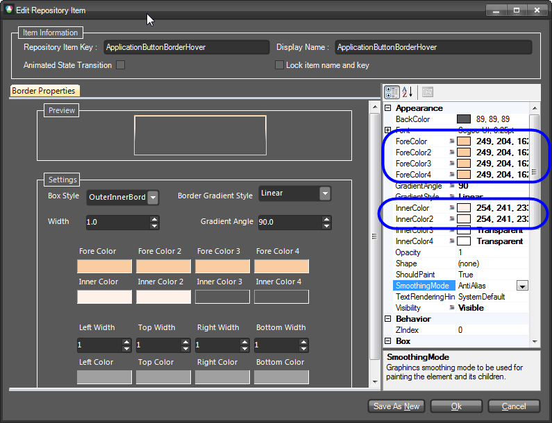

Now, select the QuickAccessToolbar node and expand its sub-tree. Select the RibbonBarButtonElement sub-node and after that the ButtonInRibbonFill element from the Elements List. You will see that this element has styles for its default, for the MouseOver and MouseDown states. We will change the styles for the MouseOver and MouseDown states. Select the MouseOver state, find the associated repository item and modify it so that it looks the following way:

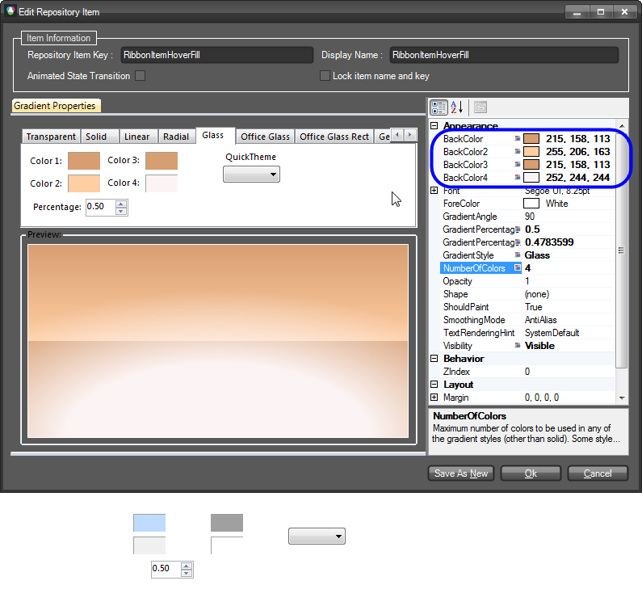

We will also have to modify the styles for the border of the button. To do so, we need to select the ButtonInRibbonBorder element and modify the repository items for the same states so that they look the following way:

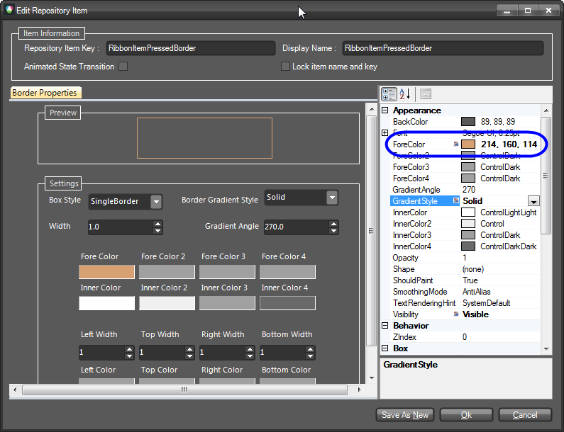

Since the repository items we have just changed are reused throughout the whole RadRibbonBar, the styles of other elements have also been changed. For instance, if you hover a button in a RadRibbonBar group, you will notice that it looks the same way as the button in the Quick Access Toolbar. In this way, by reusing repository items, we need to introduce our modifications at a single place and in order to get them applied throughout the whole control.

After styling the QuickAccessToolbar, we will go on changing the styles of the Ribbon’s system buttons. To do so, select and expand the System Buttons node and choose the RibbonMinimizeButton. From the Elements List choose the CaptionButtonFill element and take a look at the available states:

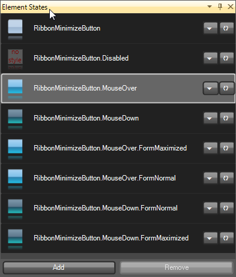

You will see that there are styles defined for the default, normal and maximized states of the form (these states are relevant when the RadRibbonBar is in RadRibbonForm). We will begin with the styles for the default state. So, select the RibbonMinimizeButton state and select the repository item associated with it (called: TitleBarButtonNormalFill). Open the editor and change the gradient as follows:

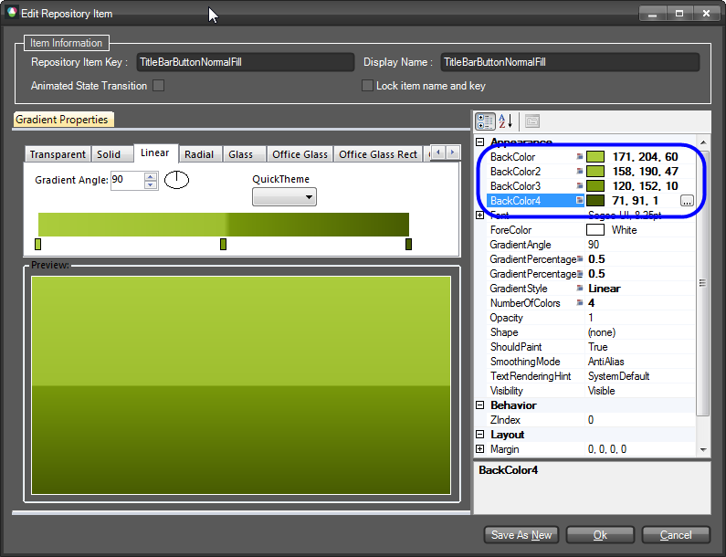

For the MouseOver and MouseDown change the styles as shown below:

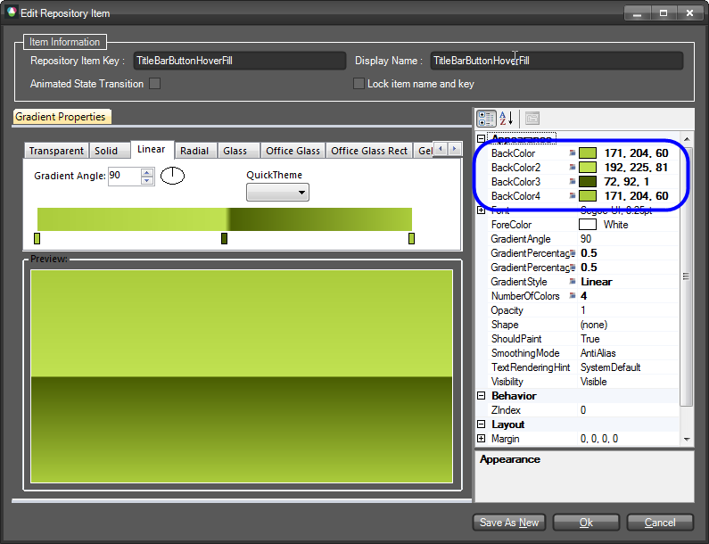

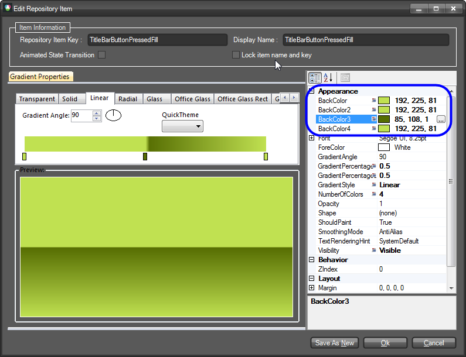

Since the repository items are reused for the remaining states, you will see that they will also be affected. Do the same for the CaptionButtonBorder, so that it looks the following way for each state:

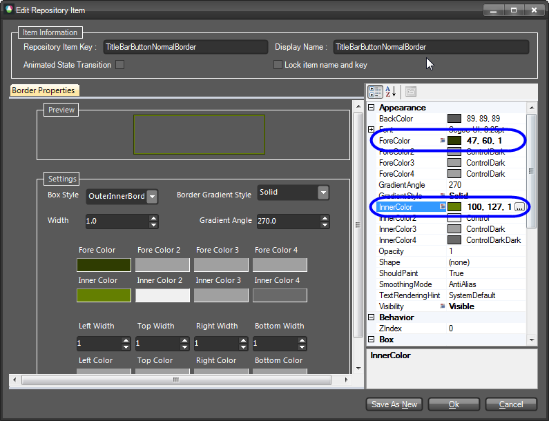

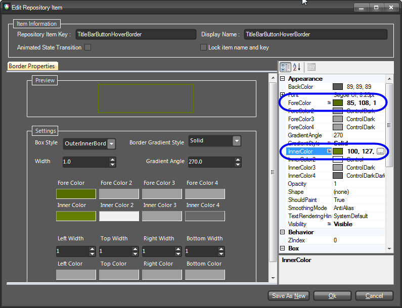

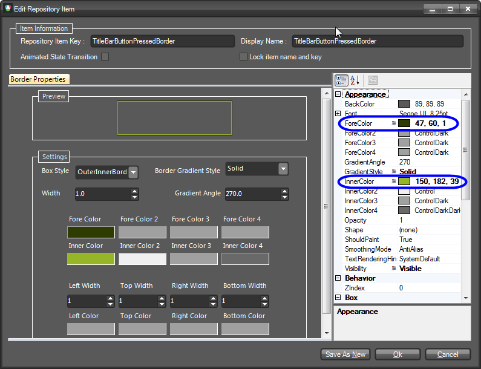

We will leave the RibbonCloseButton as it is.

Now select the RibbonTabStripElement node from the tree-view on the left. We are first going to change the color of the panel behind the tab items. To do so, select the TabHeadFill element from the Elements List below the preview pane and select the RadTabStripElement.IsRibbonFormActive state from the Element States list. Find the associated repository item (called RibbonTabStripHeadFill) with this state and open its editor. The style of the fill is Solid gradient. Change its parameters as shown on the picture below:
		

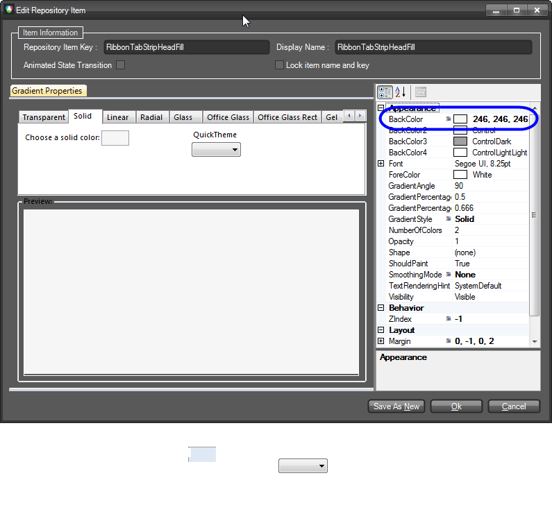

Now, select the TabBaseFill element. This element represents the FillPrimitive behind all RadRibbonBarGroups. Find the RibbonTabBaseFill repository item, open its editor and change its parameters as follows:
		

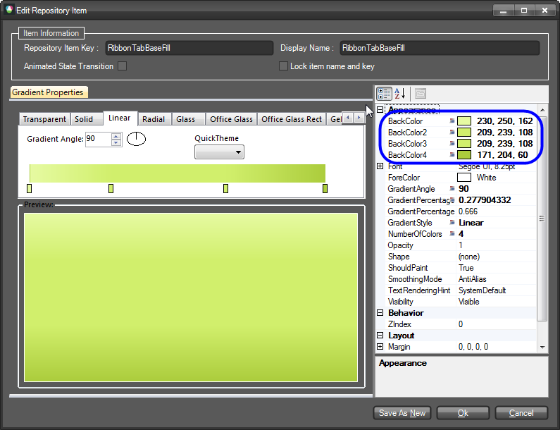

After that select the TabBaseBorder element. Find the repository item called RibbonTabBaseBorder and change its ForeColor setting to be 166, 199, 55. After finishing with the fill and the border of the RadRibbonBar’s groups container, select the TabItem subnode of the RibbonTabStripElement node from the tree-view on the left. This is the node which represents a RibbonTab . From the Elements List select the TabFill element and find the TabItemFillSelected repository item which is associated with the Selected, Selected.Pressed and Selected.MouseOver states of the item. Open the editor and change its appearance as follows:

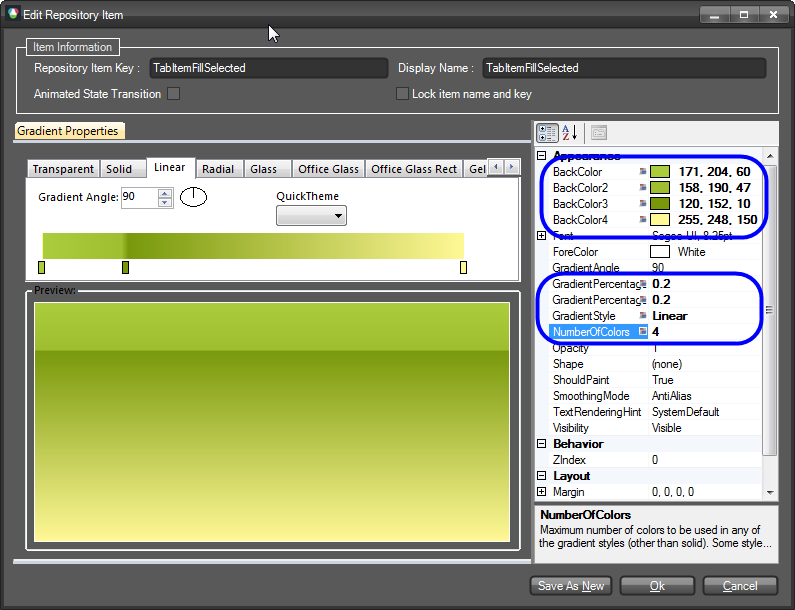

After that select the TabItemBorder element and take a look at the Element States window. You will notice that there are different styles defined for the Selected and Selected.MouseOver states. So, we are going to change the corresponding repository items for both states. First, select the TabItem.Selected state and open the editor of the highlighted repository item called RibbonTabBorderSelectedNormal. Edit its properties as shown on the screenshot below:

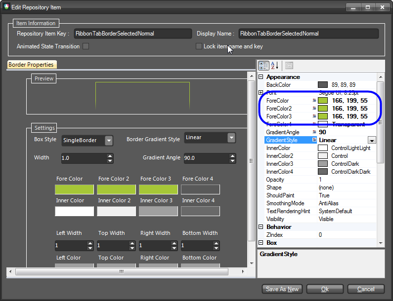

Now, select the TabItem.MouseOver state and modify its property settings as follows:

We will go on with the styles of the RadRibbonBarGroup elements which hold all elements that can be put into a RadRibbonBar control. To do so, find the RadRibbonBarGroup sub-node and select it. From the Elements List find the RibbonGroupMainFill element and select it. You will see that the element has styles for its default, MouseDown and ContainsMouse states. Since the MouseDown and ContainsMouse states reuse a single repository item, we will need to modify it in order to change the styles for both states. To do so, select one of the states, find the associated repository item (RibbonGroupFillHover) and open its editor. Change the parameters as shown on the screenshot below:

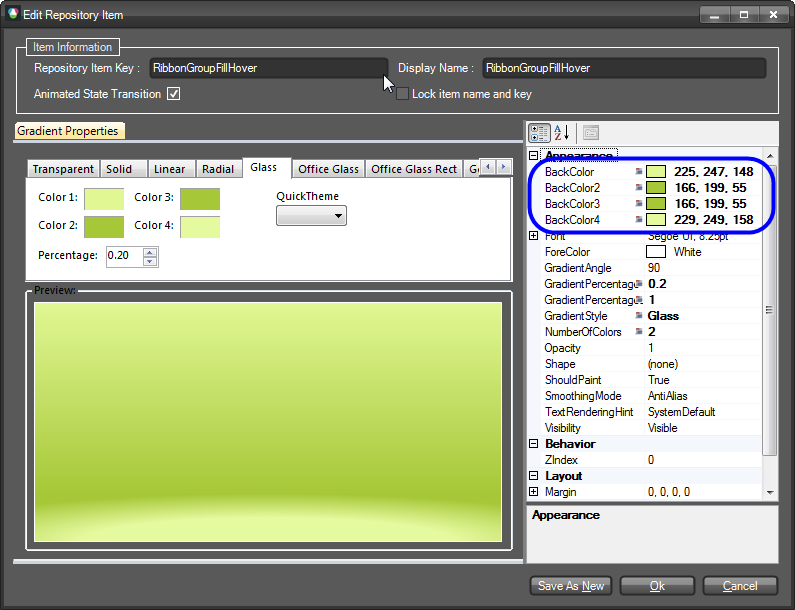

Now, find and select the RibbonGroupOuterBorder element and find the repository item associated with its default state (called RibbonGroupOuterBorder). Open its editor and modify it accordingly:

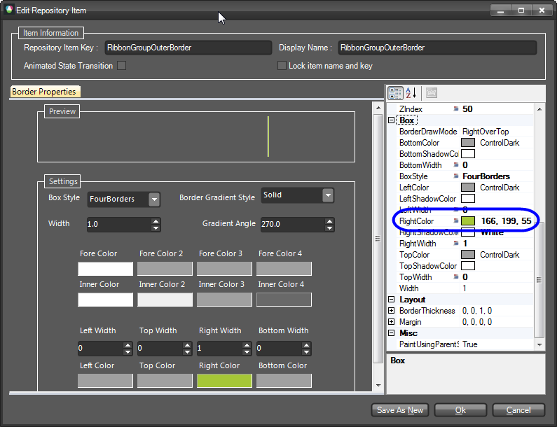

The next step is to change the styles of a RibbonBarButtonGroup. To do so, expand the RadRibbonBarGroup node and find the RibbonBarButtonGroup sub-node. Select it and take a look at the Elements List. Find the ButtonGroupFill element and select it. Find the repository item called ButtonGroupFill and modify its settings so that it looks as shown below:

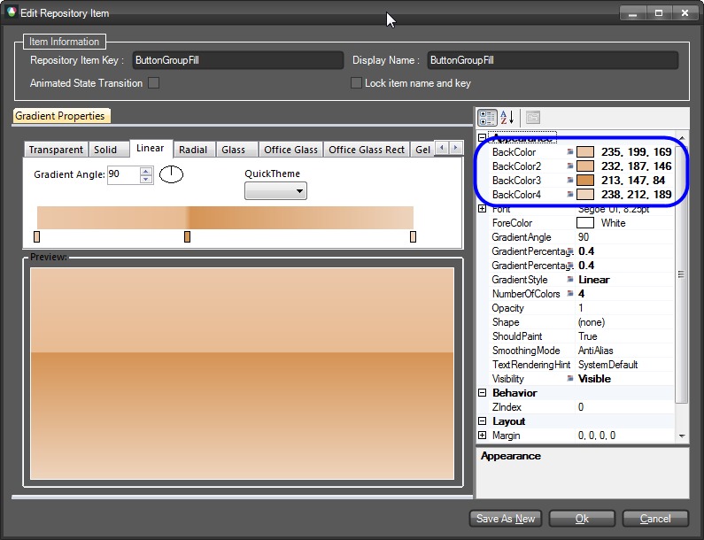

Do the same operation with the ButtonGroupBorder element so that it acquires the following style:

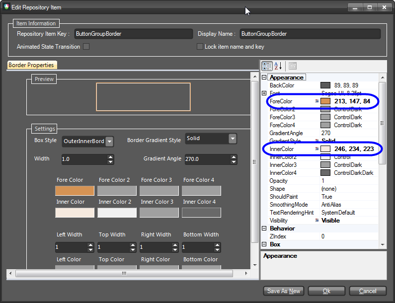

At this point, we are almost done. We only need to style the RadCheckBoxElement and the RadGalleryElement also contains a RadRibbonBarGroup. Select the RibbonBarGroupGallery node and from the Elements List pick the GalleryFill element. Find the RibbonGalleryFill repository item and modify it as shown below:

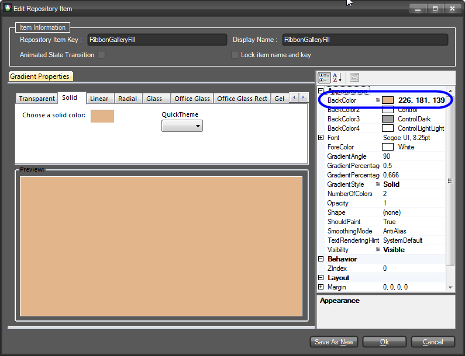

Do the same for the GalleryBorder element. The repository item associated with it is called RibbonGalleryBorder. Modify it so that it looks as follows:

Now expand the RibbonBarGroupGallery node and find the GalleryPopupSizingGripElement. This element represents the sizing grip of the gallery’s popup which can be used to resize the popup. This element has styles for its fill and its border. We are going to modify the associated repository items accordingly. To do so, find the GripFill element from the Elements List and find the repository item Windows7GrayGradient that is associated with this element. You will notice that the repository item’s name reflects its appearance. Since we would like to preserve this repository item, we are going to create a new repository item and associate it with the GripFill element. To do so, click on the Create New Repository Item button below the Repository Items list. A dialog will open which will ask you to select the type of the repository item to create. We want to create Gradient and therefore select this option. Now set the name and the key of this repository item to GripFillNormal and change its settings to look the following way:

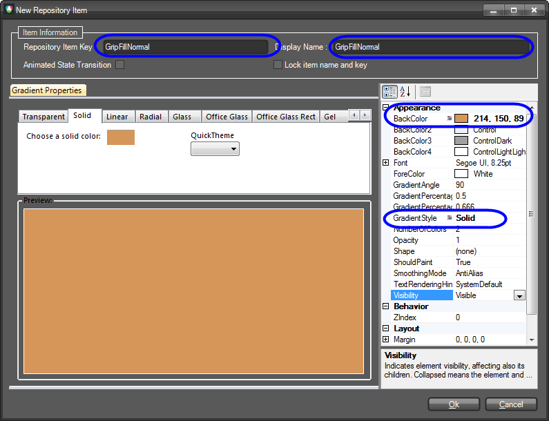

We are now going to associate this repository item with the GripFill element for its default state. But before doing this, we are going to reset all previously associated repository items by clicking the Reset All Associations button on the SizeGripElement state (this is the right button). After doing this, associate the repository item in question by simply dragging and dropping it on the state. Now open the drop-down of the gallery. You will notice that the SizeGripElement does not look as expected:

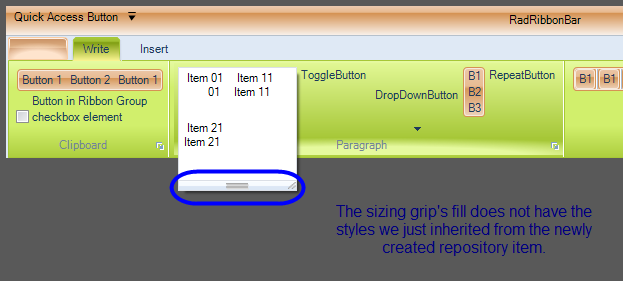

The reason for this behavior is that there is a StyleBuilder registered in the ThemeResolutionService that contains a ElementTypeDefault relation for the Telerik.WinControls.UI.SizeGripElement type. In other words, this means that each time a Telerik.WinControls.UI.SizeGripElement is found in an element tree, this style builder will be used to style the element. So, we need to remove this relation. To do so, we need to select the RadSizablePopup control from the tree-view in the Visual Style Builder, expand the node and find the SizeGripElement sub-node. In the context-menu of the node you will see an option called ”Reuse Item Styles on other Controls”. This option is checked, we need to uncheck it so that the SizeGripElement in the RibbonBarGroupGallery’s popup is styled as expected:

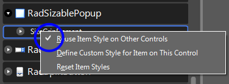

After doing this, you will see that the SizeGripElement will acquire the styles defined in the new repository item we just created:

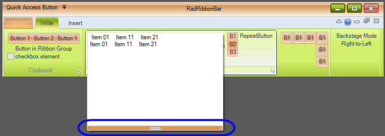

You can now try to change the styles of the RadCheckBoxElement in the RadRibbonBarGroup accordingly. Finally, you will notice that the Ribbon’s Application Menu has to be styled as well. You can do this by selecting the RadApplicationMenu node from the tree-view in the VSB.
